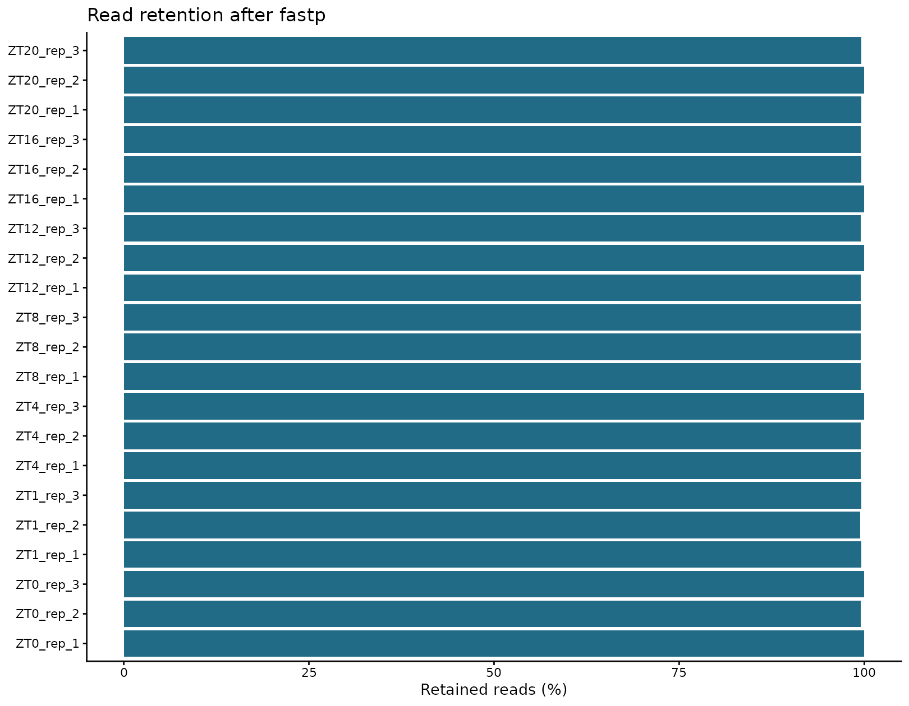

# 06 数据过滤：fastp

<!-- normalized-inputs -->
输入字段和项目迁移规则见[输入规范](<附4 输入文件规范与项目迁移.md>)。代码从能看到 `0script` 的项目根目录运行。

fastp 对原始双端 reads 进行质量、未知碱基、长度及接头处理。过滤规则作用于序列，不是对样本表达矩阵进行“去离群”。原始 FASTQ 始终保留，所有输出写入 clean 目录。

## 本章从哪里读取参数

以下值来自 [project.env](project.env)，不是写死在函数里的常量。案例值与新项目模板值分别列出；实际运行读取你当前文件中的设置。图形特有参数仍在本章入口集中设置。修改后需重新运行读取/赋值段，再调用函数；已经在内存中的旧变量不会随文件编辑自动刷新。

| 参数 | 当前案例配置 | 空模板默认 | 用途与修改注意 |
| --- | --- | --- | --- |
| `THREADS` | `24` | `24` | 上游和注释的总线程预算，正整数；默认 24。 按服务器实际分配资源调小或调大，不超过可用 CPU/内存；样本并行数还由各章 sample_jobs 分配。 |

## 1. 明确本次过滤参数

| 参数 | 本次值 | 解释 |
| --- | --- | --- |
| `-q` | 20 | 单个碱基达到合格质量的阈值，不是整条 read 的平均质量 |
| `-u` | 40 | 不合格碱基比例超过 40% 时过滤 read；与 `-q` 配合 |
| `-n` | 5 | read 中允许的最多 N 数量 |
| `-l` | 20 | 过滤后的最短长度；不是强制裁剪到 20 nt |
| `--compression` | 6 | gzip 压缩等级，影响时间和文件大小，不改变保留序列 |
| `-w` | 由总预算分配 | 当前最多两个样本并行，总线程不超过 `THREADS` |
| `-i/-I` | 原始 R1/R2 | 必须是同一个文库、正确配对的两端 |
| `-o/-O` | clean R1/R2 | 与原始输入分目录；统一名称供下一章读取 |
| `-h/-j` | HTML/JSON | HTML 供查看；JSON 供 MultiQC 和统计使用 |
| `-R` | 样本标题 | HTML 报告标题，不是输出文件前缀 |

保留原流程的过滤阈值，不因为数据能运行就额外加一套未说明的激进裁剪。新项目应结合 read 长度和第 05 章结果评估阈值；尤其 20 nt 的下限不代表所有短序列都能在下一章的 31-mer 索引中有效定量。

## 2. 逐样本过滤并记录资源

实现：[查看编号脚本](scripts/06_fastp.sh)。

<!-- execute: fastp env=rnaseq -->
```bash
# 目的：按双端样本过滤 reads，并保存质量及资源日志。
# 关键输出：2data/cleandata/fastp/{sample_id}_clean_1.fastq.gz 与 _clean_2.fastq.gz：过滤后的两端序列。
#   同目录 {sample_id}.fp.html、.fp.json 记录过滤统计，日志记录执行和资源；原 FASTQ 不改。
# 前提/去向：输入：rawdata 双端文件；输出 fastp/{sample_id}_clean_1/2.fastq.gz、.fp.html、.fp.json 和日志。
#   任何已有 clean 文件会使该样本停止，不自动覆盖或续算半成品。
# 先 source 加载同编号脚本定义，再设置下面变量并调用函数；加载本身不启动分析。所有路径相对能看见0script 的项目根目录。
# 可调参数（下面赋值是本次值，Shell 的 = 两侧不留空格）：
# sample_jobs：正整数；同时处理的样本数，超过 THREADS 时下调到线程预算。每样本线程为整除THREADS/sample_jobs；样本数不等于线程数或重复数。
# min_length：正整数，单位 nt；过滤后允许的最短 read 长度，不是把所有 read 强制剪成此长度。改变后影响clean reads 和后续分析。
# qualified_quality_phred：非负 Phred 值；fastp 判为合格碱基的质量门槛，与低质量碱基比例联用，不能理解为整条 read 的平均质量。
# unqualified_percent_limit：0–100 的百分数；单条 read 允许的低质量碱基比例上限。降低更严格，影响保留reads。
# n_base_limit：非负整数；单条 read 允许的 N 碱基数上限，超过即不满足过滤要求。
# compression_level：整数 1–9；gzip 压缩等级，只改变压缩开销和文件体积，不改变被保留的序列。
# 调用时 $变量 取上面设置的值；双引号保持每个值为一个参数，空字符串也占一个参数位置。调用顺序与脚本 $1、$2… 一致，不需深入函数体改值。
# 执行环境：rnaseq；命令退出不代表所有后续章节都已完成，查看本步结果/日志后再继续。

source 0script/scripts/06_fastp.sh
sample_jobs=2
min_length=20
qualified_quality_phred=20
unqualified_percent_limit=40
n_base_limit=5
compression_level=6
# interface-parameters: fastp
run_fastp "$sample_jobs" "$min_length" "$qualified_quality_phred" "$unqualified_percent_limit" "$n_base_limit" "$compression_level"
```

### 查看本步关键文件

过滤后切换到 rnaseq 的 R。以下按样本表第一行查看一个样本的 fastp JSON 开头；它是统计记录而非 FASTQ。完整报告打开同名 `.fp.html`，所有样本的汇总表在本章第 4 节生成。

```r
# 目的：从 Bash 切换到 rnaseq 的 R 后，只读本步关键文本结果，不重新分析。
# preview_dir/preview_files 只用于查看，不是传给分析函数的新参数。
# file.path 拼接路径；readLines(n = 10) 最多读前 10 行，含表头；不整表读入内存。
# file.exists 检查是否存在；cat 用 sep = "\n" 逐行显示；warn = FALSE 省略末行换行提示。
source("0script/tools/metadata.R")
readRenviron("0script/project.env")
preview_id <- read_samples()$sample_id[1]
preview_dir <- "2data/cleandata/fastp"
preview_files <- file.path(preview_dir, paste0(preview_id, ".fp.json"))
for (preview_file in preview_files) {
  cat("\n文件：", preview_file, "\n")
  if (file.exists(preview_file)) {
    cat(readLines(preview_file, n = 10, warn = FALSE), sep = "\n")
  } else {
    cat("尚无此文件：核对上一步是否完成、是否选择该分析，以及空结果提示。\n")
  }
}
```

本次参数仍为原来的 20/20/40/5/6，只把常量移到入口，并未重新过滤。换项目调整这些阈值后须重新生成 clean reads 及其下游结果；不能只改说明便沿用旧输出。已有文件会触发保护检查，先核实并为新运行安排独立输出位置。

## 3. 对 clean FASTQ 再做一次 FastQC

实现：[查看编号脚本](scripts/06_clean_qc.sh)。

<!-- execute: clean_qc env=rnaseq -->
```bash
# 目的：对已产生的 clean 双端 FASTQ 做独立质量检查。
# 关键输出：2data/cleandata/qc/*_fastqc.html/.zip；2data/cleandata/multiqc/clean_multiqc.html。
#   fastp 汇总为同一 multiqc 目录中的 fastp_multiqc.html；网页报告用浏览器查看。
# 前提/去向：输入：同一张样本表及 fastp/{sample_id}_clean_1/2.fastq.gz，不重新裁剪；输出 cleandata/qc与 cleandata/multiqc。
# 先 source 加载同编号脚本定义，再设置下面变量并调用函数；加载本身不启动分析。所有路径相对能看见0script 的项目根目录。
# 本入口无位置参数；样本名/分组从 samples.tsv 获取，线程等共用设置从 project.env 获取，不必逐样本改代码。
# 执行环境：rnaseq；命令退出不代表所有后续章节都已完成，查看本步结果/日志后再继续。

source 0script/scripts/06_clean_qc.sh
run_clean_qc
```

查看 [fastp 汇总](../2data/cleandata/multiqc/fastp_multiqc.html) 和 [clean FastQC 汇总](../2data/cleandata/multiqc/clean_multiqc.html)，与上一章原始报告对照。fastp 的 `total_reads` 对双端输入统计两端 reads 的总和；一对 reads 对应一个片段，解释文库大小时不能把两者混称。

## 4. 保存前后对比图

实现：[查看编号脚本](scripts/06_qc_summary.R)。

<!-- execute: qc_summary env=rnaseq -->
```r
# 目的：从 fastp JSON 汇总过滤前后的质量变化并画图。
# 关键输出：2data/cleandata/qc_summary.tsv：每个文库过滤前后 reads、碱基和质量指标。
#   同目录 read_retention.png/.pdf 与 q30_comparison.png/.pdf；图幅参数不改变表中数据。
# 运行位置：项目根目录（能看见 0script）；在本章指定环境的 R 中执行。
# 输出/边界：保存清洗汇总表与保留率/Q30 两类图的 PNG/PDF；不重新读取 FastQC，不重跑 fastp，也不改过滤阈值。主要产物为文件。
# 共用读取：readRenviron 读取 project.env；Sys.getenv 返回文本，as.numeric/as.integer 将阈值/种子转成数值。
#   更改配置后需重新执行读取与赋值，旧变量不会自动刷新。
# 参数设置（下方为本次取值；不需要修改函数内部实现）：
# plot_width：正数，单位英寸；输出图宽。增大可缓解标签拥挤，不改变统计筛选。
# plot_height：正数，单位英寸；输出图高。增大可容纳更多面板，不改变数据或显著性。
# plot_dpi：正数，单位像素/英寸；PNG 的像素密度。相同英寸下越大像素越多、文件通常越大；PDF 的矢量图形不靠此值提高清晰度。
# 调用：先加载脚本，再设置参数，最后运行函数。改值后重新执行赋值和调用。

source("0script/tools/metadata.R")
source("0script/tools/outputs.R")
readRenviron("0script/project.env")
source("0script/scripts/06_qc_summary.R")
plot_width <- 9
plot_height <- 7
plot_dpi <- 180
# interface-parameters: qc_summary
run_qc_summary(
  plot_width = plot_width,
  plot_height = plot_height,
  plot_dpi = plot_dpi
)
```

### 查看本步关键文件

read_retention 表示 reads 保留比例，base_retention 表示碱基保留比例；二者不同。原输入均一质量值的标记用于解释限制，不是自动删样本依据。

```bash
# 目的：查看本步文本结果的前 10 行；在项目根目录的 Bash 终端运行，只读不写。
# 前提：上一步已成功完成；报错后即使同名文件存在，也不能据此认定本次成功。
# head -n 10 含表头最多读 10 行；test -f 检查文件；printf 先显示路径，避免混淆。
preview_file="2data/cleandata/qc_summary.tsv"
if test -f "$preview_file"; then
  printf "\n文件：%s\n" "$preview_file"
  head -n 10 "$preview_file"
else
  printf "尚无此文件：%s；先检查上一步是否完成。\n" "$preview_file"
fi
```

reads 数不变不代表没有裁剪：保留的 reads 可以缩短，因而 bases 数下降。`base_retention` 与接头裁剪字段保留了这一差别；`constant_q30_input` 标记原始输入的均一质量现象，不用于自动删样本或制造更好看的质量分布。

## 5. 本次结果

21 个文库全部完成 fastp 和过滤后 FastQC。逐文库 reads 保留率为 **99.45%–100%**，碱基保留率为 **91.06%–96.12%**；后者包含接头裁剪造成的 read 缩短，不能与 reads 丢弃率混为一谈。




输入呈均一 Q30 的文库为 `ZT0_rep_1`、`ZT0_rep_3`、`ZT4_rep_3`、`ZT12_rep_2`、`ZT16_rep_1`、`ZT20_rep_2`。它们没有因本次过滤增加质量信息；仍发生了接头裁剪。其余文库的 Q30 前后变化可由图和 `qc_summary.tsv` 查看。对首个相关 SRR 查询原始提交文件链接未取得可用地址，因此保留这一来源限制，不推断原始仪器质量。

过滤率过高、两端明显不平衡或 Q30 未改善时应回看样本日志，而不是为了得到漂亮图形继续任意增加过滤强度。后续解释还须结合样本关系和定量诊断。
