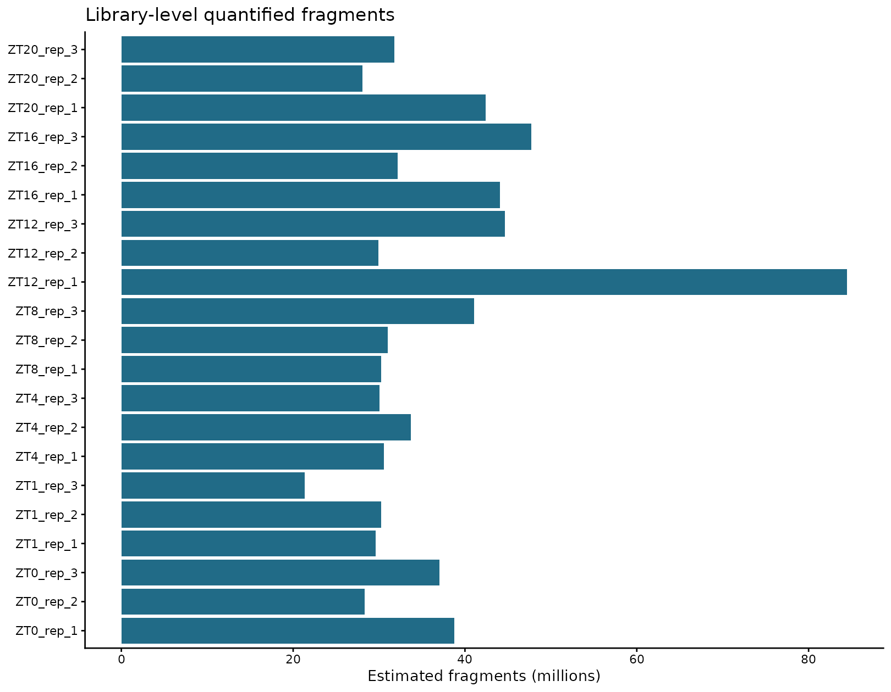

# 08 获取表达矩阵

<!-- normalized-inputs -->
输入字段和项目迁移规则见[输入规范](<附4 输入文件规范与项目迁移.md>)。代码从能看到 `0script` 的项目根目录运行。

本章保留原流程指定的 Trinity `abundance_estimates_to_matrix.pl`：先对齐转录本—基因对应关系，再汇总全部样本，产生基因计数、TPM 和 TMM 表达矩阵。

这里使用的是 Trinity 附带的矩阵整理工具，不是在本章从 reads 进行 de novo 转录本组装。

## 本章从哪里读取参数

以下值来自 [project.env](project.env)，不是写死在函数里的常量。案例值与新项目模板值分别列出；实际运行读取你当前文件中的设置。图形特有参数仍在本章入口集中设置。修改后需重新运行读取/赋值段，再调用函数；已经在内存中的旧变量不会随文件编辑自动刷新。

| 参数 | 当前案例配置 | 空模板默认 | 用途与修改注意 |
| --- | --- | --- | --- |
| `COUNT_MATRIX` | `3Salmon/quanti/gene.counts.matrix` | `3Salmon/quanti/gene.counts.matrix` | 第 10 章等读取的未做 TPM/TMM 归一化的基因计数矩阵路径。 自备矩阵或选择另一套定量时修改；第一列基因 ID、其余列与 sample_id 对应，不能用 TPM 冒充 counts。 |
| `TPM_MATRIX` | `3Salmon/quanti/gene.TPM.not_cross_norm` | `3Salmon/quanti/gene.TPM.not_cross_norm` | 第 16–17 章等读取的基因 TPM 矩阵路径。 换输入时指向真实 TPM；不通过改文件名把 counts 或 TMM 变成 TPM。 |

## 1. 对齐实际定量的转录本集合

GTF 对应表有表头、转录本在前；Trinity 要求无表头、基因在前。转录本数量不一致时应检查冗余序列和缺失映射，不能只通过截断矩阵让程序不报错。

实现：[查看编号脚本](scripts/08_mapping.R)。

<!-- execute: mapping env=rnaseq -->
```r
# 目的：核对各样本定量目标一致并整理 Trinity 所需映射。
# 关键输出：3Salmon/quanti/gene_trans_map.tsv：无表头，第一列 gene_id、第二列 transcript_id。
#   同目录 quant_files.txt：每行一个 quant.sf 路径；reference_transcripts_not_quantified.tsv：未进入定量的参考转录本。
# 运行位置：项目根目录（能看见 0script）；在本章指定环境的 R 中执行。
# 输出/边界：写 gene_trans_map.tsv、quant_files.txt 和未定量参考转录本表；不把未进入参考的基因伪装为零表达，后续从文件衔接。
# 共用读取：readRenviron 读取 project.env；Sys.getenv 返回文本，as.numeric/as.integer 将阈值/种子转成数值。
#   更改配置后需重新执行读取与赋值，旧变量不会自动刷新。
# 本入口没有可调形参；先 source 加载当前定义，再调用函数即可。输入来自本节说明的项目文件，不需要寻找一个并不存在的参数赋值段。

source("0script/tools/metadata.R")
source("0script/tools/outputs.R")
readRenviron("0script/project.env")
source("0script/scripts/08_mapping.R")
run_mapping()
```

### 查看本步关键文件

映射表没有表头，顺序是基因在前、转录本在后；不要与第 03 章有表头的 tx2gene.tsv 混用。文件列表用于确定参与合并的文库。

```bash
# 目的：查看本步文本结果的前 10 行；在项目根目录的 Bash 终端运行，只读不写。
# 前提：上一步已成功完成；报错后即使同名文件存在，也不能据此认定本次成功。
# head -n 10 含表头最多读 10 行；test -f 检查文件；printf 先显示路径，避免混淆。
for preview_file in "3Salmon/quanti/gene_trans_map.tsv" \
  "3Salmon/quanti/quant_files.txt" \
  "3Salmon/quanti/reference_transcripts_not_quantified.tsv"; do
  if test -f "$preview_file"; then
    printf "\n文件：%s\n" "$preview_file"
    head -n 10 "$preview_file"
  else
    printf "尚无此文件：%s；先检查上一步是否完成。\n" "$preview_file"
  fi
done
```

`match` 按实际定量顺序排列映射；双向检查保证每条定量转录本都有且只有一个基因。未进入定量的参考转录本单独保存，不把它们伪造为有定量结果的记录。

## 2. 使用 Trinity 合并矩阵

实现：[查看编号脚本](scripts/08_matrices.sh)。

<!-- execute: matrices env=rnaseq -->
```bash
# 目的：调用 Trinity 附带汇总工具生成基因 counts、TPM 与 TMM 表。
# 关键输出：3Salmon/quanti/genes.gene.counts.matrix、genes.gene.TPM.not_cross_norm、genes.gene.TMM.EXPR.matrix。
#   同目录 genes.isoform.* 为转录本层面的表；下一步整理统一的 gene.* 下游入口，不删除这些原表。
# 前提/去向：输入：gene_trans_map.tsv 与 quant_files.txt；输出 3Salmon/quanti 下 genes 前缀的原始汇总表，本命令不运行转录本组装。
# 先 source 加载同编号脚本定义，再设置下面变量并调用函数；加载本身不启动分析。所有路径相对能看见0script 的项目根目录。
# 本入口无位置参数；样本名/分组从 samples.tsv 获取，线程等共用设置从 project.env 获取，不必逐样本改代码。
# 执行环境：rnaseq；命令退出不代表所有后续章节都已完成，查看本步结果/日志后再继续。

source 0script/scripts/08_matrices.sh
run_matrices
```

### 查看本步关键文件

先看 Trinity 原始汇总表的表头和少量基因，再运行下面的样本列规范化。这里不从头组装转录本。

```bash
# 目的：查看本步文本结果的前 10 行；在项目根目录的 Bash 终端运行，只读不写。
# 前提：上一步已成功完成；报错后即使同名文件存在，也不能据此认定本次成功。
# head -n 10 含表头最多读 10 行；test -f 检查文件；printf 先显示路径，避免混淆。
for preview_file in "3Salmon/quanti/genes.gene.counts.matrix" \
  "3Salmon/quanti/genes.gene.TPM.not_cross_norm" \
  "3Salmon/quanti/genes.gene.TMM.EXPR.matrix"; do
  if test -f "$preview_file"; then
    printf "\n文件：%s\n" "$preview_file"
    head -n 10 "$preview_file"
  else
    printf "尚无此文件：%s；先检查上一步是否完成。\n" "$preview_file"
  fi
done
```

| 参数 | 含义 |
| --- | --- |
| `--est_method salmon` | 按 Salmon 的 `quant.sf` 列格式读取 |
| `--gene_trans_map` | 基因到转录本映射，无表头，制表符分隔 |
| `--name_sample_by_basedir` | 从定量目录取得列名，避免所有文件都叫 `quant.sf` |
| `--quant_files` | 按样本表顺序整理的文件列表 |
| `--cross_sample_norm TMM` | 保留原稿的跨样本组成归一化步骤 |
| `--out_prefix` | 输出前缀，Trinity 再添加 gene/isoform 与矩阵类型后缀 |

## 3. 统一下游入口，并检查样本列

实现：[查看编号脚本](scripts/08_matrix_summary.R)。

<!-- execute: matrix_summary env=rnaseq -->
```r
# 目的：规范已有 Trinity 表的样本列并汇总定量概览。
# 关键输出：3Salmon/quanti/gene.counts.matrix、gene.TPM.not_cross_norm、gene.TMM.EXPR.matrix：统一基因矩阵。
#   同目录 matrix_summary.tsv、mapping_summary.tsv 是文库概览；matrix_overview.png/.pdf 是图。
# 运行位置：项目根目录（能看见 0script）；在本章指定环境的 R 中执行。
# 输出/边界：写通用 counts/TPM/TMM 表、库级汇总与图，保留原 Trinity 输出；不重新定量，主要产物为文件。
# 共用读取：readRenviron 读取 project.env；Sys.getenv 返回文本，as.numeric/as.integer 将阈值/种子转成数值。
#   更改配置后需重新执行读取与赋值，旧变量不会自动刷新。
# 本入口没有可调形参；先 source 加载当前定义，再调用函数即可。输入来自本节说明的项目文件，不需要寻找一个并不存在的参数赋值段。

source("0script/tools/metadata.R")
source("0script/tools/outputs.R")
readRenviron("0script/project.env")
source("0script/scripts/08_matrix_summary.R")
run_matrix_summary()
```

### 查看本步关键文件

矩阵的 gene_id 列后应是 samples.tsv 的 sample_id。counts、TPM、TMM 分别服务计数模型、相对表达和探索展示；摘要用于核对文库规模与定量映射率。

```bash
# 目的：查看本步文本结果的前 10 行；在项目根目录的 Bash 终端运行，只读不写。
# 前提：上一步已成功完成；报错后即使同名文件存在，也不能据此认定本次成功。
# head -n 10 含表头最多读 10 行；test -f 检查文件；printf 先显示路径，避免混淆。
for preview_file in "3Salmon/quanti/gene.counts.matrix" \
  "3Salmon/quanti/gene.TPM.not_cross_norm" \
  "3Salmon/quanti/gene.TMM.EXPR.matrix" \
  "3Salmon/quanti/matrix_summary.tsv" \
  "3Salmon/quanti/mapping_summary.tsv"; do
  if test -f "$preview_file"; then
    printf "\n文件：%s\n" "$preview_file"
    head -n 10 "$preview_file"
  else
    printf "尚无此文件：%s；先检查上一步是否完成。\n" "$preview_file"
  fi
done
```

## 4. 各矩阵的含义

| 文件类型 | 含义与使用位置 | 注意 |
| --- | --- | --- |
| `gene.counts.matrix` | 基因层面 estimated counts，供 DESeq2 使用 | 可有小数；按原流程进入模型时取整，不是 TPM |
| `gene.TPM.not_cross_norm` | 基因层面 TPM，供相对表达展示及时间趋势使用 | 是样本内组成量，不是绝对 RNA 分子数 |
| `gene.TMM.EXPR.matrix` | Trinity 对表达量做 TMM 缩放后的矩阵 | 可作探索性相关性/PCA，不能代替 counts 输入 DESeq2 |
| `genes.isoform.*` | 对应转录本层面的矩阵 | 同一基因可能有多个转录本 |
| `*.TMM_info.txt` / `*.runTMM.R` | TMM 因子与实际生成的 R 代码 | 用于检查软件究竟如何完成标准化 |

TMM 可以缓解组成差异，但不能保证消除所有批次或全局表达变化。TPM 也不是“完全不能跨样本看趋势”；正确说法是其相对组成性质限制了解释，不能直接作为负二项计数模型输入。

## 5. 核对参考覆盖与本次矩阵

实现：[查看编号脚本](scripts/08_reference_accounting.R)。

<!-- execute: reference_accounting env=rnaseq -->
```r
# 目的：区分 GTF 映射、输入 FASTA 和 Salmon 目标三个范围。
# 关键输出：3Salmon/quanti/reference_scope_summary.tsv：GTF、cDNA、Salmon 范围统计。
#   同目录 transcript_reference_accounting.tsv：逐转录本是否进入各范围的核对表。
# 运行位置：项目根目录（能看见 0script）；在本章指定环境的 R 中执行。
# 输出/边界：写 reference_scope_summary.tsv 及逐转录本范围表；仅核账，不能把参考范围差异等同于表达缺失。
# 共用读取：readRenviron 读取 project.env；Sys.getenv 返回文本，as.numeric/as.integer 将阈值/种子转成数值。
#   更改配置后需重新执行读取与赋值，旧变量不会自动刷新。
# 本入口没有可调形参；先 source 加载当前定义，再调用函数即可。输入来自本节说明的项目文件，不需要寻找一个并不存在的参数赋值段。

source("0script/tools/metadata.R")
source("0script/tools/outputs.R")
readRenviron("0script/project.env")
source("0script/scripts/08_reference_accounting.R")
run_reference_accounting()
```

### 查看本步关键文件

查看不同范围的数量及成员标记；未进入参考或定量不能直接解释为该基因表达为零。

```bash
# 目的：查看本步文本结果的前 10 行；在项目根目录的 Bash 终端运行，只读不写。
# 前提：上一步已成功完成；报错后即使同名文件存在，也不能据此认定本次成功。
# head -n 10 含表头最多读 10 行；test -f 检查文件；printf 先显示路径，避免混淆。
for preview_file in "3Salmon/quanti/reference_scope_summary.tsv" \
  "3Salmon/quanti/transcript_reference_accounting.tsv"; do
  if test -f "$preview_file"; then
    printf "\n文件：%s\n" "$preview_file"
    head -n 10 "$preview_file"
  else
    printf "尚无此文件：%s；先检查上一步是否完成。\n" "$preview_file"
  fi
done
```

本次基因 counts、TPM 和 TMM 入口矩阵均为 **27,588 行 × 21 个文库列**，另有一列 `gene_id`。

| 范围 | 转录本数 | 基因数 |
| --- | --- | --- |
| 完整 GTF 映射 | 54,013 | 32,833 |
| 实际输入 cDNA FASTA | 48,359 | 27,655 |
| Salmon 定量目标 | 48,268 | 27,588 |

其中 5,654 条 GTF 转录本不在此次 cDNA 输入范围；另有 91 条输入 cDNA 在 Salmon 日志中记录为序列重复并移除。这两种原因不能混为一谈，更不能把未纳入定量的基因解释为表达量为零。



文库测序深度并不完全相同，差异表达会另行估计大小因子。上图是模型分配的片段总量，不是某个基因的表达量，也不是软件质量评分。
