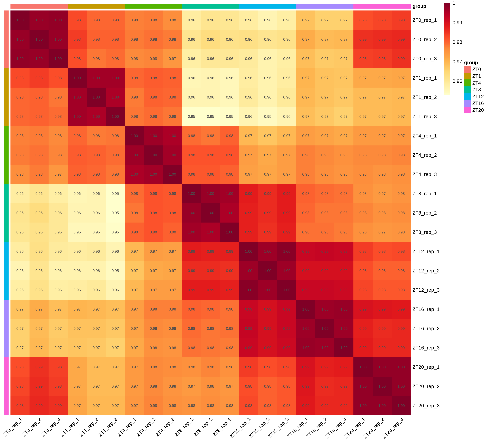

# 09 样本关系、PCA 与表达基因数量

<!-- normalized-inputs -->
输入字段和项目迁移规则见[输入规范](<附4 输入文件规范与项目迁移.md>)。代码从能看到 `0script` 的项目根目录运行。

先看样本是否符合实验设计，再进行组间检验。相关性热图描述两两相似程度，层次聚类显示相似样本如何聚合，PCA 把主要变异投影到低维空间。三者相互补充，不能单独作为自动删样本的依据。

## 本章从哪里读取参数

以下值来自 [project.env](project.env)，不是写死在函数里的常量。案例值与新项目模板值分别列出；实际运行读取你当前文件中的设置。图形特有参数仍在本章入口集中设置。修改后需重新运行读取/赋值段，再调用函数；已经在内存中的旧变量不会随文件编辑自动刷新。

| 参数 | 当前案例配置 | 空模板默认 | 用途与修改注意 |
| --- | --- | --- | --- |
| `RANDOM_SEED` | `20260907` | `20260907` | 随机过程的整数种子；示例固定为 20260907，不需要随日期更新。 通常保留以便复现。变更可能改变随机标签位置或聚类，需另存结果；不保证跨软件版本完全一致。 |
| `TMM_MATRIX` | `3Salmon/quanti/gene.TMM.EXPR.matrix` | `3Salmon/quanti/gene.TMM.EXPR.matrix` | 第 09、13 章等展示使用的 TMM 表达矩阵路径。 换输入时填写实际 TMM；路径不是自动转换命令，缺少时先准备该矩阵或跳过需要它的步骤。 |

## 1. 数据和参数

本章明确读取第 08 章的 TMM 表达矩阵，不在缺失时静默切换为另一种矩阵。Trinity 在这里对 TPM 矩阵进行 TMM 因子缩放，输出为 `TPM / norm.factor`，不是 counts 的 TMM-CPM。因此本章的 TMM > 1 与第 16 章的 TPM > 1 是不同数值口径。相关性与 PCA 使用 `log2(TMM + 1)`，减轻极高表达基因的支配；正式 DESeq2 仍使用 counts。

| 参数或选择 | 含义 |
| --- | --- |
| `check.names = FALSE` | 保留样本原名，不把连字符等自动改成点号 |
| `drop = FALSE` | 选中一列时仍保留二维矩阵 |
| `removeVar = 0.3` | PCA 去除方差最低的 30% 基因，不是保留前 30% |
| `center = TRUE, scale = FALSE` | 每个基因中心化，不把低表达噪声统一放大到单位方差 |
| `encircle` | 样本点的分组包围区域，是视觉辅助，不是置信区间 |
| `ellipse = FALSE` | 不为每组仅 3 个点绘制不稳定的置信椭圆 |
| 均值表达量 > 1 | 描述性阈值，单位为本章 TMM 表达量，不是原始 reads 检出阈值 |
| `pca_x / pca_y` | 默认 PC1/PC2，可选择实际存在的其他成分；改变查看的投影，完整入口仍会执行本章计算 |
| `label_versions / encircle_versions` | 默认各 `c(FALSE, TRUE)`，保留四种展示；可只选一种 |
| `expression_threshold` | 默认 1，只改变表达基因数量的描述性统计，不影响 DESeq2 输入 |

## 2. 相关性、聚类、PCA 与数量图

实现：[查看编号脚本](scripts/09_sample_relationships.R)。

<!-- execute: sample_relationships env=rnaseq -->
```r
# 目的：从 TMM 表达查看相关性、PCA、样本树与表达基因数。
# 关键输出：output_dir/cor方法_removeVar比例_axes横轴-纵轴_expr阈值[__标签]/，如默认 corpearson_removeVar0.3_axesPC1-PC2_expr1。
#   内含 sample_correlation.tsv、pca_scores.tsv、pca_variance.tsv、expressed_gene_count.tsv、gene_exp.RData。
#   图片有 sample_correlation_顺序_numbers_TRUE或FALSE、pca_labels_TRUE或FALSE_encircle_TRUE或FALSE 等 PNG/PDF。
# 运行位置：项目根目录（能看见 0script）；在本章指定环境的 R 中执行。
# 输出/边界：保存多种标签/排列图、相应统计表与来源清单；不可见返回 output_dir，不自动排除异常样本。
# 共用读取：readRenviron 读取 project.env；Sys.getenv 返回文本，as.numeric/as.integer 将阈值/种子转成数值。
#   更改配置后需重新执行读取与赋值，旧变量不会自动刷新。
# 参数设置（下方为本次取值；不需要修改函数内部实现）：
# removeVar：0 到 1 之间且小于 1 的比例；在正方差基因中再去除低变异部分，0.3 指去掉低变异的 30%，不是保留 30%。改变 PCA 使用的基因集合。
# correlation_method：单选 "pearson" 或 "spearman"，均对 log2(TMM+1) 计算样本相关。
#  "pearson"：衡量表达值的线性关系，默认采用；"spearman"：先转为秩，衡量单调关系。
#  换方法会重新计算相关系数，不只是换配色；不据此自动删样本。
# correlation_orders：选 "clustered"、"time_order" 中一个或两个，两个写 c("clustered", "time_order")。
#  "clustered"：按相似性聚类排列；"time_order"：按真实时间排列，没有时间则按组首次出现顺序。
#  两种排列共享同一张相关系数表，适合分别看相似分群和实验设计顺序。
# number_versions：逻辑向量；FALSE 不在相关性热图单元格写数字，TRUE 显示相关系数；c(FALSE, TRUE) 保存两种。
# pca_x：主成分名称字符串，如 PC1；必须在本次 PCA 中存在，用作横轴，不能与 pca_y 相同。
#   PC1 是解释变异最多的成分，PC2/PC3 等依次往后；不是时期编号或比较方向。
#   直接 R 调用可选实际存在的成分；CLI 白名单仅开放 PC1、PC2、PC3、PC4、PC5。
# pca_y：主成分名称字符串，如 PC2；必须在本次 PCA 中存在，用作纵轴，更换它仅改变查看的投影。
# label_versions：逻辑向量；FALSE 不显示样本标签，TRUE 显示，c(FALSE,TRUE) 保存两版。仅控制标签呈现，不改变点的位置、检验结果或模块成员。
# encircle_versions：逻辑向量；FALSE 不画 PCA 分组包围线，TRUE 画，c(FALSE, TRUE) 保存两版。
#  包围线只帮助辨认分组，不是置信区间；不能把它当作组间显著性检验。
# expression_threshold：非负数，单位为输入 TMM 表达量；统计组平均表达量大于该值的基因数，不是 P 值，也不是 TPM 门槛。
# output_dir：字符路径；本函数保存结果的目录。是否拒绝同名文件或复用旧结果以本函数下面的保存步骤为准，不代表自动选择最新结果。
# variant_label：一个文本标签，默认 "" 表示不加额外后缀；如 "large_font" 会给末级结果目录加 __large_font。
#  非空时只用字母、数字、点、下划线、短横线，首字符为字母或数字；不填路径、空格或 NA。
#  调整未进入目录名的图幅、字体等时用不同标签另存；标签本身不改变计算参数。
#  它不是强制覆盖开关：同一路径参数冲突仍停止，不修改旧结果清单。
# 调用：先加载脚本，再设置参数，最后运行函数。改值后重新执行赋值和调用。

source("0script/tools/metadata.R")
source("0script/tools/outputs.R")
readRenviron("0script/project.env")
source("0script/scripts/09_sample_relationships.R")
removeVar <- 0.3
correlation_method <- "pearson"
correlation_orders <- c("clustered", "time_order")
number_versions <- c(FALSE, TRUE)
pca_x <- "PC1"
pca_y <- "PC2"
label_versions <- c(FALSE, TRUE)
encircle_versions <- c(FALSE, TRUE)
expression_threshold <- 1
output_dir <- "4SampleHeatmapPCA"
variant_label <- ""
# interface-parameters: sample_relationships
run_sample_relationships(
  removeVar = removeVar,
  correlation_method = correlation_method,
  correlation_orders = correlation_orders,
  number_versions = number_versions,
  pca_x = pca_x,
  pca_y = pca_y,
  label_versions = label_versions,
  encircle_versions = encircle_versions,
  expression_threshold = expression_threshold,
  output_dir = output_dir,
  variant_label = variant_label
)
```

### 查看本步关键文件

相关表行为样本、列为样本；PCA scores 是每个样本的坐标，variance 是成分解释比例；表达基因数按本章 TMM 阈值统计。本框只沿当前参数定位，不回退到无参数层的历史图目录。

```r
# 目的：只读当前参数路径的关键文本；留在上一框的 R 会话，不重新分析。
# 前提：上一分析已成功或明确提示完整结果复用；若报错/冲突，先处理，不把旧文件当本次成功结果。
# preview_dir/preview_files 只用于查看，不是传给分析函数的新参数。
# file.path 拼接路径；readLines(n = 10) 最多读前 10 行，含表头；不整表读入内存。
# file.exists 检查是否存在；cat 用 sep = "\n" 逐行显示；warn = FALSE 省略末行换行提示。
# nzchar 判断标签是否非空；非空时按原命名规则在末级目录加 __标签。
preview_dir <- file.path(output_dir, parameter_tag(cor = correlation_method, removeVar = removeVar,
  axes = c(pca_x, pca_y), expr = expression_threshold))
if (nzchar(variant_label)) preview_dir <- paste0(preview_dir, "__", variant_label)
preview_files <- file.path(preview_dir, c("sample_correlation.tsv", "pca_scores.tsv", "pca_variance.tsv", "expressed_gene_count.tsv"))
for (preview_file in preview_files) {
  cat("\n文件：", preview_file, "\n")
  if (file.exists(preview_file)) {
    cat(readLines(preview_file, n = 10, warn = FALSE), sep = "\n")
  } else {
    cat("尚无此文件：核对上一步是否完成、是否选择该分析，以及空结果提示。\n")
  }
}
```

### 2.2 PCA：先计算，再决定显示方式

本章入口先计算 PCA，再绘制各展示版本。上表 center/scale/ellipse 是内部既定方法说明，不是 run_sample_relationships 的公开参数；不要在调用中添加这些不存在的形参。只查看已有结果时，直接打开对应图片或 pca_scores.tsv/pca_variance.tsv，无需再执行本章分析。

### 2.3 各组表达基因数量

相关性图有按相似度聚类和按设计顺序排列两种布局，分别有数值与无数值版；普通分组项目沿用样本表首次出现的组别顺序。PCA 的标签和包围区域只是同一结果的四种展示；包围区域并不估计总体分布。表达数量折线只在真实时间设计下生成，因此 ZT0–ZT1 与 ZT4–ZT8 的水平间隔不同，普通处理组不强行连成时间曲线。

本次样本间 Pearson 相关系数范围为 **0.9527–0.9986**；PC1/PC2 分别解释 **46.42%/20.87%** 的变异。图中同一时期的重复相近，不同时间位置有系统差异；这支持继续分析时间相关表达变化，但不能据此证明节律机制或排除所有技术影响。



单元格的 `1.00` 经过两位小数四舍五入，并不表示不同文库完全相同；完整精度在 `sample_correlation.tsv`。聚类/固定顺序、有/无数值四种图均保存。


同一组的颜色在相关性、PCA 和 Top 基因热图间保持一致。PCA 还保存无标签、无轮廓及二者组合，文件名中的 TRUE/FALSE 标明开关。


异常判断必须结合原始质量、定量诊断、实验处理和样本身份，不能为了让组内点靠近而修改数据。本次未启用下面的均值替代分支。

## 3. 离群重复的探索性补救（默认不执行）

一个重复离群不意味着所有分析在软件上必然无法进行。可以先核查技术原因，评估保留全部样本或减少一个重复时的敏感性；在补充新数据前，如果需要用其他重复的均值继续查看表达图形，应仅使用独立副本。

```r
# 目的：明确开启后保存独立的均值替代探索分支。
# 关键输出：4SampleHeatmapPCA/exploratory[__标签]/mean_replaced_expression.tsv
#   和 exploration_note.txt；关闭时不生成任何文件，不把历史探索结果算成本次输出。
# 运行位置：项目根目录（能看见 0script）；在本章指定环境的 R 中执行。
# 输出/边界：FALSE 返回不可见 NULL；TRUE 保存探索矩阵与限制说明并返回 output_dir，不进入正式 DESeq2、不覆盖原矩阵，仍需补充真实实验。
# 参数设置（下方为本次取值；不需要修改函数内部实现）：
# RUN_EXPLORATORY_RESCUE：单个 TRUE/FALSE；FALSE 立即返回、不写文件。只有明确确认探索用途才设 TRUE；替代值不是新增的独立生物学重复。
# target_col：默认 "" 表示尚未指定，只能在关闭分支时留空；启用后填单个字符样本 ID；已由人工核实的待替代列，必须在矩阵和样本表中存在，不能同时出现在source_cols。
# source_cols：character() 表示暂未选择，不是“全部样本”；真正启用时用 c("真实重复1", "真实重复2")。
#   字符向量；同组至少两个不同的真实重复 ID。逐基因取这些列的均值，不允许把替代目标或重复列再当来源。
# variant_label：一个文本标签，默认 "" 表示不加额外后缀；如 "large_font" 会给末级结果目录加 __large_font。
#  非空时只用字母、数字、点、下划线、短横线，首字符为字母或数字；不填路径、空格或 NA。
#  调整未进入目录名的图幅、字体等时用不同标签另存；标签本身不改变计算参数。
#  它不是强制覆盖开关：同一路径参数冲突仍停止，不修改旧结果清单。
# run_exploratory 是函数形参，接收上面的 RUN_EXPLORATORY_RESCUE；两者不是两个独立开关。
# 调用：先加载脚本，再设置参数，最后运行函数。改值后重新执行赋值和调用。

source("0script/scripts/09_exploratory_rescue.R")
RUN_EXPLORATORY_RESCUE <- FALSE
target_col <- ""
source_cols <- character()
variant_label <- ""
run_exploratory_rescue(target_col = target_col, source_cols = source_cols,
  run_exploratory = RUN_EXPLORATORY_RESCUE, variant_label = variant_label)
```


### 查看探索分支（仅在已明确启用后）

```r
# 目的：按本次开关和标签只读探索副本；不启用分析，不查看其他标签的旧文件。
# RUN_EXPLORATORY_RESCUE/variant_label 沿用上一框；FALSE 时仅报告未执行。
# file.path 拼接路径；nzchar 检查标签；readLines(n = 10) 最多显示前 10 行。
if (RUN_EXPLORATORY_RESCUE) {
  preview_dir <- "4SampleHeatmapPCA/exploratory"
  if (nzchar(variant_label)) preview_dir <- paste0(preview_dir, "__", variant_label)
  for (preview_name in c("mean_replaced_expression.tsv", "exploration_note.txt")) {
    preview_file <- file.path(preview_dir, preview_name)
    cat("\n文件：", preview_file, "\n")
    if (file.exists(preview_file)) {
      cat(readLines(preview_file, n = 10, warn = FALSE), sep = "\n")
    } else cat("尚未生成；先核对上一步是否成功。\n")
  }
} else cat("本次未启用均值替代，不读取历史探索文件。\n")
```

实现见 [09_exploratory_rescue.R](scripts/09_exploratory_rescue.R)。均值替代不产生新的独立生物学重复，会人为降低组内变异。本项目不会把替代值送入正式 DESeq2 显著性检验；探索图必须标注处理方式，且仍需后续正式实验、重测或补充重复来支持结论。原始矩阵和正式结果不覆盖。
