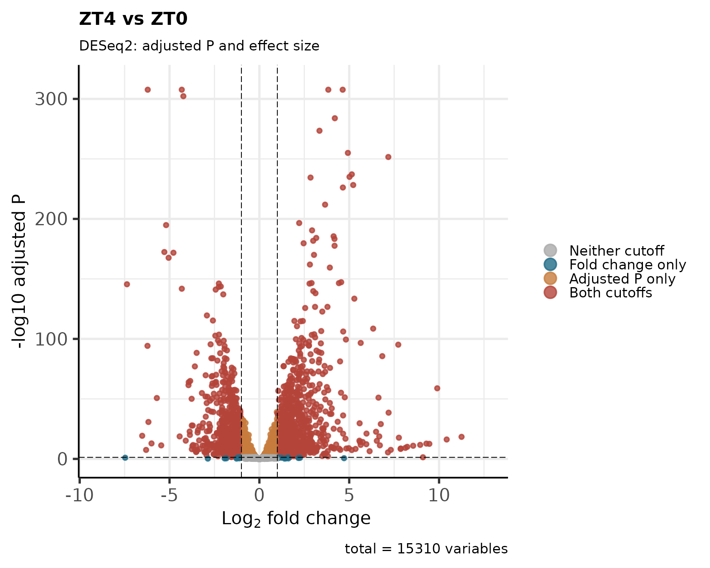
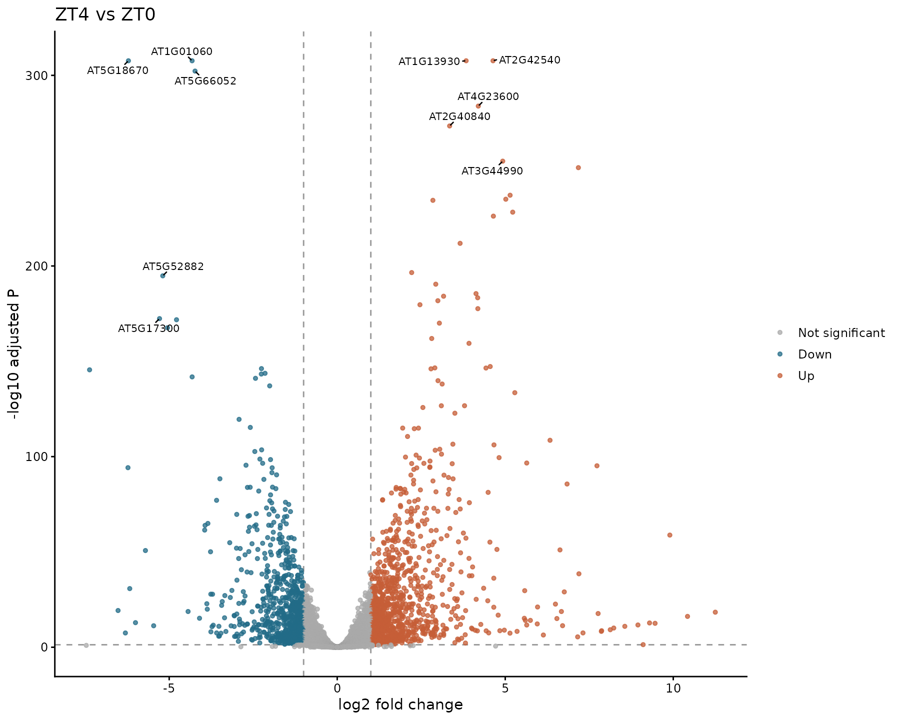

# 12 火山图

<!-- normalized-inputs -->
输入字段和项目迁移规则见[输入规范](<附4 输入文件规范与项目迁移.md>)。代码从能看到 `0script` 的项目根目录运行。

以下代码从项目根目录运行，该目录应能看到 `0script` 和 `5DESeq2`；不要把 R 工作目录设到 `0script`。

火山图横轴是效应量 `log2FoldChange`，纵轴是 `-log10(padj)`。点的位置反映数据与统计结果；点形、颜色、大小及文字标签是展示选择，不改变显著性结论。

## 本章从哪里读取参数

以下值来自 [project.env](project.env)，不是写死在函数里的常量。案例值与新项目模板值分别列出；实际运行读取你当前文件中的设置。图形特有参数仍在本章入口集中设置。修改后需重新运行读取/赋值段，再调用函数；已经在内存中的旧变量不会随文件编辑自动刷新。

| 参数 | 当前案例配置 | 空模板默认 | 用途与修改注意 |
| --- | --- | --- | --- |
| `FDR_CUTOFF` | `0.05` | `0.05` | 差异汇总、火山图及相应富集筛选使用的校正 P 值阈值；默认 0.05。 改小通常筛选更严格。各章具体作用见正文；不等于所有检验共享一次多重校正，也不控制所有同名局部阈值。 |
| `LOG2FC_CUTOFF` | `1` | `1` | 差异方向分类及火山图的绝对 log2FC 阈值；默认 1，即两倍变化。 增大要求更大的效应量；只改分类不重拟合 DESeq2，但须重做受影响汇总/图形并选择对应结果来源。 |
| `RANDOM_SEED` | `20260907` | `20260907` | 随机过程的整数种子；示例固定为 20260907，不需要随日期更新。 通常保留以便复现。变更可能改变随机标签位置或聚类，需另存结果；不保证跨软件版本完全一致。 |
| `DE_RESULT_FILE` | `5DESeq2/de_result.tsv` | `5DESeq2/padj0.05_lfc1/de_result.tsv` | 第 11–15、19–20 章读取的合并差异结果表。 第 10 章重新汇总后更新为实际新文件；更改阈值不会自动把旧表搬到新目录。 |

## 1. 保留三种绘图方式

保留原稿 `plot_Volcano` 函数、EnhancedVolcano 和渐变散点样式，同时保留经典的上调/下调分类配色。每种分别保存无标签和有标签版，共六种。标签默认上下调各最多 5 个，按校正 P 值、效应量和基因 ID 稳定排序；`top_n` 不再与旧版 dplyr 同名函数冲突。

缺失检验值不伪装成 `padj = 1` 的正常点，单独记录未绘制的基因；原结果中的精确零 P 值仅在绘图副本中替换为有限下界，原始数值不覆盖。渐变图保留点形和大小的设计，纵轴统一明确为 `-log10(padj)`，不再额外嵌套未解释的变换。

## 2. 参数入口：先在这里选择要画的内容

| 参数 | 默认值与修改效果 |
| --- | --- |
| `comparison_ids` | 所有启用比较；改成比较表中的一个或多个 ID 只画相应比较 |
| `top_n` | 5，上下调各最多 5 个；改 10 则各最多 10 个；0 不标基因名 |
| `p_cutoff / logfc_cutoff` | 默认 0.05 / 1；用于图中分类和候选标签，不重算 DESeq2；改变后图中分类可能与第 10 章原方向列不同 |
| `methods` | `enhanced`、`classic`、`gradient`；保留全部或选择其中一种 |
| `label_versions` | `c(FALSE, TRUE)` 保存两版；只需带标签时写 `TRUE` |
| `label_size` | 3，基因标签字号；标签变多时可适当减小或加大图幅 |
| `width / height / dpi` | 10 / 8 英寸、180 dpi；dpi 仅控制 PNG 像素密度 |
| `output_root / variant_label` | 默认 `7volcano`；关键参数自动进入子目录。相同目标存在不同设置时，用 `variant_label` 另存，不静默覆盖 |

实现：[查看编号脚本](scripts/12_volcano.R)。

<!-- execute: volcano env=rnaseq -->
```r
# 目的：读取入口表并对所选比较调用火山图函数。
# 关键输出：output_root/比较ID/top标签数_padj阈值_lfc阈值[__标签]/，如 7volcano/比较ID/top5_padj0.05_lfc1/。
#   保存 plot_data.tsv、labeled_genes.tsv、not_plotted.tsv；图名 volcano_方法_labels_TRUE或FALSE.png/.pdf。
#   没有可绘制记录时保存 NO_PLOTTABLE_GENES.txt，不伪造点或标签。
# 运行位置：项目根目录（能看见 0script）；在本章指定环境的 R 中执行。
# 输出/边界：每个比较分别保存图和来源记录，不重新拟合 DESeq2。函数默认值只在本次调用省略该参数时生效。
# 共用读取：readRenviron 读取 project.env；Sys.getenv 返回文本，as.numeric/as.integer 将阈值/种子转成数值。
#   更改配置后需重新执行读取与赋值，旧变量不会自动刷新。
# 参数设置（下方为本次取值；不需要修改函数内部实现）：
# comparison_ids：字符向量或 NULL，比较 ID 必须来自 contrasts.tsv 且已有差异结果。
#  NULL：处理全部启用比较；"Treat_vs_Control"：只处理这一个真实 ID。
#  c("A_vs_Control", "B_vs_Control")：只处理列出的多个比较，名称只是写法示例。
#  不按文件名拆组，不用 ""、NA 或 character() 代替“全部”；换项目从自己的比较表取值。
# top_n：非负整数；火山图上调、下调各最多标注多少个基因，5 改为 10 表示每方向最多 10 个，0 不选标签。先达阈值再排序，不用非显著基因补足名额。
# p_cutoff：数值阈值 (0,1]；火山图使用的 padj 门槛。与 logfc_cutoff 共同决定图中类别和标签候选，不重新计算 P 值。
# logfc_cutoff：正数（必须 >0）；传给火山图核心函数的绝对 log2FC 门槛，1 为两倍变化，0 会被拒绝。修改只改变图中分类/标签，不重拟合 DESeq2。
# methods：火山图样式，可选 "enhanced"、"classic"、"gradient"，可用 c(...) 同时保存。
#  "enhanced"：EnhancedVolcano，颜色表示是否达到效应量阈值、校正 P 值阈值或两者。
#  "classic"：经典散点图，按上调、下调、未达阈值配色，适合直接看变化方向。
#  "gradient"：以 -log10(padj) 连续着色并调整点大小，点形区分方向，突出统计证据强弱。
#  三者使用同一份检验结果；换样式不会重新拟合 DESeq2，也不代表新增生物学证据。
# label_versions：逻辑向量；FALSE 不显示候选基因标签，TRUE 显示，c(FALSE,TRUE) 保存两版。仅控制标签呈现，不改变点的位置、检验结果或模块成员。
# label_size：正数；火山图基因标签字号，默认 3，传入相应绘图库标签设置。标签多时可调小或增大图幅，不是PNG 的 dpi。
# width：正数，单位英寸；画布宽度。仅改变排版，PNG 像素宽约为 width × dpi。
# height：正数，单位英寸；画布高度。仅改变排版，PNG 像素高约为 height × dpi。
# dpi：正数，单位像素/英寸；控制 PNG 像素密度，不改变图幅的英寸数或统计结果。
# output_root：字符路径；本步骤输出根目录，函数再按比较/参数建立子目录。通常沿用；试算可选新目录，但后续读取位置不会自动更新。
# variant_label：一个文本标签，默认 "" 表示不加额外后缀；如 "large_font" 会给末级结果目录加 __large_font。
#  非空时只用字母、数字、点、下划线、短横线，首字符为字母或数字；不填路径、空格或 NA。
#  调整未进入目录名的图幅、字体等时用不同标签另存；标签本身不改变计算参数。
#  它不是强制覆盖开关：同一路径参数冲突仍停止，不修改旧结果清单。
# 调用：先加载脚本，再设置参数，最后运行函数。改值后重新执行赋值和调用。

source("0script/tools/metadata.R")
source("0script/tools/outputs.R")
readRenviron("0script/project.env")
source("0script/scripts/12_volcano.R")
comparison_ids <- NULL
top_n <- 5
p_cutoff <- as.numeric(Sys.getenv("FDR_CUTOFF"))
logfc_cutoff <- as.numeric(Sys.getenv("LOG2FC_CUTOFF"))
methods <- c("enhanced", "classic", "gradient")
label_versions <- c(FALSE, TRUE)
label_size <- 3
width <- 10
height <- 8
dpi <- 180
output_root <- "7volcano"
variant_label <- ""
# interface-parameters: volcano
run_volcano(
  comparison_ids = comparison_ids,
  top_n = top_n,
  p_cutoff = p_cutoff,
  logfc_cutoff = logfc_cutoff,
  methods = methods,
  label_versions = label_versions,
  label_size = label_size,
  width = width,
  height = height,
  dpi = dpi,
  output_root = output_root,
  variant_label = variant_label
)
```

### 查看本步关键文件

本次选中比较的第一个作为查看示例，不按显著性挑选。plot_data 是实际绘图数据；labeled_genes 是候选标签，即使只画无标签图也可能保存；not_plotted 记录无效检验值。

```r
# 目的：只读当前参数路径的关键文本；留在上一框的 R 会话，不重新分析。
# 前提：上一分析已成功或明确提示完整结果复用；若报错/冲突，先处理，不把旧文件当本次成功结果。
# preview_dir/preview_files 只用于查看，不是传给分析函数的新参数。
# file.path 拼接路径；readLines(n = 10) 最多读前 10 行，含表头；不整表读入内存。
# file.exists 检查是否存在；cat 用 sep = "\n" 逐行显示；warn = FALSE 省略末行换行提示。
# nzchar 判断标签是否非空；非空时按原命名规则在末级目录加 __标签。
preview_comparisons <- read_contrasts()
preview_ids <- if (is.null(comparison_ids)) preview_comparisons$contrast_id[preview_comparisons$enabled] else comparison_ids
stopifnot(length(preview_ids) > 0)
preview_id <- preview_ids[1]
cat("示例比较：", preview_id, "\n")
preview_dir <- file.path(output_root, preview_id, parameter_tag(top = top_n, padj = p_cutoff, lfc = logfc_cutoff))
if (nzchar(variant_label)) preview_dir <- paste0(preview_dir, "__", variant_label)
preview_files <- file.path(preview_dir, c("plot_data.tsv", "labeled_genes.tsv", "not_plotted.tsv"))
for (preview_file in preview_files) {
  cat("\n文件：", preview_file, "\n")
  if (file.exists(preview_file)) {
    cat(readLines(preview_file, n = 10, warn = FALSE), sep = "\n")
  } else {
    cat("尚无此文件：核对上一步是否完成、是否选择该分析，以及空结果提示。\n")
  }
}
```

命令行 `--params` 不是上述整张参数表的通用入口：`volcano` 白名单接受 `top_n`、`methods`、`label_versions`、`label_size`、`width/height/dpi` 和 `variant_label`。`p_cutoff/logfc_cutoff` 仍从项目配置读取；`comparison_ids/output_root` 在本节手动参数入口设置，不能原样塞进 JSON。示例见[命令行说明](<附5 结果阅览与命令行.md>)。

## 4. 调用函数：单次与批量任选其一

下面是独立的可选调用，选择一种用法即可，不必与上面的完整调用连续执行。

```r
# 目的：按本节的单次选择运行；这是独立可选示例，不必接在批量分析后执行。
# 关键输出：output_root/比较ID/top标签数_padj阈值_lfc阈值[__标签]/，如 7volcano/比较ID/top5_padj0.05_lfc1/。
#   保存 plot_data.tsv、labeled_genes.tsv、not_plotted.tsv；图名 volcano_方法_labels_TRUE或FALSE.png/.pdf。
#   没有可绘制记录时保存 NO_PLOTTABLE_GENES.txt，不伪造点或标签。
# 输入与输出：使用同一份项目配置和规范输入；输出根目录由下方 output_root 明确指定。
# 文件命名、全部参数的取值含义及限制见本章紧邻的完整参数入口与结果说明。
# 下方把全部公开参数列出，常改项在前，通常沿用项在后；不需要改函数体。
# source 加载函数；readRenviron 先读取配置，保证阈值和种子取自当前项目。
# comparison_id/selected_ids：由比较表取示例 ID，须核实所选比较已启用且已有结果。

source("0script/tools/metadata.R")
source("0script/tools/outputs.R")
readRenviron("0script/project.env")
source("0script/scripts/12_volcano.R")
comparisons <- read_contrasts()
comparison_id <- comparisons$contrast_id[comparisons$enabled][1]

# 本例选择：可以在此更换比较、分析内容和输出位置。
comparison_ids <- comparison_id
top_n <- 10
methods <- "classic"
label_versions <- TRUE
output_root <- "7volcano/custom_top10"

# 通常沿用：数值与原函数默认行为一致；需要调整时仍在这里修改。
p_cutoff <- as.numeric(Sys.getenv("FDR_CUTOFF"))
logfc_cutoff <- as.numeric(Sys.getenv("LOG2FC_CUTOFF"))
label_size <- 3
width <- 10
height <- 8
dpi <- 180
variant_label <- ""

run_volcano(
  comparison_ids = comparison_ids,
  top_n = top_n,
  p_cutoff = p_cutoff,
  logfc_cutoff = logfc_cutoff,
  methods = methods,
  label_versions = label_versions,
  label_size = label_size,
  width = width,
  height = height,
  dpi = dpi,
  output_root = output_root,
  variant_label = variant_label
)
```

### 查看本步关键文件

本次选中比较的第一个作为查看示例，不按显著性挑选。plot_data 是实际绘图数据；labeled_genes 是候选标签，即使只画无标签图也可能保存；not_plotted 记录无效检验值。

```r
# 目的：只读当前参数路径的关键文本；留在上一框的 R 会话，不重新分析。
# 前提：上一分析已成功或明确提示完整结果复用；若报错/冲突，先处理，不把旧文件当本次成功结果。
# preview_dir/preview_files 只用于查看，不是传给分析函数的新参数。
# file.path 拼接路径；readLines(n = 10) 最多读前 10 行，含表头；不整表读入内存。
# file.exists 检查是否存在；cat 用 sep = "\n" 逐行显示；warn = FALSE 省略末行换行提示。
# nzchar 判断标签是否非空；非空时按原命名规则在末级目录加 __标签。
preview_comparisons <- read_contrasts()
preview_ids <- if (is.null(comparison_ids)) preview_comparisons$contrast_id[preview_comparisons$enabled] else comparison_ids
stopifnot(length(preview_ids) > 0)
preview_id <- preview_ids[1]
cat("示例比较：", preview_id, "\n")
preview_dir <- file.path(output_root, preview_id, parameter_tag(top = top_n, padj = p_cutoff, lfc = logfc_cutoff))
if (nzchar(variant_label)) preview_dir <- paste0(preview_dir, "__", variant_label)
preview_files <- file.path(preview_dir, c("plot_data.tsv", "labeled_genes.tsv", "not_plotted.tsv"))
for (preview_file in preview_files) {
  cat("\n文件：", preview_file, "\n")
  if (file.exists(preview_file)) {
    cat(readLines(preview_file, n = 10, warn = FALSE), sep = "\n")
  } else {
    cat("尚无此文件：核对上一步是否完成、是否选择该分析，以及空结果提示。\n")
  }
}
```

上面的默认入口处理全部启用比较；可选示例只处理指定比较，二者不必连续运行。

## 5. 参数和结果选择

`p_cutoff` 与 `logfc_cutoff` 来自入口参数，六种图使用同一份结果。`top_n` 只控制标注数量，少于阈值个数时全部标出，不补入非显著基因。`labels_TRUE/FALSE` 写进文件名，避免多种样式覆盖同一个文件。

例如 `top10_padj0.05_lfc1` 下同时保存图片、`labeled_genes.tsv` 和 `plot_data.tsv`。绘图输入摘要和该函数显式登记的参数记录在 `result_manifest.json`；相同设置的完整结果可复用，不同设置冲突时拒绝覆盖。只改字号等未放入目录名的参数时，设置 `variant_label` 另存。原有图片保留原名，不因本次文档适配重画。

`RANDOM_SEED` 从项目配置读取，但现有火山图函数的结果指纹不包含这个外部种子。只改种子可能仍复用旧图；确实想比较不同随机布局时，同时设置新的 `variant_label` 或 `output_root`，再重新读取配置并绘图。不要修改旧结果清单绕过检查。

带标签图方便查找候选基因，无标签图便于观察整体分布。EnhancedVolcano 保留软件的四类图例：不满足阈值、仅倍数、仅校正 P 值、同时满足；其颜色不直接代表上下调。渐变图突出统计证据和上下调点形，经典图突出上下调类别。选择排版样式不等于重新筛选显著性。

下面以本次 `ZT4_vs_ZT0` 展示六种选择。其他比较具有相同文件结构；全部数值点的位置来自同一份检验结果。

| 方法 | 无基因标签 | 带基因标签 |
| --- | --- | --- |
| EnhancedVolcano |  |  |
| 经典上下调配色 |  |  |
| 渐变与点形 |  |  |
