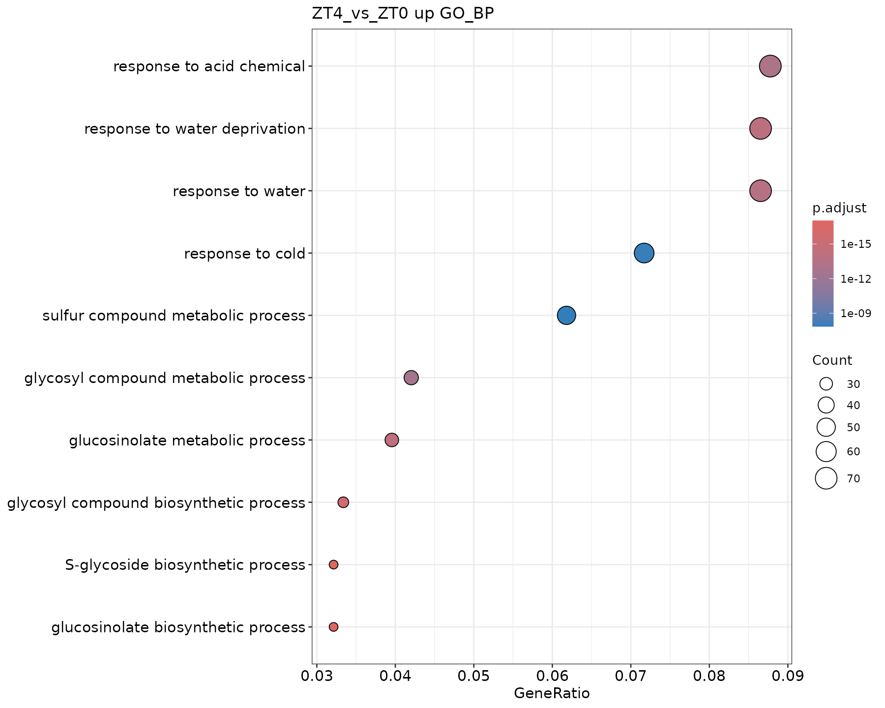

# 14 模式生物 GO 和 KEGG 富集分析

<!-- normalized-inputs -->
输入字段和项目迁移规则见[输入规范](<附4 输入文件规范与项目迁移.md>)。代码从能看到 `0script` 的项目根目录运行。

## 本章从哪里读取参数

以下值来自 [project.env](project.env)，不是写死在函数里的常量。案例值与新项目模板值分别列出；实际运行读取你当前文件中的设置。图形特有参数仍在本章入口集中设置。修改后需重新运行读取/赋值段，再调用函数；已经在内存中的旧变量不会随文件编辑自动刷新。

| 参数 | 当前案例配置 | 空模板默认 | 用途与修改注意 |
| --- | --- | --- | --- |
| `ORGDB_PACKAGE` | `org.At.tair.db` | 空（按条件填写） | 第 14–16 章使用的物种 OrgDb 包名称；案例为 org.At.tair.db。 换物种时安装并填写匹配的包；没有合适 OrgDb 时不能借用拟南芥或小鼠包冒充。 |
| `ORGDB_KEYTYPE` | `TAIR` | 空（按条件填写） | 传给 OrgDb 的基因 ID 类型；案例 TAIR，与输入 gene_id 对应。 通过 AnnotationDbi::keytypes() 核实；修改字符串并不会自动转换基因 ID。 |
| `KEGG_ORGANISM` | `ath` | 空（按条件填写） | 第 14–16 章 KEGG 的物种代码；案例 ath，人类 hsa，小鼠 mmu。 核对目标物种与实际 ID；没有匹配 KEGG 时明确关闭相应分析，不照搬案例代码。 |
| `KEGG_KEYTYPE` | `kegg` | `kegg` | KEGG 接口的 ID 类型；默认 kegg，不是 OrgDb 的 keyType。 按已取得的基因标识核实，可用类型取决于接口；不要把 ENSEMBL 字符串假装成 NCBI GeneID。 |
| `FDR_CUTOFF` | `0.05` | `0.05` | 差异汇总、火山图及相应富集筛选使用的校正 P 值阈值；默认 0.05。 改小通常筛选更严格。各章具体作用见正文；不等于所有检验共享一次多重校正，也不控制所有同名局部阈值。 |
| `DE_RESULT_FILE` | `5DESeq2/de_result.tsv` | `5DESeq2/padj0.05_lfc1/de_result.tsv` | 第 11–15、19–20 章读取的合并差异结果表。 第 10 章重新汇总后更新为实际新文件；更改阈值不会自动把旧表搬到新目录。 |
| `ORA_RESULT_ROOT` | `9Enrichment_Analysis/ORA` | `9Enrichment_Analysis/ORA/fdr0.05_gs10-500_top10-20` | 第 14 章重绘已有模式物种 ORA 结果时读取的根目录。 改统计参数后指向实际新结果；不是自动选择最新目录，也不替代该章运行时的 output_root。 |

## 1. ORA 比较的是什么

过度富集分析（ORA）比较候选基因中某个功能类别的比例与背景中的比例。本章保留全部差异基因的分析，同时分别分析上调和下调。全部集合不保留方向信息，不能把其显著条目直接称为“激活”。

背景取该比较中有有限检验 P 值的基因，进一步受数据库可注释范围限制。不能直接用整个基因组，也不能只用显著基因作背景。输入 ID、数据库和物种必须匹配。

## 2. 参数解释

| 参数 | 本项目设置与含义 |
| --- | --- |
| `OrgDb_name` | 入口参数对应的数据库对象；此案例是 `org.At.tair.db` |
| `keyType` | 此案例为 `TAIR`，换物种须核对 `keytypes()`，不是把参数顺序调换 |
| `organism_name` | KEGG 物种代码，此案例为 `ath`；与 OrgDb 可用物种列表不是一回事 |
| `ont` | BP 生物过程、MF 分子功能、CC 细胞组分、ALL 三类合并分析 |
| `pool = TRUE` | ORA 的 ALL 对合并的条目做检验和校正；不能把三个已校正结果简单拼接冒充同一检验集合 |
| `minGSSize/maxGSSize` | 10/500，限制参与检验的注释基因集大小 |
| `pAdjustMethod` | BH，多重检验校正 |
| `pvalueCutoff` | 计算时先设为 1 保存完整结果；报告按 P 值及 BH 校正值 <= 0.05 筛选 |
| `qvalueCutoff` | GO 为 0.05、KEGG 为 0.2，沿用原稿；qvalue 不是 BH 的同义词 |
| `simplify(cutoff = 0.75)` | 按 GO 语义相似性去冗余，保留校正 P 值较小的代表条目；不是合并基因或重新检验 |
| `term_num` | 默认 `c(10, 20)`；改 `15` 只画 Top15，改 `c(5, 15)` 保存两套；只控制显示数量 |
| `directions` | 默认 `c("all", "up", "down")`；只看上调写 `"up"`，候选方向来自第 10 章 |
| `ontologies / include_kegg` | 默认 BP/MF/CC/ALL 和 KEGG；例如只做 BP 时写 `"BP"`、`FALSE` |
| `fdr_cutoff` | 富集结果的 P/BH 阈值，不会重新划分输入差异基因的 up/down |
| `simplify_cutoff` | 0.75，GO 去冗余的语义相似性阈值；不是显著性阈值 |
| `plot_styles / plot_width / plot_dpi` | 默认条形和点图、单图宽 10 英寸、单图 PNG 180 dpi |
| `overview_dpi` | 综合图 PNG 默认 150 dpi，单独设置；综合图宽 17 英寸，图高自动排版 |
| `output_root` | 默认 `9Enrichment_Analysis/ORA`；改参示例使用独立子目录保留原结果 |

## 3. 富集与绘图函数

保留 `plot_ORA`，将组名和阈值作为显式参数。下面也保留可选自定义 KEGG 映射入口，供末尾非模式支线复用同一绘图逻辑；其具体映射在第 18–19 章说明。

实现：[查看编号脚本](scripts/14_ora_functions.R)。

<!-- execute: ora_functions env=rnaseq -->
```r
# 目的：加载本节共用函数，供后面的分析/重绘入口调用；本段不启动统计或绘图。
# source("路径")：在当前 R 会话读取该脚本及它声明的共用依赖。路径相对项目根目录，不是下载地址。
# 输入：0script/scripts/14_ora_functions.R；产物是 R 会话中的函数定义，不是结果文件。
# 修改脚本后需重新 source；仅加载函数不会自动更新已有结果，后面的参数赋值和调用仍须执行。

source("0script/scripts/14_ora_functions.R")
```

## 4. 运行与可选重绘

### 4.1 准备输入与入口参数

实现：[查看编号脚本](scripts/14_ora_analysis.R)。

<!-- execute: ora_analysis env=rnaseq -->
```r
# 目的：使用本物种 OrgDb 批量运行模式物种 ORA。
# 关键输出：output_root/fdr阈值_gs最小-最大_top展示数/比较ID/方向[__标签]/。
#   默认根目录 9Enrichment_Analysis/ORA；all_tests 为返回的完整检验，raw 为筛选后未去冗余，simplified 为 GO 去冗余结果。
#   保存 *_all_tests.tsv、*_raw.tsv、*_simplified.tsv 和 ORA_results.rds；空/未检验条目另有状态 TXT。
#   同目录 input_genes.txt、tested_background.txt、*_effective_background.txt 分别是候选、可检验背景和注释有效背景。
#   图名如 GO_BP_raw_top10_bar/dot.png/.pdf，综合图以 ORA_overview 开头。
# 运行位置：项目根目录（能看见 0script）；在本章指定环境的 R 中执行。
# 输出/边界：按比较调用 plot_ORA；参数决定本体、方向和检验范围，保存于主线 ORA 目录。
# 共用读取：readRenviron 读取 project.env；Sys.getenv 返回文本，as.numeric/as.integer 将阈值/种子转成数值。
#   更改配置后需重新执行读取与赋值，旧变量不会自动刷新。
# 参数设置（下方为本次取值；不需要修改函数内部实现）：
# comparison_ids：字符向量或 NULL，比较 ID 必须来自 contrasts.tsv 且已有差异结果。
#  NULL：处理全部启用比较；"Treat_vs_Control"：只处理这一个真实 ID。
#  c("A_vs_Control", "B_vs_Control")：只处理列出的多个比较，名称只是写法示例。
#  不按文件名拆组，不用 ""、NA 或 character() 代替“全部”；换项目从自己的比较表取值。
# term_num：正整数向量；每种图最多展示的富集条目数，如 c(10,20) 各出 Top10/Top20，只取已有达标条目，不强行补足。要避免重算请选择重绘入口；
#   完整分析入口改此值仍会运行相应分析。
# directions：只能从 "all"、"up"、"down" 中选一个或多个，多个写 c("all", "up", "down")。
#  "up"：差异表中 direction=up 的上调基因；"down"：direction=down 的下调基因。
#  "all"：上述两类的并集，不包含 ns，不是全部被检验基因；方向均相对比较表的参照组。
#  第 11 章只据此选集合；第 14/19 章会对所选方向分别做富集，不合并为同一次检验。
# ontologies：GO 本体，选 "BP"、"MF"、"CC"、"ALL" 中一个或多个，大小写按此填写。
#  "BP"：生物过程，如基因参与什么活动；"MF"：分子功能，如结合或催化能力。
#  "CC"：细胞组分，如位于什么结构；"ALL"：把三类 GO 条目合在同一次本体分析中。
#  c("BP", "MF", "CC", "ALL") 会分别运行四套，ALL 不是前三张显著表的简单拼接。
#  改本体会改变检验集合和校正范围；不只是换标题，不能在重绘阶段补算缺少的本体。
# include_kegg：单个 TRUE/FALSE；TRUE 计算所选路线的 KEGG 富集，FALSE 跳过 KEGG、仍分析所选 GO。
#  官方路线 TRUE 需匹配的物种代码、基因 ID 及可用 KEGG 服务；自建路线 TRUE 需第 18 章通路映射。
#  没有匹配注释时用 FALSE 明确跳过，不用另一物种的数据冒充。
# fdr_cutoff：数值阈值，通常 0.05，范围 (0,1]；控制当前步骤的校正 P 值筛选，调小更严格。各比较/富集本体分别校正，不代表全项目共同做一次 BH。
# minGSSize：正整数；与输入/背景匹配后的基因集中允许的最少基因数。提高会排除较小条目，改变参与检验的条目集合。
# maxGSSize：正整数，且不小于 minGSSize；允许的最大基因集规模。降低会排除过大的条目，改变检验范围。
# simplify_cutoff：0–1 数值；GO 语义相似性去冗余门槛，不是 P 值。越低越容易将相似条目合并；原始 raw 结果仍单独保留，KEGG 不做这项 GO 简化。
# go_qvalue：0–1 数值；GO ORA 的 q-value 筛选设置，另于 fdr_cutoff 的 BH/p.adjust 门槛。不是图中条目数量，也不用于 GSEA。
# kegg_qvalue：0–1 数值；KEGG ORA 的 q-value 筛选设置，独立于 BH 门槛；改它会影响保留的通路。
# plot_styles：ORA 图形样式，选 "bar"、"dot" 中一个或两个，两个写 c("bar", "dot")。
#  "bar"：条形图便于比较条目命中数量；"dot"：点图同时展示比例、命中数及校正 P 值。
#  具体轴与图例以图片为准；二者共享同一份富集对象，不产生第二次检验。
# plot_width：正数，单位英寸；输出图宽。增大可缓解标签拥挤，不改变统计筛选。
# plot_dpi：正数，单位像素/英寸；PNG 的像素密度。相同英寸下越大像素越多、文件通常越大；PDF 的矢量图形不靠此值提高清晰度。
# overview_dpi：正数，像素/英寸；多面板富集综合图的 PNG 密度，与单张图的 plot_dpi 独立。
# output_root：字符路径；本步骤输出根目录，函数再按比较/参数建立子目录。通常沿用；试算可选新目录，但后续读取位置不会自动更新。
# kegg_keytype：官方 KEGG 接口的输入 ID 类型，取自 KEGG_KEYTYPE，单选一个字符串。
#  "kegg"：该物种的 KEGG 基因编号；"ncbi-geneid"：NCBI GeneID。
#  "ncbi-proteinid"：NCBI 蛋白编号；"uniprot"：UniProt 编号。
#  只有物种和当前输入 ID 存在可用映射才可选；不能将 ENSEMBL、TAIR 等直接写成这里的新选项。
#  本流程不自动替你转换差异表 ID；include_kegg=FALSE 时不调用官方 KEGG 接口。
# variant_label：一个文本标签，默认 "" 表示不加额外后缀；如 "large_font" 会给末级结果目录加 __large_font。
#  非空时只用字母、数字、点、下划线、短横线，首字符为字母或数字；不填路径、空格或 NA。
#  调整未进入目录名的图幅、字体等时用不同标签另存；标签本身不改变计算参数。
#  它不是强制覆盖开关：同一路径参数冲突仍停止，不修改旧结果清单。
# 调用：先加载脚本，再设置参数，最后运行函数。改值后重新执行赋值和调用。

source("0script/tools/metadata.R")
source("0script/tools/outputs.R")
readRenviron("0script/project.env")
source("0script/scripts/14_ora_analysis.R")
comparison_ids <- NULL
term_num <- c(10, 20)
directions <- c("all", "up", "down")
ontologies <- c("BP", "MF", "CC", "ALL")
include_kegg <- TRUE
fdr_cutoff <- as.numeric(Sys.getenv("FDR_CUTOFF"))
minGSSize <- 10
maxGSSize <- 500
simplify_cutoff <- 0.75
go_qvalue <- 0.05
kegg_qvalue <- 0.2
plot_styles <- c("bar", "dot")
plot_width <- 10
plot_dpi <- 180
overview_dpi <- 150
output_root <- "9Enrichment_Analysis/ORA"
kegg_keytype <- Sys.getenv("KEGG_KEYTYPE", "kegg")
variant_label <- ""
# interface-parameters: ora_analysis
run_ora_analysis(
  comparison_ids = comparison_ids,
  term_num = term_num,
  directions = directions,
  ontologies = ontologies,
  include_kegg = include_kegg,
  fdr_cutoff = fdr_cutoff,
  minGSSize = minGSSize,
  maxGSSize = maxGSSize,
  simplify_cutoff = simplify_cutoff,
  go_qvalue = go_qvalue,
  kegg_qvalue = kegg_qvalue,
  plot_styles = plot_styles,
  plot_width = plot_width,
  plot_dpi = plot_dpi,
  overview_dpi = overview_dpi,
  output_root = output_root,
  kegg_keytype = kegg_keytype,
  variant_label = variant_label
)
```

### 查看本步关键文件

示例查看本次第一个比较和第一个方向；候选名单与背景名单用途不同。检验表中 ID/Description 为条目，Count 为命中数，p.adjust 为校正 P 值；不要把 raw 当成未筛选的完整检验。

```r
# 目的：只读当前参数路径的关键文本；留在上一框的 R 会话，不重新分析。
# 前提：上一分析已成功或明确提示完整结果复用；若报错/冲突，先处理，不把旧文件当本次成功结果。
# preview_dir/preview_files 只用于查看，不是传给分析函数的新参数。
# file.path 拼接路径；readLines(n = 10) 最多读前 10 行，含表头；不整表读入内存。
# file.exists 检查是否存在；cat 用 sep = "\n" 逐行显示；warn = FALSE 省略末行换行提示。
# nzchar 判断标签是否非空；非空时按原命名规则在末级目录加 __标签。
preview_comparisons <- read_contrasts()
preview_ids <- if (is.null(comparison_ids)) preview_comparisons$contrast_id[preview_comparisons$enabled] else comparison_ids
stopifnot(length(preview_ids) > 0)
preview_id <- preview_ids[1]
cat("示例比较：", preview_id, "\n")
preview_dir <- file.path(output_root, parameter_tag(fdr = fdr_cutoff, gs = c(minGSSize, maxGSSize),
  top = term_num), preview_id, directions[1])
if (nzchar(variant_label)) preview_dir <- paste0(preview_dir, "__", variant_label)
preview_annotations <- c(paste0("GO_", ontologies), if (include_kegg) "KEGG" else character())
stopifnot(length(preview_annotations) > 0)
preview_annotation <- preview_annotations[1]
preview_files <- file.path(preview_dir, c("input_genes.txt", "tested_background.txt", paste0(preview_annotation, c("_all_tests.tsv", "_raw.tsv", "_simplified.tsv"))))
if (preview_annotation == "KEGG") preview_files <- preview_files[!grepl("_simplified.tsv$", preview_files)]
for (preview_file in preview_files) {
  cat("\n文件：", preview_file, "\n")
  if (file.exists(preview_file)) {
    cat(readLines(preview_file, n = 10, warn = FALSE), sep = "\n")
  } else {
    cat("尚无此文件：核对上一步是否完成、是否选择该分析，以及空结果提示。\n")
  }
}
```

### 4.2 单次示例（可选）

```r
# 目的：按本节的单次选择运行；这是独立可选示例，不必接在批量分析后执行。
# 关键输出：output_root/fdr阈值_gs最小-最大_top展示数/比较ID/方向[__标签]/。
#   默认根目录 9Enrichment_Analysis/ORA；all_tests 为返回的完整检验，raw 为筛选后未去冗余，simplified 为 GO 去冗余结果。
#   保存 *_all_tests.tsv、*_raw.tsv、*_simplified.tsv 和 ORA_results.rds；空/未检验条目另有状态 TXT。
#   同目录 input_genes.txt、tested_background.txt、*_effective_background.txt 分别是候选、可检验背景和注释有效背景。
#   图名如 GO_BP_raw_top10_bar/dot.png/.pdf，综合图以 ORA_overview 开头。
# 输入与输出：使用同一份项目配置和规范输入；输出根目录由下方 output_root 明确指定。
# 文件命名、全部参数的取值含义及限制见本章紧邻的完整参数入口与结果说明。
# 下方把全部公开参数列出，常改项在前，通常沿用项在后；不需要改函数体。
# source 加载函数；readRenviron 先读取配置，保证阈值和种子取自当前项目。
# comparison_id/selected_ids：由比较表取示例 ID，须核实所选比较已启用且已有结果。

source("0script/tools/metadata.R")
source("0script/tools/outputs.R")
readRenviron("0script/project.env")
source("0script/scripts/14_ora_analysis.R")
comparison_id <- with(read_contrasts(), contrast_id[enabled][1])

# 本例选择：可以在此更换比较、分析内容和输出位置。
comparison_ids <- comparison_id
term_num <- 15
directions <- "up"
ontologies <- "BP"
include_kegg <- FALSE
output_root <- "9Enrichment_Analysis/ORA/custom"

# 通常沿用：数值与原函数默认行为一致；需要调整时仍在这里修改。
fdr_cutoff <- as.numeric(Sys.getenv("FDR_CUTOFF"))
minGSSize <- 10
maxGSSize <- 500
simplify_cutoff <- 0.75
go_qvalue <- 0.05
kegg_qvalue <- 0.2
plot_styles <- c("bar", "dot")
plot_width <- 10
plot_dpi <- 180
overview_dpi <- 150
kegg_keytype <- Sys.getenv("KEGG_KEYTYPE", "kegg")
variant_label <- ""

run_ora_analysis(
  comparison_ids = comparison_ids,
  term_num = term_num,
  directions = directions,
  ontologies = ontologies,
  include_kegg = include_kegg,
  fdr_cutoff = fdr_cutoff,
  minGSSize = minGSSize,
  maxGSSize = maxGSSize,
  simplify_cutoff = simplify_cutoff,
  go_qvalue = go_qvalue,
  kegg_qvalue = kegg_qvalue,
  plot_styles = plot_styles,
  plot_width = plot_width,
  plot_dpi = plot_dpi,
  overview_dpi = overview_dpi,
  output_root = output_root,
  kegg_keytype = kegg_keytype,
  variant_label = variant_label
)
```

### 查看本步关键文件

示例查看本次第一个比较和第一个方向；候选名单与背景名单用途不同。检验表中 ID/Description 为条目，Count 为命中数，p.adjust 为校正 P 值；不要把 raw 当成未筛选的完整检验。

```r
# 目的：只读当前参数路径的关键文本；留在上一框的 R 会话，不重新分析。
# 前提：上一分析已成功或明确提示完整结果复用；若报错/冲突，先处理，不把旧文件当本次成功结果。
# preview_dir/preview_files 只用于查看，不是传给分析函数的新参数。
# file.path 拼接路径；readLines(n = 10) 最多读前 10 行，含表头；不整表读入内存。
# file.exists 检查是否存在；cat 用 sep = "\n" 逐行显示；warn = FALSE 省略末行换行提示。
# nzchar 判断标签是否非空；非空时按原命名规则在末级目录加 __标签。
preview_comparisons <- read_contrasts()
preview_ids <- if (is.null(comparison_ids)) preview_comparisons$contrast_id[preview_comparisons$enabled] else comparison_ids
stopifnot(length(preview_ids) > 0)
preview_id <- preview_ids[1]
cat("示例比较：", preview_id, "\n")
preview_dir <- file.path(output_root, parameter_tag(fdr = fdr_cutoff, gs = c(minGSSize, maxGSSize),
  top = term_num), preview_id, directions[1])
if (nzchar(variant_label)) preview_dir <- paste0(preview_dir, "__", variant_label)
preview_annotations <- c(paste0("GO_", ontologies), if (include_kegg) "KEGG" else character())
stopifnot(length(preview_annotations) > 0)
preview_annotation <- preview_annotations[1]
preview_files <- file.path(preview_dir, c("input_genes.txt", "tested_background.txt", paste0(preview_annotation, c("_all_tests.tsv", "_raw.tsv", "_simplified.tsv"))))
if (preview_annotation == "KEGG") preview_files <- preview_files[!grepl("_simplified.tsv$", preview_files)]
for (preview_file in preview_files) {
  cat("\n文件：", preview_file, "\n")
  if (file.exists(preview_file)) {
    cat(readLines(preview_file, n = 10, warn = FALSE), sep = "\n")
  } else {
    cat("尚无此文件：核对上一步是否完成、是否选择该分析，以及空结果提示。\n")
  }
}
```

### 4.3 批量调用（与单次示例任选其一）

第 19 章直接加载维护中的编号函数脚本，不依赖先运行本章生成函数文件。上面的完整入口与单次示例任选其一。

### 4.4 已有结果只换 Top 数量或图形

实现：[只重绘脚本](scripts/14_ora_redraw.R)。以下调用只读取已有对象，不重新检验。

```r
# 目的：只读取指定 ORA 对象重新安排 Top 条目展示。
# 关键输出：redraw_dir[__标签]/：所选 ORA 对象的 Top 条形图/点图，例如 GO_BP_raw_top15_bar.png/.pdf。
#   不再保存一份新统计表；原始统计在 source_dir/ORA_results.rds 及对应的 TSV，原对象不变。
# 运行位置：项目根目录（能看见 0script）；在本章指定环境的 R 中执行。
# 输出/边界：重绘另存，不重新富集、不访问在线 KEGG 获取新检验；来源对象不存在会停止。
# 共用读取：readRenviron 读取 project.env；Sys.getenv 返回文本，as.numeric/as.integer 将阈值/种子转成数值。
#   更改配置后需重新执行读取与赋值，旧变量不会自动刷新。
# 参数设置（下方为本次取值；不需要修改函数内部实现）：
# comparison_id：本次明确选取的比较 ID；示例用已启用比较中的第一个，不代表所有项目都有某个固定 ZT 名称。
# source_dir：字符路径；明确选择已完成的原结果目录，内部须有本函数要读取的 RDS/TSV。不会查找最近一次运行，也不从别的项目回退。
# redraw_dir：字符路径；保存重绘结果的新目录。原对象保持不动；相同目录参数冲突时用新目录或variant_label，不能靠覆盖隐藏差别。
# term_num：单个正整数，默认 15；本次重绘最多展示多少个已有条目，不重新检验。
#   这个重绘入口不接受 c(10,20)；要两种 Top 图，分别设置 10 和 20，并使用不同 redraw_dir。
# annotation：重绘时选择一个已有对象："GO_BP" 生物过程、"GO_MF" 分子功能、
#  "GO_CC" 细胞组分、"GO_ALL" 三类合并、"KEGG" 通路。
#  必须已经存在于所选来源的结果对象中；它不是下载数据库或补算本体的开关。
# result_style：单选 "raw" 或 "simplified"；与 annotation 一起选择已经保存的结果。
#  "raw"：通过筛选但未做 GO 语义去冗余；不是完整检验表，完整检验见 *_all_tests.tsv。
#  "simplified"：已有 GO 去冗余代表条目；KEGG 只使用 "raw"。
#  重绘不会补做 simplify，缺少对应对象时先核对来源，不能只改文件名。
# variant_label：一个文本标签，默认 "" 表示不加额外后缀；如 "large_font" 会给末级结果目录加 __large_font。
#  非空时只用字母、数字、点、下划线、短横线，首字符为字母或数字；不填路径、空格或 NA。
#  调整未进入目录名的图幅、字体等时用不同标签另存；标签本身不改变计算参数。
#  它不是强制覆盖开关：同一路径参数冲突仍停止，不修改旧结果清单。
# with(read_contrasts(), contrast_id[enabled][1])：先取 enabled=TRUE 的比较，再选第一个 ID；不是按 P值挑比较。
# 路径组合：file.path 按目录层级拼接；project_result 读取配置指定来源并核对存在，不查找最新目录。重绘来源与输出目录应分清。
# 调用：先加载脚本，再设置参数，最后运行函数。改值后重新执行赋值和调用。

source("0script/tools/metadata.R")
source("0script/tools/outputs.R")
readRenviron("0script/project.env")
source("0script/scripts/14_ora_redraw.R")
comparison_id <- with(read_contrasts(), contrast_id[enabled][1])
source_dir <- file.path(project_result("ORA_RESULT_ROOT", "9Enrichment_Analysis/ORA"), comparison_id, "up")
redraw_dir <- file.path(source_dir, "custom_top15")
term_num <- 15
annotation <- "GO_BP"
result_style <- "raw"
variant_label <- ""
# interface-parameters: ora_redraw
run_ora_redraw(
  comparison_id = comparison_id,
  source_dir = source_dir,
  redraw_dir = redraw_dir,
  term_num = term_num,
  annotation = annotation,
  result_style = result_style,
  variant_label = variant_label
)
```

### 查看本步关键文件

重绘没有重新检验；这里查看所选来源对象对应的原 TSV，新图保存在上面的 redraw_dir（有标签时加后缀）。

```r
# 目的：只读当前参数路径的关键文本；留在上一框的 R 会话，不重新分析。
# 前提：上一分析已成功或明确提示完整结果复用；若报错/冲突，先处理，不把旧文件当本次成功结果。
# preview_dir/preview_files 只用于查看，不是传给分析函数的新参数。
# file.path 拼接路径；readLines(n = 10) 最多读前 10 行，含表头；不整表读入内存。
# file.exists 检查是否存在；cat 用 sep = "\n" 逐行显示；warn = FALSE 省略末行换行提示。
preview_dir <- source_dir
preview_files <- file.path(preview_dir, paste0(annotation, "_", result_style, ".tsv"))
for (preview_file in preview_files) {
  cat("\n文件：", preview_file, "\n")
  if (file.exists(preview_file)) {
    cat(readLines(preview_file, n = 10, warn = FALSE), sep = "\n")
  } else {
    cat("尚无此文件：核对上一步是否完成、是否选择该分析，以及空结果提示。\n")
  }
}
```

## 5. 结果文件与限制

`all_tests` 保存可检验条目的原始结果，`raw` 是显著但未去冗余的结果，`simplified` 是 GO 去冗余结果。`GeneRatio`/`BgRatio` 的分母取决于有效注释覆盖，并非固定等于输入文件行数；具体基因背景另存为 TXT。

条形图、点图、Top10/Top20 和拼图只改变展示。KEGG 网络或数据库错误会留下失败日志并停止该任务，不能用“无显著条目”掩盖失败。

部分 GO 名称换行后很长，尤其是 MF 条目。`enrichment_plot_height()` 根据实际显示标签的行数预留间距，综合图按每一行面板所需高度分配空间；不通过删条目或截断名称来腾位置。只补救已有图的标签拥挤时，可读取 `ORA_results.rds`，用 `refresh_layout_only = TRUE` 调用对应绘图函数，保留不需要增高的原图片。

图高公式中的 12 是默认标签字号（pt），6 是额外行距，72 pt 等于 1 英寸，另留 2 英寸给标题和坐标等区域。这些都是排版尺寸，不是显著性阈值。

本机 enrichplot 1.30.4 的条形图可能报告内部 `by = "Count"` 参数未使用，这是 `barplot` 向 `fortify` 传参时产生的兼容提示。已核对该版本仍从数据表的 `Count` 列构造横轴；此提示不修改 ORA 检验值。保留提示与包版本记录，不为消除它而换用另一套统计方法。

## 6. 本次结果示例

以 ZT4_vs_ZT0 的上调集合为例，GO BP 通过阈值的条目为 119 个，去冗余后保留 85 个；KEGG 为 11 个。GO CC 在同一设置下没有显著条目，因此综合图中省略 CC 面板，并在目录中保留说明文件。空面板不表示代码没有执行。

| GO BP 条形图 | GO BP 点图 |
| --- | --- |
|  |  |

这些图选取同一结果中的条目，但横轴不同：默认条形图是命中基因数，点图横轴是 GeneRatio，点大小是 Count、颜色是校正 P 值。不要只比较条形长度与点的横坐标。


例如 `GO:0019761`（glucosinolate biosynthetic process）命中 26 个基因，GeneRatio 为 `26/809`，BgRatio 为 `41/11616`，FoldEnrichment 约为 9.11。809 和 11,616 是本次 GO BP 检验实际匹配注释后的候选/背景数量，不是所有上调基因数或整个基因组大小。该结果表明相关注释在上调集合中过度代表，不能单凭富集结果断言代谢通量增加。

其余比较及 all/down 集合均按相同规则保存；本节只选一个示例解释，不将不同检验集合拼成一份统计结论。
