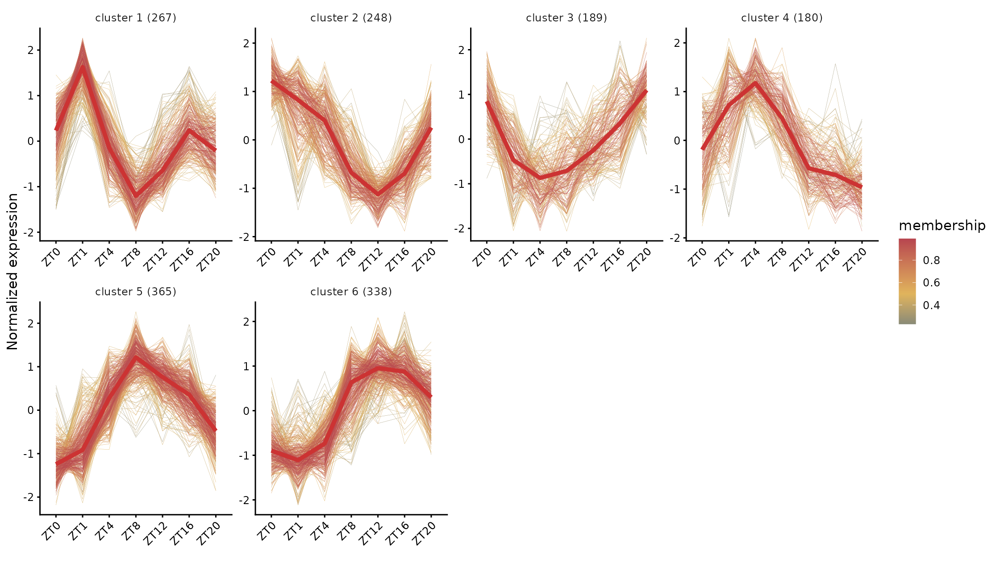
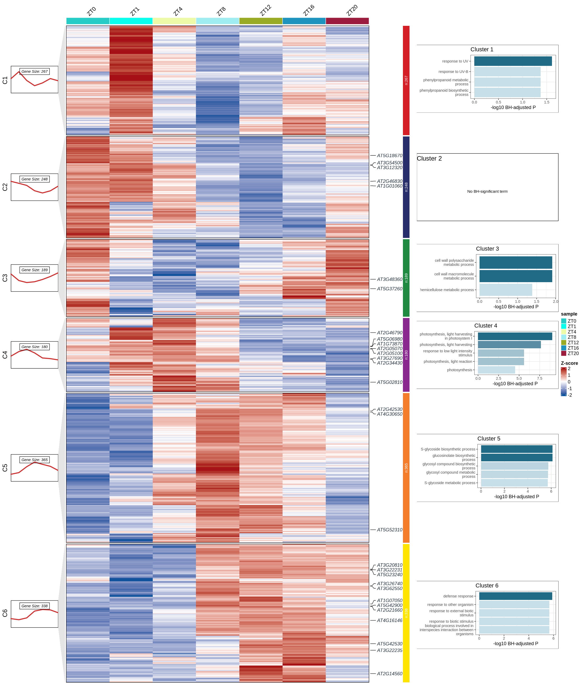

# 16 时间序列聚类：ClusterGVis 与 Mfuzz

<!-- normalized-inputs -->
输入字段和项目迁移规则见[输入规范](<附4 输入文件规范与项目迁移.md>)。代码从能看到 `0script` 的项目根目录运行。

以下代码从项目根目录运行，该目录应能看到 `0script`、`3Salmon` 和 `10Time_Series`；不要把 R 工作目录设到 `0script`。第 3 节说明函数与图形层次，第 4 节直接加载编号脚本并调用；不从日志导出函数。

## 本章从哪里读取参数

以下值来自 [project.env](project.env)，不是写死在函数里的常量。案例值与新项目模板值分别列出；实际运行读取你当前文件中的设置。图形特有参数仍在本章入口集中设置。修改后需重新运行读取/赋值段，再调用函数；已经在内存中的旧变量不会随文件编辑自动刷新。

| 参数 | 当前案例配置 | 空模板默认 | 用途与修改注意 |
| --- | --- | --- | --- |
| `ORGDB_PACKAGE` | `org.At.tair.db` | 空（按条件填写） | 第 14–16 章使用的物种 OrgDb 包名称；案例为 org.At.tair.db。 换物种时安装并填写匹配的包；没有合适 OrgDb 时不能借用拟南芥或小鼠包冒充。 |
| `ORGDB_KEYTYPE` | `TAIR` | 空（按条件填写） | 传给 OrgDb 的基因 ID 类型；案例 TAIR，与输入 gene_id 对应。 通过 AnnotationDbi::keytypes() 核实；修改字符串并不会自动转换基因 ID。 |
| `KEGG_ORGANISM` | `ath` | 空（按条件填写） | 第 14–16 章 KEGG 的物种代码；案例 ath，人类 hsa，小鼠 mmu。 核对目标物种与实际 ID；没有匹配 KEGG 时明确关闭相应分析，不照搬案例代码。 |
| `RANDOM_SEED` | `20260907` | `20260907` | 随机过程的整数种子；示例固定为 20260907，不需要随日期更新。 通常保留以便复现。变更可能改变随机标签位置或聚类，需另存结果；不保证跨软件版本完全一致。 |
| `TPM_MATRIX` | `3Salmon/quanti/gene.TPM.not_cross_norm` | `3Salmon/quanti/gene.TPM.not_cross_norm` | 第 16–17 章等读取的基因 TPM 矩阵路径。 换输入时指向真实 TPM；不通过改文件名把 counts 或 TMM 变成 TPM。 |
| `TIME_INPUT_FILE` | `10Time_Series/clustering_input_log2.tsv` | `10Time_Series/input_tpm1/clustering_input_log2.tsv` | 第 16 章聚类所用已生成的 log2 表达输入文件。 输入过滤参数变化后指向新的准备结果；不把原始 TPM 直接冒充已处理文件。 |
| `TIME_RESULT_ROOT` | `10Time_Series` | `10Time_Series` | 第 16、19 章重绘/支线读取已有聚类组合的根目录。 通常保持 10Time_Series；若聚类输出到 custom 等目录，应明确更新，不按修改时间找文件。 |
| `TIME_VARIANT_DIR` | 空（按条件填写） | `mark30_GOtop5_seed20260907` | 聚类的 top_var_prop/Clusters_num 组合下，mark/GOtop/seed 末级目录。 旧案例结果没有该层时为空；新运行按真实目录填写。改值只是选择已有组合，不重算聚类。 |

## 1. 看表达形状，不把聚类当作周期检验

Mfuzz 将变化形状相近的基因归入模块。一个基因对多个模块都有隶属度，结果表中的 `cluster` 是隶属度最大的模块，并不表示它只能参与一种过程。行标准化让不同表达量的基因可以比较形状，但会弱化绝对表达量信息。

使用 **ClusterGVis 0.1.2、Mfuzz**，在 `rnaseq_time` 环境运行。七个时期全部保留；ZT0、ZT1、ZT4 等间隔不相等，ClusterGVis 图上的横轴是有序时期，不是严格按小时缩放的动力学曲线。第 17 章才进行等间隔周期检验。

本机时间环境中的 `org.At.tair.db/GO.db` 为 3.20.0，常规分析环境中为 3.22.0。模块富集按时间环境的实际注释版本记录；不能把它与第 14 章不同背景、不同注释版本的数值当作同一次检验的重复结果。完整包版本见 `0script/runlogs/environments`，本次不为追求数字一致而升级指定环境。


衔接下一步：使用本节新生成的输入时，无论阈值是否改变，都先把 `project.env` 中 `TIME_INPUT_FILE` 指向本次目录的 `clustering_input_log2.tsv`，然后重新读取配置。例如无标签且阈值为 1 时是 `10Time_Series/input_tpm1/clustering_input_log2.tsv`。案例配置保留的是已经完成的历史输入路径，不会自动切换到新目录。

Mfuzz 聚类至少需要 **3 个真实时期**；选中的高变基因数必须严格大于模块数。两时期可做组间差异，但不能直接套用本章聚类入口。本章模块 GO 筛选由局部 `enrichment_fdr` 控制，不读取全局 `FDR_CUTOFF` 代替它。

## 2. 准备表达矩阵

除本节的表达过滤阈值外，常改参数集中在第 4 节调用入口；实现保存在编号脚本，不需要进入函数内部修改常量。

| 参数 | 默认值、含义与修改后的处理 |
| --- | --- |
| `tpm_threshold` | 1，至少一个时期平均 TPM 大于此值；改变后重做本节输入和后续聚类 |
| `top_var_props` | `c(0.1, 0.2)`；只分析 20% 时写 `0.2`，不是去除 20% |
| `cluster_numbers` | `6:10`；只分 8 个模块时写 `8`，需重新计算相应聚类 |
| `markGenes_num` | 30，从入选高变基因排名取标签；0 不标注，可从缓存对象重绘 |
| `enrichment_top_n` | 5，主图每模块最多显示多少个 BH 达标 GO 条目；只改变展示 |
| `enrichment_fdr` | 0.05，主图按 BH 校正值筛选；可对完整检验表重新筛选 |
| `compatibility_top_n` | 5，仅控制原 `enrichCluster` 展示表，不是主图的 BH 阈值 |
| `enrich_type` | `BP`；支持 `BP/MF/CC/ALL`，换类别需要重做对应富集，不需要重新聚类 |
| `minGSSize / maxGSSize` | 10 / 500，参与模块富集检验的基因集大小；改变后需重新富集 |
| `label_versions / go_versions` | 各为 `c(FALSE, TRUE)`，分别控制基因标签和富集面板；可只选一种 |
| `line_variants` | `line1/line2/line3`；依次为默认配色、自定配色、自定配色不加中位数粗线 |
| `heatmap_width / heatmap_height` | `NULL` 自动沿用按面板数量计算的图幅；手动值单位为英寸 |
| `seed / output_root` | 固定种子与输出目录；改统计参数时用新的输出子目录保留原结果 |

用每组的平均 TPM，先保留至少一个时期平均 TPM > 1 的基因，再取 `log2(TPM + 1)`。这里明确使用 TPM，而不是把 TMM 表达矩阵误叫 TPM。平均值用于描述趋势，三个生物学重复仍保存在原矩阵中，没有制造新的重复。

实现：[查看编号脚本](scripts/16_time_input.R)。

<!-- execute: time_input env=rnaseq_time -->
```r
# 目的：按真实小时汇总组均值并准备聚类 log2 表。
# 关键输出：10Time_Series/input_tpm阈值[__标签]/，默认 input_tpm1/。
#   保存 mean_TPM.tsv、clustering_input_log2.tsv、gene_variance.tsv、time_design.tsv；不聚类。
# 运行位置：项目根目录（能看见 0script）；在本章指定环境的 R 中执行。
# 输出/边界：保存组均值、过滤和 log2 输入及来源；不直接聚类，过滤改变后需明确选择新 TIME_INPUT_FILE。
# 共用读取：readRenviron 读取 project.env；Sys.getenv 返回文本，as.numeric/as.integer 将阈值/种子转成数值。
#   更改配置后需重新执行读取与赋值，旧变量不会自动刷新。
# 参数设置（下方为本次取值；不需要修改函数内部实现）：
# tpm_threshold：非负 TPM；先按样本表分组求重复均值，保留至少一个时期均值严格大于阈值的基因，再取 log2(TPM+1)。不是周期入口的中位数过滤。
# variant_label：一个文本标签，默认 "" 表示不加额外后缀；如 "large_font" 会给末级结果目录加 __large_font。
#  非空时只用字母、数字、点、下划线、短横线，首字符为字母或数字；不填路径、空格或 NA。
#  调整未进入目录名的图幅、字体等时用不同标签另存；标签本身不改变计算参数。
#  它不是强制覆盖开关：同一路径参数冲突仍停止，不修改旧结果清单。
# 调用：先加载脚本，再设置参数，最后运行函数。改值后重新执行赋值和调用。

source("0script/tools/metadata.R")
source("0script/tools/outputs.R")
readRenviron("0script/project.env")
source("0script/scripts/16_time_input.R")
tpm_threshold <- 1
variant_label <- ""
# interface-parameters: time_input
run_time_input(
  tpm_threshold = tpm_threshold,
  variant_label = variant_label
)
```

### 查看本步关键文件

time_design 对应真实组别与小时；mean_TPM 是组均值，clustering_input_log2 才是过滤和转换后的聚类入口；variance_before_standardisation 是行标准化之前的方差。

```r
# 目的：只读当前参数路径的关键文本；留在上一框的 R 会话，不重新分析。
# 前提：上一分析已成功或明确提示完整结果复用；若报错/冲突，先处理，不把旧文件当本次成功结果。
# preview_dir/preview_files 只用于查看，不是传给分析函数的新参数。
# file.path 拼接路径；readLines(n = 10) 最多读前 10 行，含表头；不整表读入内存。
# file.exists 检查是否存在；cat 用 sep = "\n" 逐行显示；warn = FALSE 省略末行换行提示。
# nzchar 判断标签是否非空；非空时按原命名规则在末级目录加 __标签。
preview_dir <- file.path("10Time_Series", paste0("input_tpm", tpm_threshold))
if (nzchar(variant_label)) preview_dir <- paste0(preview_dir, "__", variant_label)
preview_files <- file.path(preview_dir, c("time_design.tsv", "mean_TPM.tsv", "clustering_input_log2.tsv", "gene_variance.tsv"))
for (preview_file in preview_files) {
  cat("\n文件：", preview_file, "\n")
  if (file.exists(preview_file)) {
    cat(readLines(preview_file, n = 10, warn = FALSE), sep = "\n")
  } else {
    cat("尚无此文件：核对上一步是否完成、是否选择该分析，以及空结果提示。\n")
  }
}
```

`top_var_prop` 从上述非零方差基因中选取比例；`Clusters_num` 是模块数。这里比较 0.1/0.2 与 6–10，不把模块数当作显著性阈值。原稿提到的 MAD 筛选未实际实现；K-means 只用于后面的选 k 参考图，最终模块划分采用方差筛选后的 Mfuzz。

本章的输入是一条时间轨迹，每个小时值只对应一个时期组。如果新项目同时包含不同处理各自的时间序列，应按研究设计分别组织轨迹或另建相应模型，不能把两个处理的同一时刻混排成一条曲线，也不能为通过检查而编造不同小时。

## 3. 保留原函数和图形层次

每个参数组合保存三种折线图，以及无标签/有标签的热图、热图加富集图。不同样式使用同一个聚类对象，不为换颜色重新聚类。`markGenes_num = 30` 从标准化前的高变基因排名中取 30 个标签；不能从已经按行标准化的 `cm$wide.res` 重新计算方差来选标签。

`line1/line2` 的粗线是模块内基因在各时期的标准化值中位数；`add.mline = FALSE` 的 `line3` 去掉这条粗线。不要与前一步“每个基因在三个重复间取平均 TPM”混淆，也不要把粗线当作 Mfuzz 的加权簇中心。组合图默认 `set.md = "median"`，同样显示模块内的中位数轨迹。

实现：[查看编号脚本](scripts/16_time_functions.R)。

<!-- execute: time_functions env=rnaseq_time -->
```r
# 目的：加载本节共用函数，供后面的分析/重绘入口调用；本段不启动统计或绘图。
# source("路径")：在当前 R 会话读取该脚本及它声明的共用依赖。路径相对项目根目录，不是下载地址。
# 输入：0script/scripts/16_time_functions.R；产物是 R 会话中的函数定义，不是结果文件。
# 修改脚本后需重新 source；仅加载函数不会自动更新已有结果，后面的参数赋值和调用仍须执行。

source("0script/scripts/16_time_functions.R")
```

### 3.1 模块富集与组合图

`enrichCluster` 的原始展示表保留供查看该函数的输出；它先将 TAIR 转为 SYMBOL，使用数据库默认背景，并按名义 P 值取 Top 条目。主图另做 GO 检验，保留原 TAIR ID，背景限定为同次参与聚类的全部基因，并按 BH 校正值筛选。两表属于不同背景和 ID 口径的独立检验，不能逐行核对显著性，也不能给原展示表补一列 BH 就视为主分析。每个模块内进行多重校正；跨模块、跨不同 k 的选择仍属于探索性比较。原稿将富集倍数与 P 值叠在同一个数值轴上的做法不再采用，两者不是可互换的度量。

`ggplot.panel.arg = c(5, 0.5, 11, "white", NA)` 依次控制富集面板高度、面板间距、富集图列宽度（前三项单位均为 cm）、底色和边框色。模块较多时，面板总高度超过固定 20 英寸画布的可用空间，因此图高按模块数适当增加；模块数、基因集合和富集统计不随图高改变。

`genes.gp` 的三项分别是字体样式、字号和颜色。有标签图统一用深色基因名，避免某些模块的浅黄标签在白底上难以辨认；模块色条仍保留各自颜色。`layout_refresh_only = TRUE` 仅重绘有标签图和需要增加高度的富集图，不改聚类对象或重新检验富集。

## 4. 运行与可选重绘

### 4.1 加载函数并设置参数

实现：[查看编号脚本](scripts/16_time_clustering.R)。

<!-- execute: time_clustering env=rnaseq_time -->
```r
# 目的：枚举保留比例与模块数并调用时间聚类流程。
# 关键输出：output_root/top_var_prop_比例/Clusters_num_模块数/mark数量_GOtop条目数_seed种子[__标签]/。
#   保存 selected_genes.tsv、marked_genes.txt、cluster_object.rds、cluster_metadata_df.csv、cluster_profiles_long.csv。
#   启用富集时另有 cluster_enrich_df.csv、cluster_enrichment_BH.tsv；line1/2/3 和 pheatmap* 保存 PNG/PDF。
# 运行位置：项目根目录（能看见 0script）；在本章指定环境的 R 中执行。
# 输出/边界：每个比例×模块数组合独立保存；include_module_enrichment=FALSE 仍做聚类，但不虚构 GO 注释。
# 共用读取：readRenviron 读取 project.env；Sys.getenv 返回文本，as.numeric/as.integer 将阈值/种子转成数值。
#   更改配置后需重新执行读取与赋值，旧变量不会自动刷新。
# 参数设置（下方为本次取值；不需要修改函数内部实现）：
# include_module_enrichment：单个 TRUE/FALSE；TRUE 计算模块 GO 富集，需要匹配的 OrgDb 和 ID 类型。
#  FALSE 仍做同一 Mfuzz 聚类，但跳过官方模块富集和 GO 图，适合暂无官方注释的新项目。
#  跳过不等于“没有显著功能”；以后可用第 19 章自建注释解释同一聚类对象。
# top_var_props：数值向量，范围 (0,1]；按过滤后的时间表达矩阵基因方差分别保留前若干比例，0.1 为高变异的 10%。每个比例与每个模块数组合单独分析，不是去除比例。
# cluster_numbers：整数向量，元素至少 2；第 16 章逐一运行这些 Mfuzz 聚类数，第 19 章读取对应已有组合；选中基因数须足够。
# markGenes_num：非负整数；从本组合已选高变基因中优先标记的总数，不是每模块各 N 个，0 不标记。只重绘用本章重绘入口；完整聚类入口改它仍可能执行整步。
# enrichment_top_n：正整数；每个模块图上最多展示的 GO 条目数，不是标记基因数，只显示通过enrichment_fdr 的条目。重绘入口可不重算；
#   完整分析入口改此值仍会执行相应分析步骤。
# compatibility_top_n：正整数；原 ClusterGVis::enrichCluster 兼容展示表的 Top 数，独立于主图 BH 表的enrichment_top_n。
#   该兼容表不替代主图的多重校正结果。
# enrichment_fdr：数值 (0,1]；模块富集图取 p.adjust 不大于此值的 GO 条目，每个模块的检验先完成 BH。没有达标条目时显示明确空结果提示。
# enrich_type：模块 GO 本体，单选 "BP"、"MF"、"CC" 或 "ALL"，不能传 c(...) 多选。
#  "BP" 看生物过程；"MF" 看分子功能；"CC" 看细胞组分；"ALL" 合并三类后分析。
#  更换它需要重新做对应模块富集；模块聚类本身不是因此改变。
# minGSSize：正整数；与输入/背景匹配后的基因集中允许的最少基因数。提高会排除较小条目，改变参与检验的条目集合。
# maxGSSize：正整数，且不小于 minGSSize；允许的最大基因集规模。降低会排除过大的条目，改变检验范围。
# seed：整数随机种子；用于需要随机过程的步骤，保持相同有助于复现，不是采样时间。改变种子可能改变聚类、GSEA 或标签布局，需保留独立结果。
# input_file：字符路径；当前步骤使用的已准备输入文件。时间聚类读取第 16 章输出的 log2 矩阵，不用原counts 直接替代。
# output_root：字符路径；本步骤输出根目录，函数再按比较/参数建立子目录。通常沿用；试算可选新目录，但后续读取位置不会自动更新。
# line_variants：时间聚类独立曲线图，选 "line1"、"line2"、"line3" 中一个或多个。
#  "line1"：软件默认配色、有模块中位数粗线；"line2"：自定配色、有同一中位数线。
#  "line3"：自定配色、不画中位数粗线，便于观察逐基因细线；不是不同的聚类方法。
#  character()：跳过独立曲线，热图仍由其他开关控制；不会删掉旧图或改变模块成员。
# label_versions：逻辑向量；FALSE 不显示已选标记基因标签，TRUE 显示，c(FALSE,TRUE) 保存两版。仅控制标签呈现，不改变点的位置、检验结果或模块成员。
# go_versions：逻辑向量；FALSE 保存不带 GO 侧栏的图，TRUE 保存带已有 GO 侧栏的图，
#  c(FALSE, TRUE) 两版都保存。TRUE 需要已计算的模块富集，不表示现在自动生成注释。
#  include_module_enrichment=FALSE 时完整聚类入口会关闭 GO 版本；只重绘无富集结果时明确设 FALSE。
# label_size：正数；时间聚类热图中标记基因的字号，通常从 10 调整，经 genes.gp 传给绘图函数；不改变标签名单或聚类结果。
# heatmap_width：NULL 或正数（英寸）；NULL 根据是否有 GO 侧栏采用自动宽度，数值用于手动图宽，不影响聚类或显著性。
# heatmap_height：NULL 或正数（英寸）；NULL 根据模块数和 GO 展示量估算高度，数值用于手动图高。条目多时增高可减少拥挤。
# heatmap_dpi：正数，像素/英寸；时间热图 PNG 的输出密度，不改变行标准化、模块或 GO 筛选。
# variant_label：一个文本标签，默认 "" 表示不加额外后缀；如 "large_font" 会给末级结果目录加 __large_font。
#  非空时只用字母、数字、点、下划线、短横线，首字符为字母或数字；不填路径、空格或 NA。
#  调整未进入目录名的图幅、字体等时用不同标签另存；标签本身不改变计算参数。
#  它不是强制覆盖开关：同一路径参数冲突仍停止，不修改旧结果清单。
# 路径组合：file.path 按目录层级拼接；project_result 读取配置指定来源并核对存在，不查找最新目录。重绘来源与输出目录应分清。
# 调用：先加载脚本，再设置参数，最后运行函数。改值后重新执行赋值和调用。

source("0script/tools/metadata.R")
source("0script/tools/outputs.R")
readRenviron("0script/project.env")
source("0script/scripts/16_time_clustering.R")
include_module_enrichment <- TRUE
top_var_props <- c(0.1, 0.2)
cluster_numbers <- 6:10
markGenes_num <- 30
enrichment_top_n <- 5
compatibility_top_n <- 5
enrichment_fdr <- 0.05
enrich_type <- "BP"
minGSSize <- 10
maxGSSize <- 500
seed <- as.integer(Sys.getenv("RANDOM_SEED"))
input_file <- project_result("TIME_INPUT_FILE", "10Time_Series/clustering_input_log2.tsv")
output_root <- "10Time_Series"
line_variants <- c("line1", "line2", "line3")
label_versions <- c(FALSE, TRUE)
go_versions <- c(FALSE, TRUE)
label_size <- 10
heatmap_width <- NULL
heatmap_height <- NULL
heatmap_dpi <- 130
variant_label <- ""
# interface-parameters: time_clustering
run_time_clustering(
  include_module_enrichment = include_module_enrichment,
  top_var_props = top_var_props,
  cluster_numbers = cluster_numbers,
  markGenes_num = markGenes_num,
  enrichment_top_n = enrichment_top_n,
  compatibility_top_n = compatibility_top_n,
  enrichment_fdr = enrichment_fdr,
  enrich_type = enrich_type,
  minGSSize = minGSSize,
  maxGSSize = maxGSSize,
  seed = seed,
  input_file = input_file,
  output_root = output_root,
  line_variants = line_variants,
  label_versions = label_versions,
  go_versions = go_versions,
  label_size = label_size,
  heatmap_width = heatmap_width,
  heatmap_height = heatmap_height,
  heatmap_dpi = heatmap_dpi,
  variant_label = variant_label
)
```

### 查看本步关键文件

只查看本次第一个比例和模块数组合。selected_genes 是高变基因排名，cluster_metadata_df 是每基因的模块结果，BH 表为模块富集。include_module_enrichment=FALSE 时没有 BH 表，查看 MODULE_ENRICHMENT_NOT_RUN.txt，不能称为“富集不显著”。

```r
# 目的：只读当前参数路径的关键文本；留在上一框的 R 会话，不重新分析。
# 前提：上一分析已成功或明确提示完整结果复用；若报错/冲突，先处理，不把旧文件当本次成功结果。
# preview_dir/preview_files 只用于查看，不是传给分析函数的新参数。
# file.path 拼接路径；readLines(n = 10) 最多读前 10 行，含表头；不整表读入内存。
# file.exists 检查是否存在；cat 用 sep = "\n" 逐行显示；warn = FALSE 省略末行换行提示。
# nzchar 判断标签是否非空；非空时按原命名规则在末级目录加 __标签。
preview_dir <- file.path(output_root, paste0("top_var_prop_", top_var_props[1]),
  paste0("Clusters_num_", cluster_numbers[1]), parameter_tag(mark = markGenes_num, GOtop = enrichment_top_n, seed = seed))
if (nzchar(variant_label)) preview_dir <- paste0(preview_dir, "__", variant_label)
preview_files <- file.path(preview_dir, c("selected_genes.tsv", "marked_genes.txt", "cluster_metadata_df.csv", "cluster_enrichment_BH.tsv"))
for (preview_file in preview_files) {
  cat("\n文件：", preview_file, "\n")
  if (file.exists(preview_file)) {
    cat(readLines(preview_file, n = 10, warn = FALSE), sep = "\n")
  } else {
    cat("尚无此文件：核对上一步是否完成、是否选择该分析，以及空结果提示。\n")
  }
}
```

### 4.2 单次示例（可选，不自动执行）

下面只跑一个组合，输出到独立目录。它与第 4.1 节的批量调用任选其一，不需要先跑单次再跑十套。

```r
# 目的：按本节的单次选择运行；这是独立可选示例，不必接在批量分析后执行。
# 关键输出：output_root/top_var_prop_比例/Clusters_num_模块数/mark数量_GOtop条目数_seed种子[__标签]/。
#   保存 selected_genes.tsv、marked_genes.txt、cluster_object.rds、cluster_metadata_df.csv、cluster_profiles_long.csv。
#   启用富集时另有 cluster_enrich_df.csv、cluster_enrichment_BH.tsv；line1/2/3 和 pheatmap* 保存 PNG/PDF。
# 输入与输出：使用同一份项目配置和规范输入；输出根目录由下方 output_root 明确指定。
# 文件命名、全部参数的取值含义及限制见本章紧邻的完整参数入口与结果说明。
# 下方把全部公开参数列出，常改项在前，通常沿用项在后；不需要改函数体。
# source 加载函数；readRenviron 先读取配置，保证阈值和种子取自当前项目。

source("0script/tools/metadata.R")
source("0script/tools/outputs.R")
readRenviron("0script/project.env")
source("0script/scripts/16_time_clustering.R")

# 本例选择：可以在此更换比较、分析内容和输出位置。
include_module_enrichment <- TRUE
top_var_props <- 0.2
cluster_numbers <- 8
markGenes_num <- 20
enrichment_top_n <- 10
output_root <- "10Time_Series/custom"
line_variants <- "line2"
label_versions <- TRUE
go_versions <- TRUE

# 通常沿用：数值与原函数默认行为一致；需要调整时仍在这里修改。
compatibility_top_n <- 5
enrichment_fdr <- 0.05
enrich_type <- "BP"
minGSSize <- 10
maxGSSize <- 500
seed <- as.integer(Sys.getenv("RANDOM_SEED"))
input_file <- project_result("TIME_INPUT_FILE", "10Time_Series/clustering_input_log2.tsv")
label_size <- 10
heatmap_width <- NULL
heatmap_height <- NULL
heatmap_dpi <- 130
variant_label <- ""

run_time_clustering(
  include_module_enrichment = include_module_enrichment,
  top_var_props = top_var_props,
  cluster_numbers = cluster_numbers,
  markGenes_num = markGenes_num,
  enrichment_top_n = enrichment_top_n,
  compatibility_top_n = compatibility_top_n,
  enrichment_fdr = enrichment_fdr,
  enrich_type = enrich_type,
  minGSSize = minGSSize,
  maxGSSize = maxGSSize,
  seed = seed,
  input_file = input_file,
  output_root = output_root,
  line_variants = line_variants,
  label_versions = label_versions,
  go_versions = go_versions,
  label_size = label_size,
  heatmap_width = heatmap_width,
  heatmap_height = heatmap_height,
  heatmap_dpi = heatmap_dpi,
  variant_label = variant_label
)
```

### 查看本步关键文件

只查看本次第一个比例和模块数组合。selected_genes 是高变基因排名，cluster_metadata_df 是每基因的模块结果，BH 表为模块富集。include_module_enrichment=FALSE 时没有 BH 表，查看 MODULE_ENRICHMENT_NOT_RUN.txt，不能称为“富集不显著”。

```r
# 目的：只读当前参数路径的关键文本；留在上一框的 R 会话，不重新分析。
# 前提：上一分析已成功或明确提示完整结果复用；若报错/冲突，先处理，不把旧文件当本次成功结果。
# preview_dir/preview_files 只用于查看，不是传给分析函数的新参数。
# file.path 拼接路径；readLines(n = 10) 最多读前 10 行，含表头；不整表读入内存。
# file.exists 检查是否存在；cat 用 sep = "\n" 逐行显示；warn = FALSE 省略末行换行提示。
# nzchar 判断标签是否非空；非空时按原命名规则在末级目录加 __标签。
preview_dir <- file.path(output_root, paste0("top_var_prop_", top_var_props[1]),
  paste0("Clusters_num_", cluster_numbers[1]), parameter_tag(mark = markGenes_num, GOtop = enrichment_top_n, seed = seed))
if (nzchar(variant_label)) preview_dir <- paste0(preview_dir, "__", variant_label)
preview_files <- file.path(preview_dir, c("selected_genes.tsv", "marked_genes.txt", "cluster_metadata_df.csv", "cluster_enrichment_BH.tsv"))
for (preview_file in preview_files) {
  cat("\n文件：", preview_file, "\n")
  if (file.exists(preview_file)) {
    cat(readLines(preview_file, n = 10, warn = FALSE), sep = "\n")
  } else {
    cat("尚无此文件：核对上一步是否完成、是否选择该分析，以及空结果提示。\n")
  }
}
```

### 4.3 哪些改动需要重算

改变基因筛选比例或模块数应重新计算对应组合；仅修改配色、标签和图幅可读取 `cluster_object.rds`、`marked_genes.txt`、`cluster_enrichment_BH.tsv` 后调用 `render_cluster_variants()`。不能把其他组合的标签表与当前对象混用。

### 4.4 只改变标签或 GO 条目数：读取结果重绘

`source_dir` 必须指向已经完成的那一套结果。下面默认选 10%/6 模块；若接续第 4.2 节的单次示例，应改成从该次“完成:”消息或输出目录确认的实际组合目录（包括 mark/GOtop/seed 末级目录），不能省略参数层级。

实现：[只重绘脚本](scripts/16_time_redraw.R)。以下调用只读取已有对象，不重新检验。若前面使用 `include_module_enrichment <- FALSE`，这里设 `go_versions <- FALSE`，即可只改聚类标签；没有富集表不代表无显著条目。

```r
# 目的：读取一个已有聚类组合调整标记基因和 GO 侧栏。
# 关键输出：redraw_dir[__标签]/：marked_genes.txt 与本次热图 PNG/PDF；不改 source_dir 中的聚类对象。
#   原聚类及富集表仍从明确的 source_dir 读取，不按更新时间寻找另一组合。
# 运行位置：项目根目录（能看见 0script）；在本章指定环境的 R 中执行。
# 输出/边界：另存重绘，不重新运行 Mfuzz/富集；若请求 GO 却缺少保存富集输入则停止。
# 共用读取：readRenviron 读取 project.env；Sys.getenv 返回文本，as.numeric/as.integer 将阈值/种子转成数值。
#   更改配置后需重新执行读取与赋值，旧变量不会自动刷新。
# 参数设置（下方为本次取值；不需要修改函数内部实现）：
# source_dir：字符路径；明确选择已完成的原结果目录，内部须有本函数要读取的 RDS/TSV。不会查找最近一次运行，也不从别的项目回退。
# redraw_dir：字符路径；保存重绘结果的新目录。原对象保持不动；相同目录参数冲突时用新目录或variant_label，不能靠覆盖隐藏差别。
# markGenes_num：非负整数；从本组合已选高变基因中优先标记的总数，不是每模块各 N 个，0 不标记。只重绘用本章重绘入口；完整聚类入口改它仍可能执行整步。
# enrichment_top_n：正整数；每个模块图上最多展示的 GO 条目数，不是标记基因数，只显示通过enrichment_fdr 的条目。重绘入口可不重算；
#   完整分析入口改此值仍会执行相应分析步骤。
# enrichment_fdr：数值 (0,1]；模块富集图取 p.adjust 不大于此值的 GO 条目，每个模块的检验先完成 BH。没有达标条目时显示明确空结果提示。
# variant_label：一个文本标签，默认 "" 表示不加额外后缀；如 "large_font" 会给末级结果目录加 __large_font。
#  非空时只用字母、数字、点、下划线、短横线，首字符为字母或数字；不填路径、空格或 NA。
#  调整未进入目录名的图幅、字体等时用不同标签另存；标签本身不改变计算参数。
#  它不是强制覆盖开关：同一路径参数冲突仍停止，不修改旧结果清单。
# go_versions：逻辑向量；FALSE 保存不带 GO 侧栏的图，TRUE 保存带已有 GO 侧栏的图，
#  c(FALSE, TRUE) 两版都保存。TRUE 需要已计算的模块富集，不表示现在自动生成注释。
#  include_module_enrichment=FALSE 时完整聚类入口会关闭 GO 版本；只重绘无富集结果时明确设 FALSE。
# 路径组合：file.path 按目录层级拼接；project_result 读取配置指定来源并核对存在，不查找最新目录。重绘来源与输出目录应分清。
# 调用：先加载脚本，再设置参数，最后运行函数。改值后重新执行赋值和调用。

source("0script/tools/metadata.R")
source("0script/tools/outputs.R")
readRenviron("0script/project.env")
source("0script/scripts/16_time_redraw.R")
source_dir <- file.path(project_result("TIME_RESULT_ROOT", "10Time_Series"),
  "top_var_prop_0.1/Clusters_num_6", Sys.getenv("TIME_VARIANT_DIR", ""))
redraw_dir <- file.path(source_dir, "custom_labels20_terms10")
markGenes_num <- 20
enrichment_top_n <- 10
enrichment_fdr <- 0.05
variant_label <- ""
go_versions <- TRUE
# interface-parameters: time_redraw
run_time_redraw(
  source_dir = source_dir,
  redraw_dir = redraw_dir,
  markGenes_num = markGenes_num,
  enrichment_top_n = enrichment_top_n,
  enrichment_fdr = enrichment_fdr,
  go_versions = go_versions,
  variant_label = variant_label
)
```

### 查看本步关键文件

每行一个本次选中的标记基因，无表头；这是标签名单，不是全部模块成员。

```r
# 目的：只读当前参数路径的关键文本；留在上一框的 R 会话，不重新分析。
# 前提：上一分析已成功或明确提示完整结果复用；若报错/冲突，先处理，不把旧文件当本次成功结果。
# preview_dir/preview_files 只用于查看，不是传给分析函数的新参数。
# file.path 拼接路径；readLines(n = 10) 最多读前 10 行，含表头；不整表读入内存。
# file.exists 检查是否存在；cat 用 sep = "\n" 逐行显示；warn = FALSE 省略末行换行提示。
# nzchar 判断标签是否非空；非空时按原命名规则在末级目录加 __标签。
preview_dir <- redraw_dir
if (nzchar(variant_label)) preview_dir <- paste0(preview_dir, "__", variant_label)
preview_files <- file.path(preview_dir, c("marked_genes.txt"))
for (preview_file in preview_files) {
  cat("\n文件：", preview_file, "\n")
  if (file.exists(preview_file)) {
    cat(readLines(preview_file, n = 10, warn = FALSE), sep = "\n")
  } else {
    cat("尚无此文件：核对上一步是否完成、是否选择该分析，以及空结果提示。\n")
  }
}
```

该重绘段直接加载编号函数脚本，不需要额外导出。不要为重绘启动整个 `time_clustering` 任务，它还包括批量聚类。`line_variants = character()` 表示本次不画三种独立折线图。`analysis_parameters.rds` 记录新运行组合的主要参数；较早已完成组合没有该附加记录时，以原执行日志为准。

结果按高变比例、簇数及标签/富集/随机种子参数分目录保存，并记录完整输入和参数清单。不同参数不能覆盖已有目录；未进入目录名的字号等参数改变时设置新的 `variant_label`。未选中的旧样式不会自动清理。

`getClusters()` 在这个指定版本内调用 K-means，绘制组内平方和（WSS）的肘部图：随着 k 增大，WSS 通常下降，拐点用于观察继续细分的收益。本章保留原稿对所选 log2(TPM+1) 矩阵的调用，它尚未按行标准化；而随后 Mfuzz 按行标准化后侧重形状。因此该图既不是直接评估 Mfuzz 的目标函数，也不能独自决定唯一的 k。最终模块仍只用 Mfuzz 计算，并保留 6–10 的结果作探索性比较。

## 5. 结果怎么看

先看 `line1/line2/line3` 中模块内的变化是否一致，再用热图看逐基因的组均值趋势差异；这些热图不显示生物学重复间变异，颜色表示隶属度的曲线也不等于置信区间。`cluster_metadata_df.csv` 每行是一个基因，`cluster_profiles_long.csv` 每行是一个基因在一个时期的记录。模块编号没有固有生物学意义，换 k 后不能把两个“模块 1”直接当作同一集合。

长表中的 `cell_type` 是 ClusterGVis 沿用的列名，在本项目实际表示时期，不表示细胞类型；`norm_value` 是行标准化后的表达值，不是 TPM。本项目仍是 bulk RNA-seq。

## 6. 本次结果

表达过滤和零方差排除后，输入为 15,874 个基因。按标准化前方差排序，10% 组合选入 1,587 个，20% 组合选入 3,175 个；每种比例分别计算 k = 6–10，共十套聚类对象。下图以 10%、k = 6 为例，不代表已经从十套结果中选出唯一最优方案。



同一模块中的细线越集中，说明这批基因的标准化变化形状越相近。隶属度配色表示基因对所分模块的归属程度，粗线是逐时期中位数，不是三个重复的不确定性范围。比较 `line3` 可以更清楚地看到粗线遮挡处的细线。



| 模块 | 基因数 | BH ≤ 0.05 的 GO BP 条目数 | 一个显著条目示例 |
| --- | ---: | ---: | --- |
| C1 | 267 | 4 | response to UV |
| C2 | 248 | 0 | 当前背景和阈值下无显著条目 |
| C3 | 189 | 3 | cell wall polysaccharide metabolic process |
| C4 | 180 | 40 | photosynthesis, light harvesting in photosystem I |
| C5 | 365 | 14 | S-glycoside biosynthetic process |
| C6 | 338 | 22 | defense response |

C4 的上述条目为 `15/137` 对 `18/1203`，BH 校正值约为 `9.26 × 10^-10`。137 是该模块可对应 GO BP 的基因数，1,203 是这次 1,587 个聚类基因中可对应 GO BP 的背景数，不是样本量。图中每模块只显示 Top5，表中的 40 表示完整检验表中达到阈值的条目数。C2 没有显著条目不等于没有生物学功能。

运行日志中原 `enrichCluster` 展示分支出现 TAIR→SYMBOL 转换缺失警告；例如此组合 C1 有 28.09% 输入 ID 未转为 SYMBOL。主图和 `cluster_enrichment_BH.tsv` 沿用 TAIR，不经过这一步转换，但仍受 GO 本身注释覆盖率限制。不能把 ID 转换失败当作表达量为零，也不能用展示表取代主检验表。

基因选择、固定的 30 个标签、行标准化值、宽/长表导出以及模块超几何检验和 BH 校正均通过独立核对。本章使用官方 OrgDb；采用自建注释解释同一批模块的结果放到第 19 章，保持支线独立。
