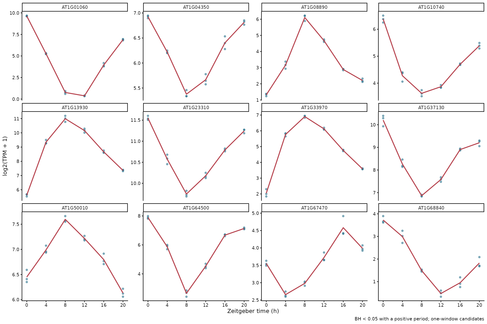

# 17 周期性分析：MetaCycle 与 JTK-CYCLE

<!-- normalized-inputs -->
输入字段和项目迁移规则见[输入规范](<附4 输入文件规范与项目迁移.md>)。代码从能看到 `0script` 的项目根目录运行。

## 本章从哪里读取参数

以下值来自 [project.env](project.env)，不是写死在函数里的常量。案例值与新项目模板值分别列出；实际运行读取你当前文件中的设置。图形特有参数仍在本章入口集中设置。修改后需重新运行读取/赋值段，再调用函数；已经在内存中的旧变量不会随文件编辑自动刷新。

| 参数 | 当前案例配置 | 空模板默认 | 用途与修改注意 |
| --- | --- | --- | --- |
| `RANDOM_SEED` | `20260907` | `20260907` | 随机过程的整数种子；示例固定为 20260907，不需要随日期更新。 通常保留以便复现。变更可能改变随机标签位置或聚类，需另存结果；不保证跨软件版本完全一致。 |
| `TPM_MATRIX` | `3Salmon/quanti/gene.TPM.not_cross_norm` | `3Salmon/quanti/gene.TPM.not_cross_norm` | 第 16–17 章等读取的基因 TPM 矩阵路径。 换输入时指向真实 TPM；不通过改文件名把 counts 或 TMM 变成 TPM。 |
| `JTK_INPUT_DIR` | `10Time_Series/JTK_CYCLE` | `10Time_Series/JTK_CYCLE/input_tpm0.5` | 第 17 章周期检验读取 JTK_input.tsv 等文件的目录。 输入 TPM 过滤改变后指向新生成目录；案例保留旧路径，模板指向 input_tpm0.5。 |
| `JTK_RESULT_ROOT` | `10Time_Series/JTK_CYCLE` | `10Time_Series/JTK_CYCLE/period20-28_fdr0.05` | 第 17 章曲线重绘读取已有 JTK 统计结果的目录。 周期范围或统计设置改变后指向实际新结果；不是输入目录，不自动搜索最新结果。 |

## 1. 与趋势聚类的区别

第 16 章寻找变化形状相近的基因，本章检验表达序列是否与候选周期模板相符。使用原定 **MetaCycle 1.2.1 的 JTK-CYCLE**，不以聚类曲线或自行拟合的正弦曲线代替周期检验。

本案例只有第 2 天的一个采样窗口，不能完整复现原研究所有阶段。依据[作者公开的分析代码](https://github.com/stressedplants/DiurnalDevelopmental/blob/main/R/1_basic_filtering.R)，原研究先根据完整时间集合的组内中位数 TPM 过滤，再分阶段，并排除 ZT1 后进行等间隔 JTK。本章对应地**先使用本案例全部七个时期过滤，再选择六个等间隔时期**；这属于单阶段复现，不声称与全研究的基因过滤集合相同。

## 2. 准备输入：先过滤，再选等间隔时间

| 参数 | 修改位置及影响 |
| --- | --- |
| `tpm_threshold` | 本节默认 0.5，至少一个时期的重复中位数 TPM 大于此值；改后重做输入与 JTK |
| `samples.tsv` 的 `cycle_use/time_hour` | 决定入选采样及真实小时；不在函数内部按组名字串猜测时间 |
| `minper / maxper` | 第 3 节默认 20 / 28 小时；改后重做 JTK，实际模板受采样间隔和窗口限制 |
| `fdr_cutoff` | 默认 0.05，按 BH.Q 严格小于阈值筛选；不等于富集阈值 |
| `top_genes / facet_columns` | 第 4 节默认 12 / 4，只改曲线数量和每行面板数，不重新检验 |
| `plot_width / plot_height / plot_dpi` | 默认 12 / 8 英寸、180 dpi，仅改变曲线图排版 |
| `input_dir / output_dir` | 检验的 input_dir 指 JTK 输入目录；绘图的 output_dir 指已完成检验目录，图片另存其 plots 子目录。二者不是必须同一个路径 |

每个基因只要在至少一个时期的组内重复中位数 TPM > 0.5 就保留。该过滤不使用周期检验 P 值。JTK 输入为 `log2(TPM + 1)`，保留各生物学重复，不先取平均冒充一次测量。

实现：[查看编号脚本](scripts/17_jtk_input.R)。

<!-- execute: jtk_input env=rnaseq_time -->
```r
# 目的：过滤 TPM 后准备保留重复的等间隔 JTK 输入。
# 关键输出：10Time_Series/JTK_CYCLE/input_tpm阈值[__标签]/，默认 input_tpm0.5/。
#   保存 prefilter_all_timepoints.tsv、JTK_sample_order.tsv、JTK_input.tsv；JTK_input 第一列为 CycID。
# 运行位置：项目根目录（能看见 0script）；在本章指定环境的 R 中执行。
# 输出/边界：保存全部时期过滤表、JTK_sample_order.tsv/JTK_input.tsv；要求至少四个等间隔时期且重复数相同、每时点至少两个。
# 共用读取：readRenviron 读取 project.env；Sys.getenv 返回文本，as.numeric/as.integer 将阈值/种子转成数值。
#   更改配置后需重新执行读取与赋值，旧变量不会自动刷新。
# 参数设置（下方为本次取值；不需要修改函数内部实现）：
# tpm_threshold：非负 TPM；先计算所有时期各组内中位数，保留其中最大值严格大于阈值的基因，再按cycle_use 选周期时点；最终仍保留各重复列。
# variant_label：一个文本标签，默认 "" 表示不加额外后缀；如 "large_font" 会给末级结果目录加 __large_font。
#  非空时只用字母、数字、点、下划线、短横线，首字符为字母或数字；不填路径、空格或 NA。
#  调整未进入目录名的图幅、字体等时用不同标签另存；标签本身不改变计算参数。
#  它不是强制覆盖开关：同一路径参数冲突仍停止，不修改旧结果清单。
# 调用：先加载脚本，再设置参数，最后运行函数。改值后重新执行赋值和调用。

source("0script/tools/metadata.R")
source("0script/tools/outputs.R")
readRenviron("0script/project.env")
source("0script/scripts/17_jtk_input.R")
tpm_threshold <- 0.5
variant_label <- ""
# interface-parameters: jtk_input
run_jtk_input(
  tpm_threshold = tpm_threshold,
  variant_label = variant_label
)
```

### 查看本步关键文件

prefilter 的 retained 表示表达过滤是否保留；sample_order 记录入选时点与独立重复顺序；JTK_input 为各重复的 log2(TPM+1)，不是组均值。

```r
# 目的：只读当前参数路径的关键文本；留在上一框的 R 会话，不重新分析。
# 前提：上一分析已成功或明确提示完整结果复用；若报错/冲突，先处理，不把旧文件当本次成功结果。
# preview_dir/preview_files 只用于查看，不是传给分析函数的新参数。
# file.path 拼接路径；readLines(n = 10) 最多读前 10 行，含表头；不整表读入内存。
# file.exists 检查是否存在；cat 用 sep = "\n" 逐行显示；warn = FALSE 省略末行换行提示。
# nzchar 判断标签是否非空；非空时按原命名规则在末级目录加 __标签。
preview_dir <- file.path("10Time_Series/JTK_CYCLE", paste0("input_tpm", tpm_threshold))
if (nzchar(variant_label)) preview_dir <- paste0(preview_dir, "__", variant_label)
preview_files <- file.path(preview_dir, c("prefilter_all_timepoints.tsv", "JTK_sample_order.tsv", "JTK_input.tsv"))
for (preview_file in preview_files) {
  cat("\n文件：", preview_file, "\n")
  if (file.exists(preview_file)) {
    cat(readLines(preview_file, n = 10, warn = FALSE), sep = "\n")
  } else {
    cat("尚无此文件：核对上一步是否完成、是否选择该分析，以及空结果提示。\n")
  }
}
```

此案例排除 ZT1 后为 0、4、8、12、16、20 小时。ZT1 仍参与上述表达过滤和上一章聚类。迁移项目时根据采样设计调整 `samples.tsv` 的 `time_hour` 与 `cycle_use`；本段明确要求各入选时期重复数相同且至少为 2。

## 3. 运行指定版本 JTK

如果要接续刚准备的新输入，无论过滤阈值是否改变，都先让 `JTK_INPUT_DIR` 指向本次 `input_tpm阈值[__标签]` 目录，再重新读取配置。检验完成后，绘图所读的 `JTK_RESULT_ROOT` 也应指向本次 `period最短-最长_fdr阈值[__标签]` 目录。案例配置保留历史结果来源，不会自动替换成最近生成的目录。

`minper = 20`、`maxper = 28` 对应作者调用所使用的 MetaCycle 默认搜索范围。当前六个时期的 4 小时间隔只支持 20/24 小时的候选模板；MetaCycle 1.2.1 会对超过可用时间序列长度的上限作调整。请求范围和有效候选周期分别记录，不能把请求的 28 小时写成已经可靠检验了 28 小时。

实现：[查看编号脚本](scripts/17_jtk_analysis.R)。

<!-- execute: jtk_analysis env=rnaseq_time -->
```r
# 目的：用指定 MetaCycle 1.2.1 的 JTK 检验周期。
# 关键输出：10Time_Series/JTK_CYCLE/period最短-最长_fdr阈值[__标签]/，默认 period20-28_fdr0.05/。
#   保存 JTK_period_design.tsv、JTK_results.tsv、JTK_rhythmic_BH阈值.tsv、JTK_significant_invalid_period.tsv、JTK_summary.tsv。
#   候选名把阈值的小数点去掉：0.05 对应 JTK_rhythmic_BH005.tsv，0.01 对应 BH001；不能自行保留小数点。
# 运行位置：项目根目录（能看见 0script）；在本章指定环境的 R 中执行。
# 输出/边界：保存实际周期模板、完整结果、有效候选及无效周期诊断；正周期且 BH.Q 严格达标才入候选，不把请求周期范围冒充实际模板。
# 共用读取：readRenviron 读取 project.env；Sys.getenv 返回文本，as.numeric/as.integer 将阈值/种子转成数值。
#   更改配置后需重新执行读取与赋值，旧变量不会自动刷新。
# 参数设置（下方为本次取值；不需要修改函数内部实现）：
# input_dir：字符路径；含 JTK_input.tsv 与 JTK_sample_order.tsv 的已完成输入目录。修改过滤阈值后指向对应目录，不能只改周期参数却沿用不明输入。
# minper：正数，单位小时；请求检验的最短周期。实际模板按采样间隔离散化，需查看 JTK_period_design.tsv，而不把请求值视为全部已检验周期。
# maxper：正数（小时），不小于 minper；请求最长周期，还受时间点数和间隔限制。增加范围不能补出缺失的时间点或更多采样周期。
# fdr_cutoff：数值 (0,1]；周期候选要求 BH.Q 严格小于此阈值，并同时要求估计周期为有限正数；显著但周期无效的基因另存诊断表。
# variant_label：一个文本标签，默认 "" 表示不加额外后缀；如 "large_font" 会给末级结果目录加 __large_font。
#  非空时只用字母、数字、点、下划线、短横线，首字符为字母或数字；不填路径、空格或 NA。
#  调整未进入目录名的图幅、字体等时用不同标签另存；标签本身不改变计算参数。
#  它不是强制覆盖开关：同一路径参数冲突仍停止，不修改旧结果清单。
# 路径组合：file.path 按目录层级拼接；project_result 读取配置指定来源并核对存在，不查找最新目录。重绘来源与输出目录应分清。
# 调用：先加载脚本，再设置参数，最后运行函数。改值后重新执行赋值和调用。

source("0script/tools/metadata.R")
source("0script/tools/outputs.R")
readRenviron("0script/project.env")
source("0script/scripts/17_jtk_analysis.R")
input_dir <- project_result("JTK_INPUT_DIR", "10Time_Series/JTK_CYCLE")
minper <- 20
maxper <- 28
fdr_cutoff <- 0.05
variant_label <- ""
# interface-parameters: jtk_analysis
run_jtk_analysis(
  input_dir = input_dir,
  minper = minper,
  maxper = maxper,
  fdr_cutoff = fdr_cutoff,
  variant_label = variant_label
)
```

### 查看本步关键文件

先核对请求周期与实际模板，再看 PER/BH.Q 和候选表；达到 BH 门槛但周期无效的记录独立保存，不当作有效节律基因。

```r
# 目的：只读当前参数路径的关键文本；留在上一框的 R 会话，不重新分析。
# 前提：上一分析已成功或明确提示完整结果复用；若报错/冲突，先处理，不把旧文件当本次成功结果。
# preview_dir/preview_files 只用于查看，不是传给分析函数的新参数。
# file.path 拼接路径；readLines(n = 10) 最多读前 10 行，含表头；不整表读入内存。
# file.exists 检查是否存在；cat 用 sep = "\n" 逐行显示；warn = FALSE 省略末行换行提示。
# nzchar 判断标签是否非空；非空时按原命名规则在末级目录加 __标签。
preview_dir <- file.path("10Time_Series/JTK_CYCLE", parameter_tag(period = c(minper, maxper), fdr = fdr_cutoff))
if (nzchar(variant_label)) preview_dir <- paste0(preview_dir, "__", variant_label)
# format 禁用科学计数法；gsub(fixed = TRUE) 仅移除字面小数点，与原输出命名一致。
preview_threshold <- gsub(".", "", format(fdr_cutoff, scientific = FALSE, trim = TRUE), fixed = TRUE)
preview_files <- file.path(preview_dir, c("JTK_period_design.tsv", "JTK_results.tsv",
  paste0("JTK_rhythmic_BH", preview_threshold, ".tsv"), "JTK_significant_invalid_period.tsv", "JTK_summary.tsv"))
for (preview_file in preview_files) {
  cat("\n文件：", preview_file, "\n")
  if (file.exists(preview_file)) {
    cat(readLines(preview_file, n = 10, warn = FALSE), sep = "\n")
  } else {
    cat("尚无此文件：核对上一步是否完成、是否选择该分析，以及空结果提示。\n")
  }
}
```

`BH.Q < 0.05` 控制这批基因的多重检验；不是未校正 P 值。`PER <= 0` 或非有限值表示没有可解释的正周期估计，即使达到 BH 阈值也单独列入诊断表，不计入候选周期基因。

换采样间隔时，这个指定版本先把请求范围除以间隔，再用 R 的 `round()` 映射到离散模板；不能自行用 ceiling/floor 向内收窄后声称是软件实际搜索范围。例如五个时期、6 小时间隔，请求 20–28 小时时实际候选为 18、24、30 小时。`effective_max` 记录候选模板的实际最大值，不代表这个设计能可靠估计该周期；研究问题与采样设计是否匹配仍需先判断。

## 4. 画出曲线和周期分布

绘图中的点显示每个重复，实线显示时期平均值；平均的是 log 转换后的表达量，纵轴名称与之保持一致。没有显著基因时可以看排序靠前的候选，但图注明确其未显著。

实现：[查看编号脚本](scripts/17_jtk_plots.R)。

<!-- execute: jtk_plots env=rnaseq_time -->
```r
# 目的：从已有周期检验结果画周期分布和候选曲线。
# 关键输出：output_dir/plots/top基因数_facets列数[__标签]/，默认末级 top12_facets4/。
#   保存 displayed_genes.tsv、displayed_profiles.tsv 与 JTK_top_profiles、JTK_period_distribution 的 PNG/PDF。
#   output_dir 在这里是已完成检验的来源目录，不是可任意填写的空输出目录。
# 运行位置：项目根目录（能看见 0script）；在本章指定环境的 R 中执行。
# 输出/边界：把图及展示数据写 JTK 结果下的 plots 子目录；无有效周期显著基因时明确给出诊断说明，不重新检验。
# 共用读取：readRenviron 读取 project.env；Sys.getenv 返回文本，as.numeric/as.integer 将阈值/种子转成数值。
#   更改配置后需重新执行读取与赋值，旧变量不会自动刷新。
# 参数设置（下方为本次取值；不需要修改函数内部实现）：
# legacy_file：字符文件名；仅旧结果缺少 JTK_analysis_parameters.rds 时使用的候选表名，位于所选 JTK 结果目录中。有参数记录时优先读取记录。
#   新结果有参数记录时可留 ""；旧结果必须填真实文件名，不能拿空值猜测候选表。
# legacy_fdr：数值 (0,1]；仅兼容旧 JTK 结果的阈值说明。有保存参数时读取其实际阈值；不能仅改变它就声称重新完成周期筛选。
#   新结果有参数记录时可用 NA_real_ 表示无需手工提供；旧结果无记录时必须填已核实的真实阈值。
# output_dir：字符路径；虽然沿用 output_dir 名称，这里首先是已完成 JTK 检验的读取目录（JTK_RESULT_ROOT），新图写其 plots 子目录；
#   不能填任意空目录。
# top_genes：正整数；周期曲线最多展示的基因数，优先用已有有效周期候选。无达标候选时诊断曲线会明确注明，不把展示基因当成已证实节律。
# facet_columns：正整数；每行曲线面板的列数。只影响排版，应配合图宽/图高，不改变基因检验结果。
# plot_width：正数，单位英寸；输出图宽。增大可缓解标签拥挤，不改变统计筛选。
# plot_height：正数，单位英寸；输出图高。增大可容纳更多面板，不改变数据或显著性。
# plot_dpi：正数，单位像素/英寸；PNG 的像素密度。相同英寸下越大像素越多、文件通常越大；PDF 的矢量图形不靠此值提高清晰度。
# variant_label：一个文本标签，默认 "" 表示不加额外后缀；如 "large_font" 会给末级结果目录加 __large_font。
#  非空时只用字母、数字、点、下划线、短横线，首字符为字母或数字；不填路径、空格或 NA。
#  调整未进入目录名的图幅、字体等时用不同标签另存；标签本身不改变计算参数。
#  它不是强制覆盖开关：同一路径参数冲突仍停止，不修改旧结果清单。
# 路径组合：file.path 按目录层级拼接；project_result 读取配置指定来源并核对存在，不查找最新目录。重绘来源与输出目录应分清。
# 调用：先加载脚本，再设置参数，最后运行函数。改值后重新执行赋值和调用。

source("0script/tools/metadata.R")
source("0script/tools/outputs.R")
readRenviron("0script/project.env")
source("0script/scripts/17_jtk_plots.R")
legacy_file <- "JTK_rhythmic_BH005.tsv"
legacy_fdr <- 0.05
output_dir <- project_result("JTK_RESULT_ROOT", "10Time_Series/JTK_CYCLE")
top_genes <- 12
facet_columns <- 4
plot_width <- 12
plot_height <- 8
plot_dpi <- 180
variant_label <- ""
# interface-parameters: jtk_plots
run_jtk_plots(
  legacy_file = legacy_file,
  legacy_fdr = legacy_fdr,
  output_dir = output_dir,
  top_genes = top_genes,
  facet_columns = facet_columns,
  plot_width = plot_width,
  plot_height = plot_height,
  plot_dpi = plot_dpi,
  variant_label = variant_label
)
```

### 查看本步关键文件

displayed_genes 是本次展示名单，不保证都是已证实节律基因；displayed_profiles 保存实际作图的重复观测，数值尺度按表与图的 log2(TPM+1) 解释。

```r
# 目的：只读当前参数路径的关键文本；留在上一框的 R 会话，不重新分析。
# 前提：上一分析已成功或明确提示完整结果复用；若报错/冲突，先处理，不把旧文件当本次成功结果。
# preview_dir/preview_files 只用于查看，不是传给分析函数的新参数。
# file.path 拼接路径；readLines(n = 10) 最多读前 10 行，含表头；不整表读入内存。
# file.exists 检查是否存在；cat 用 sep = "\n" 逐行显示；warn = FALSE 省略末行换行提示。
# nzchar 判断标签是否非空；非空时按原命名规则在末级目录加 __标签。
preview_dir <- file.path(output_dir, "plots", parameter_tag(top = top_genes, facets = facet_columns))
if (nzchar(variant_label)) preview_dir <- paste0(preview_dir, "__", variant_label)
preview_files <- file.path(preview_dir, c("displayed_genes.tsv", "displayed_profiles.tsv"))
for (preview_file in preview_files) {
  cat("\n文件：", preview_file, "\n")
  if (file.exists(preview_file)) {
    cat(readLines(preview_file, n = 10, warn = FALSE), sep = "\n")
  } else {
    cat("尚无此文件：核对上一步是否完成、是否选择该分析，以及空结果提示。\n")
  }
}
```

## 5. 本次结果与边界

全部七个时期的中位数表达过滤保留 16,764 个基因，随后用六个等间隔时期、每时期三个重复进行 JTK 检验。日志确认请求的 `maxper = 28` 被程序调整为 24，与保存的候选周期表一致。

| 结果范围 | 基因数 |
| --- | ---: |
| 实际检验 | 16,764 |
| BH.Q < 0.05 且返回有限正周期 | 9,979 |
| 其中返回 20 小时 | 3,175 |
| 其中返回 24 小时 | 6,804 |
| 达到 BH 阈值但返回无效周期，单独诊断 | 8 |



图中蓝点是三个重复，红线连接各时期的平均 log2(TPM+1)，不是 JTK 拟合出的连续波形。各面板纵轴范围不同，适合看各自形状，不能直接凭线的高度比较不同基因的绝对变化幅度。多个候选具有相同 BH 值时按基因 ID 排序，因此前十二个不是十二个统计强度互不相同的“最佳基因”。


这不是连续测得的周期分布，而是本次可用的 20/24 小时模板之间的归类。3,175 这个数量恰好与上一章 20% 高变基因数相同，并不表示两者是同一基因集合。

八条诊断记录的 `PER/LAG/AMP` 均为 0，原值保存在 `JTK_significant_invalid_period.tsv`。它们的输入并非全零或恒定，不能据此解释成“基因不表达”。本机指定版本的实现先计算模板检验 P 值，再用幅度选择周期；周期和幅度初值为 0，只有出现更大的正幅度才更新，因此 P 值显著与返回正周期是两个条件。这里保留原算法输出，不强行为这八条补一个 24 小时周期。实现细节可对照 [MetaCycle 的 JTK 源码](https://github.com/gangwug/MetaCycle/blob/master/R/JTKv3.1p.R)。

过滤顺序、18 个输入列、对象与结果表的一致性、基于 `ADJ.P` 的 BH 校正以及正周期/无效周期分表均通过独立核对。只覆盖一个窗口时，单峰或单谷也可能匹配周期模板；候选显著不等于已经证明内源昼夜节律。周期、相位和生物学结论需要更长时间序列、独立实验和外部证据支持。
