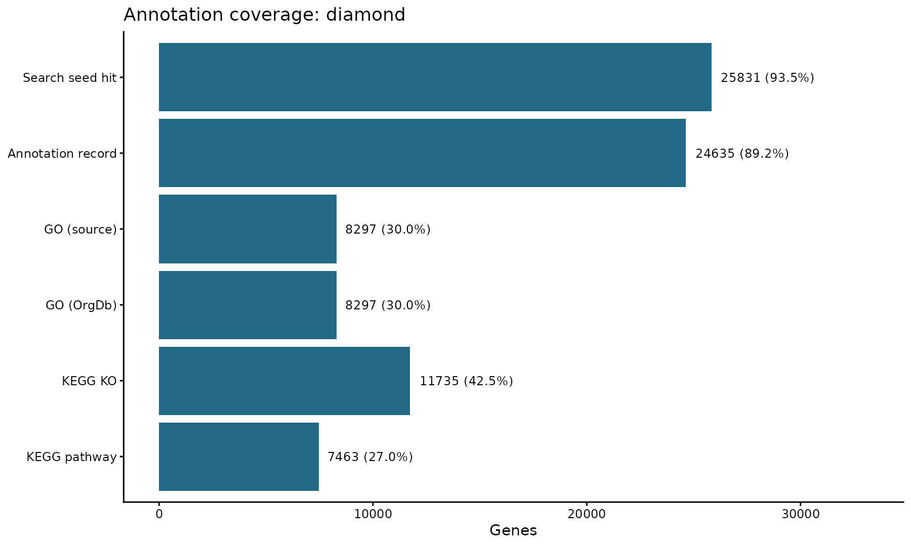

# 18 非模式生物支线：蛋白注释与 OrgDb 构建

<!-- normalized-inputs -->
输入字段和项目迁移规则见[输入规范](<附4 输入文件规范与项目迁移.md>)。代码从能看到 `0script` 的项目根目录运行。

本章与接下来的两章是独立支线。案例仍为拟南芥，但暂时假设没有现成物种注释，从蛋白序列开始验证非模式植物的分析过程。它不能取代主线的官方注释，也不等同于真正未知物种的独立性能测试。

## 本章从哪里读取参数

以下值来自 [project.env](project.env)，不是写死在函数里的常量。案例值与新项目模板值分别列出；实际运行读取你当前文件中的设置。图形特有参数仍在本章入口集中设置。修改后需重新运行读取/赋值段，再调用函数；已经在内存中的旧变量不会随文件编辑自动刷新。

| 参数 | 当前案例配置 | 空模板默认 | 用途与修改注意 |
| --- | --- | --- | --- |
| `EGGNOG_DATA_DIR` | `../../resources/eggnog` | `../../resources/eggnog` | 共享 eggNOG 数据库位置，相对项目根目录解析。 项目集合内通常不改；迁移数据库位置后更新。多个项目共用一份库，不把数据库复制进环境。 |
| `THREADS` | `24` | `24` | 上游和注释的总线程预算，正整数；默认 24。 按服务器实际分配资源调小或调大，不超过可用 CPU/内存；样本并行数还由各章 sample_jobs 分配。 |

## 1. 每个基因选择一个代表转录本

沿用 `gtftk short_long -l` 选择成熟转录本长度最大的异构体；长度按外显子计算，不包括内含子。这与选择最长蛋白不同，因为转录本还包含非翻译区。只在有对应蛋白序列的转录本中选择，避免选中无法用于蛋白注释的记录。

下面在 `rnaseq_gtf` 中运行。该工具需要正常的本地进程通信权限；受限执行器禁止本地套接字时，应在普通终端执行，而不是修改分析算法。

实现：[查看编号脚本](scripts/18_representatives.sh)。

<!-- execute: representatives env=rnaseq_gtf -->
```bash
# 目的：在有明确蛋白对应的转录本中选最长成熟转录本并保留基因身份。
# 关键输出：9Enrichment_Analysis/OrgDb/representatives/longest_mapid.tsv：代表转录本到基因映射。
#   同级 protein_identity/ 保存身份核对；OrgDb/representative_proteins.fa 以 gene_id 为查询名，原蛋白不改。
# 前提/去向：输入：GTF、蛋白 FASTA 和可选身份表；
#   先由 protein_identity.py 核实关系，再输出代表映射、派生 GTF 和 representative_proteins.fa，原参考不改。
# 先 source 加载同编号脚本定义，再设置下面变量并调用函数；加载本身不启动分析。所有路径相对能看见0script 的项目根目录。
# 可调参数（下面赋值是本次值，Shell 的 = 两侧不留空格）：
# protein_mapping_file：空字符串 "" 或一个已有映射表路径，相对项目根目录。
#  ""：从 GTF 的明确 protein_id/transcript_id/gene_id 关系核对，不是默认认定三种 ID 相同。
#  自备来源无法这样对应时，填人工核实的 TSV，表头为 protein_id、transcript_id、gene_id。
#  路径必须指向真实表，不能填 "auto" 或把人/鼠蛋白 ID 当作转录本 ID。
# 调用时 $变量 取上面设置的值；双引号保持每个值为一个参数，空字符串也占一个参数位置。调用顺序与脚本 $1、$2… 一致，不需深入函数体改值。
# 执行环境：rnaseq_gtf；命令退出不代表所有后续章节都已完成，查看本步结果/日志后再继续。

source 0script/scripts/18_representatives.sh
protein_mapping_file=""
# interface-parameters: representatives
run_representatives "$protein_mapping_file"
```

### 查看本步关键文件

先看映射表的转录本和基因列，再看代表 FASTA 的 > 标题；不能因为三个 ID 相似就认定蛋白、转录本、基因是同一编号。

```bash
# 目的：查看本步文本结果的前 10 行；在项目根目录的 Bash 终端运行，只读不写。
# 前提：上一步已成功完成；报错后即使同名文件存在，也不能据此认定本次成功。
# head -n 10 含表头最多读 10 行；test -f 检查文件；printf 先显示路径，避免混淆。
for preview_file in "9Enrichment_Analysis/OrgDb/representatives/longest_mapid.tsv" \
  "9Enrichment_Analysis/OrgDb/representative_proteins.fa"; do
  if test -f "$preview_file"; then
    printf "\n文件：%s\n" "$preview_file"
    head -n 10 "$preview_file"
  else
    printf "尚无此文件：%s；先检查上一步是否完成。\n" "$preview_file"
  fi
done
```

`-f` 读取一个 ID 列表，`short_long -l` 保留最长成熟转录本，`tabulate` 输出属性表，`seqtk subseq` 按转录本 ID 提取蛋白。`identifiers_only.gtf` 保留原有前八列，以及本步骤需要的 gene_id/transcript_id 属性；原参考文件不改动。

这里有一个实际兼容性处理：参考中的部分名称包含引号内的分号，例如 `gene_name "CYCD1;1"`。pygtftk 1.6.2 的 C 解析器仍按分号切分，会产生空属性并崩溃。因此先生成仅含必需 ID 的派生 GTF，仍由 `gtftk short_long` 完成选择，不修改名称对应的真实基因，也不替换算法。并列最长时沿用固定输入顺序；后面用原始 GTF 独立检查外显子长度。

按 transcript_id 筛选会去掉没有该属性的 gene 层记录。`short_long` 还需要 gene 层结构，因此用同一工具的 `convert_ensembl` 在派生文件中恢复；它不改变外显子坐标，也不参与选择最长转录本。

实现：[查看编号脚本](scripts/18_representative_validation.R)。

<!-- execute: representative_validation env=rnaseq -->
```r
# 目的：核实选出的代表蛋白、转录本和基因一一对应。
# 关键输出：9Enrichment_Analysis/OrgDb/representatives/validated_representatives.tsv：验证后的每基因代表记录。
#   记录真实转录本/基因及外显子长度核验，不重新选择另一套代表。
# 运行位置：项目根目录（能看见 0script）；在本章指定环境的 R 中执行。
# 输出/边界：保存 validated_representatives.tsv、覆盖/选择核对信息；使用真实身份映射，不把人/鼠蛋白 ID当转录本 ID。
# 共用读取：readRenviron 读取 project.env；Sys.getenv 返回文本，as.numeric/as.integer 将阈值/种子转成数值。
#   更改配置后需重新执行读取与赋值，旧变量不会自动刷新。
# 本入口没有可调形参；先 source 加载当前定义，再调用函数即可。输入来自本节说明的项目文件，不需要寻找一个并不存在的参数赋值段。

source("0script/tools/metadata.R")
source("0script/tools/outputs.R")
readRenviron("0script/project.env")
source("0script/scripts/18_representative_validation.R")
run_representative_validation()
```

### 查看本步关键文件

检查每个基因是否唯一、对应转录本以及长度；这张表是后续注释身份衔接材料。

```bash
# 目的：查看本步文本结果的前 10 行；在项目根目录的 Bash 终端运行，只读不写。
# 前提：上一步已成功完成；报错后即使同名文件存在，也不能据此认定本次成功。
# head -n 10 含表头最多读 10 行；test -f 检查文件；printf 先显示路径，避免混淆。
preview_file="9Enrichment_Analysis/OrgDb/representatives/validated_representatives.tsv"
if test -f "$preview_file"; then
  printf "\n文件：%s\n" "$preview_file"
  head -n 10 "$preview_file"
else
  printf "尚无此文件：%s；先检查上一步是否完成。\n" "$preview_file"
fi
```

本次重新生成并独立核验了 **27,628 个代表基因/蛋白**：每基因仅一个查询序列，全部选择满足原始 GTF 中有蛋白转录本的最大外显子长度规则。核验表为 `representatives/validated_representatives.tsv`。

## 2. 准备匹配版本的数据库

继续使用 eggNOG-mapper 2.1.15 与 eggNOG 5.0.2 核心数据库。核心 SQLite、分类库和 DIAMOND 数据库已重新校验并迁移。不能把 `.dmnd.gz` 直接传给 DIAMOND。

先用安装脚本的模拟模式查看它计划下载什么，不在已有完整库上强制重新下载：

```bash
# 目的：只查看指定 eggNOG 数据库脚本计划运行的命令，不下载数据库。
# conda activate rnaseq_eggnog：启用相应环境；
#   set -a/source/set +a：把 project.env 配置导出给当前命令，EGGNOG_DATA_DIR 指已存在的共享库目录。
# download_eggnog_data.py --data_dir：数据库位置；-y：对询问采用 yes；-s：simulate，打印计划而不下载，不是跳过校验。
#   以本机指定 2.1.15 源码/帮助为准。
# 此处保留 -s，用来核对旧脚本的来源；后面的明确归档下载另列说明。已有完整数据库不重复获取，模拟成功不代表数据库完整或可用。

conda activate rnaseq_eggnog
set -a
source 0script/project.env
set +a
download_eggnog_data.py --data_dir "$EGGNOG_DATA_DIR" -y -s
```

指定软件版本内置的旧下载地址已发生服务迁移。核心库目前可从 [官方 5.0.2 镜像目录](https://downloads.eggnogdb.org/emapper/emapperdb-5.0.2/) 获取；以下是新机器首次下载的对应过程，本次不执行全量下载：

```bash
# 目的：数据库脚本网络不适用时，按明确 URL 分别取所需归档并核对。仅共享库尚未准备时运行；不自动清理旧文件。
# database_dir 取 EGGNOG_DATA_DIR；${变量:?提示} 使空配置报错。database_url 固定当前兼容库版本；
#   for name 遍历三个必需归档，不增加其他搜索路线。
# curl --fail/--location/-o/--retry 同第 03 章；--continue-at - 续传同源片段；
#   --connect-timeout 30：连接超时秒数（不是整个下载只允许 30 秒）。
# test ! -e 保护正式目标；gzip -t 校验压缩；mv -n 不覆盖已有文件。set -euo pipefail 启用失败/变量/管道检查，但不能代替核实同名旧片段来源。
# if [[ -f … ]] 仅在历史 DATABASE_MANIFEST.tsv 存在时核对；awk -F 制表符，NR>1 跳过表头，从原 URL/摘要列生成核对表；
#   sha256sum -c 验证，单独 sha256sum 只记录本地值。
# gzip -cd：解压到标准输出，原归档保留；> 写 .part 后再 mv 采用正式数据库名。二进制 DIAMOND 数据库不是蛋白 FASTA。
# tar -tzf：先列出 gzip tar 内容；-xzf：解包；-C：目标目录；
#   --keep-old-files 不覆盖已有成员，--no-same-owner/--no-same-permissions 不沿用归档所有者/权限。
# 最后 emapper.py --data_dir … --version 仅检查软件能启动，并不扫描验证整库。任何失败先停止并核对该文件，不删除整套共享库。

set -euo pipefail
set -a
source 0script/project.env
set +a
database_dir="${EGGNOG_DATA_DIR:?请在入口设置公共数据库位置}"
database_url=https://downloads.eggnogdb.org/emapper/emapperdb-5.0.2
mkdir -p "$database_dir"
for name in eggnog.db.gz eggnog.taxa.tar.gz eggnog_proteins.dmnd.gz; do
  test ! -e "$database_dir/$name"
  curl --fail --location --continue-at - --retry 5 --connect-timeout 30 \
    "$database_url/$name" -o "$database_dir/$name.part"
  gzip -t "$database_dir/$name.part"
  mv -n "$database_dir/$name.part" "$database_dir/$name"
done
if [[ -f "$database_dir/DATABASE_MANIFEST.tsv" ]]; then
  awk -F '\t' 'NR > 1 {n=split($3,a,"/"); print $6 "  " a[n]}' \
    "$database_dir/DATABASE_MANIFEST.tsv" > "$database_dir/expected_archives.sha256"
  (cd "$database_dir" && sha256sum -c expected_archives.sha256)
fi
sha256sum "$database_dir/eggnog.db.gz" "$database_dir/eggnog.taxa.tar.gz" \
  "$database_dir/eggnog_proteins.dmnd.gz" > "$database_dir/downloaded_archives.sha256"
test ! -e "$database_dir/eggnog.db"
test ! -e "$database_dir/eggnog_proteins.dmnd"
gzip -cd "$database_dir/eggnog.db.gz" > "$database_dir/eggnog.db.part"
gzip -cd "$database_dir/eggnog_proteins.dmnd.gz" > "$database_dir/eggnog_proteins.dmnd.part"
mv -n "$database_dir/eggnog.db.part" "$database_dir/eggnog.db"
mv -n "$database_dir/eggnog_proteins.dmnd.part" "$database_dir/eggnog_proteins.dmnd"
tar -tzf "$database_dir/eggnog.taxa.tar.gz"
tar --keep-old-files --no-same-owner --no-same-permissions \
  -xzf "$database_dir/eggnog.taxa.tar.gz" -C "$database_dir"
emapper.py --data_dir "$database_dir" --version
```

## 3. 运行 DIAMOND 蛋白注释

| 参数 | 默认设置及影响 |
| --- | --- |
| `seed_evalue` | 1e-5，种子命中的 E 值阈值；修改后需要重新注释，不是只改变图形 |
| `max_annotation_threads` | 12，且不超过项目 THREADS；只控制计算资源 |
| 第 18 章 `tax_id` / `annotation_excluded_taxa` | 前者是目标物种税号；后者独立指定排除供体，案例为 3702，普通项目可为空 |

使用上节核对过的代表蛋白集合，输出与官方注释主线分开保存。本案例限制从绿色植物范围转移功能注释，并排除拟南芥作为注释供体：`--excluded_taxa 3702` 限制注释转移，不保证搜索种子中绝不出现该物种。

实现：[查看编号脚本](scripts/18_diamond.sh)。

<!-- execute: diamond env=rnaseq_eggnog -->
```bash
# 目的：运行 eggNOG-mapper 的 DIAMOND 搜索与功能转移。
# 关键输出：9Enrichment_Analysis/OrgDb/diamond/output/annotation.emapper.annotations：最终功能注释。
#   同前缀 .seed_orthologs 是种子命中，不等于最终注释；命令与资源日志用于诊断。
# 前提/去向：输入：representative_proteins.fa 与共享 eggNOG 数据库；输出OrgDb/diamond/output/annotation.emapper.*。
#   已有正式 annotations 拒绝覆盖，部分失败输出需人工核实。
# 先 source 加载同编号脚本定义，再设置下面变量并调用函数；加载本身不启动分析。所有路径相对能看见0script 的项目根目录。
# 可调参数（下面赋值是本次值，Shell 的 = 两侧不留空格）：
# annotation_tax_scope：单个字符串，指定 eggNOG 功能转移分类范围，完整写法和预设含义见下表。
#   本案例 33090 是绿色植物范围，不是目标物种 tax_id；换项目按生物学目的核实，不默认沿用。
# annotation_excluded_taxa：空字符串 "" 表示不额外排除供体；一个税号或逗号分隔列表排除这些类群及后代。
#  本案例 3702 排除拟南芥供体，用于非模式假设；普通项目不要默认照搬。
#  例如 "3702,9606" 是两个排除类群的写法，不是新项目推荐值；按真实目的核实后填写。
#  限制的是注释转移供体，不保证搜索种子绝不来自被排除物种。
# seed_evalue：正数 E 值阈值；控制种子直系同源命中筛选，值越小越严格。不是最终富集 P 值，改变需重做相关注释。
# max_annotation_threads：正整数；eggNOG 注释线程上限，实际取它与项目 THREADS 的较小者，只控制资源。
# 调用时 $变量 取上面设置的值；双引号保持每个值为一个参数，空字符串也占一个参数位置。调用顺序与脚本 $1、$2… 一致，不需深入函数体改值。
# 执行环境：rnaseq_eggnog；命令退出不代表所有后续章节都已完成，查看本步结果/日志后再继续。

source 0script/scripts/18_diamond.sh
annotation_tax_scope=33090
annotation_excluded_taxa=3702
seed_evalue=1e-5
max_annotation_threads=12
# interface-parameters: diamond
run_diamond "$annotation_tax_scope" "$annotation_excluded_taxa" "$seed_evalue" "$max_annotation_threads"
```

### 查看本步关键文件

文件开头可能有 # 运行信息，随后为注释字段。query 对应代表 FASTA 的基因 ID；种子命中与最终得到 GO/KEGG 注释是不同阶段。

```bash
# 目的：查看本步文本结果的前 10 行；在项目根目录的 Bash 终端运行，只读不写。
# 前提：上一步已成功完成；报错后即使同名文件存在，也不能据此认定本次成功。
# head -n 10 含表头最多读 10 行；test -f 检查文件；printf 先显示路径，避免混淆。
for preview_file in "9Enrichment_Analysis/OrgDb/diamond/output/annotation.emapper.annotations" \
  "9Enrichment_Analysis/OrgDb/diamond/output/annotation.emapper.seed_orthologs"; do
  if test -f "$preview_file"; then
    printf "\n文件：%s\n" "$preview_file"
    head -n 10 "$preview_file"
  else
    printf "尚无此文件：%s；先检查上一步是否完成。\n" "$preview_file"
  fi
done
```


`annotation_tax_scope` 接收的是一个字符串，不是 R 向量。以下列出指定 eggNOG-mapper 2.1.15 支持的全部命名预设；这些是程序自带的分类层级清单，不表示数据来自这些物种。

| 写法/预设 | 含义和使用条件 |
| --- | --- |
| `33090` 或 `Viridiplantae` | 绿色植物分类层级；名称/数字必须为当前 eggNOG 库识别的层级 |
| `auto`、`all` | 同一默认分类清单，根据命中可用层级选择；并非“使用所有物种 ID 做目标物种” |
| `auto_broad`、`all_broad` | 同一较宽的分类层级清单，减少对较细分类层级的限制 |
| `all_narrow` | 使用包含更多细分类群的清单；可用性仍受命中和数据库覆盖限制 |
| `archaea` | 古菌分类清单；不适用于直接照搬本植物案例 |
| `bacteria`、`bacteria_broad` | 细菌分类清单及其较宽层级版本 |
| `eukaryota`、`eukaryota_broad` | 真核生物分类清单及其较宽层级版本 |
| `prokaryota_broad` | 原核生物的较宽分类清单，覆盖细菌和古菌范围 |
| `none` | 不再使用 tax_scope 清单限制；仍有其他注释筛选，不代表“无注释” |
| `"33090,2759"` | 逗号分隔的可识别层级列表（绿色植物、真核生物），不是排除列表；不可填任意不存在的分类号 |
| `"0script/tax_scope.txt"` | 自备文本，每行一个当前库可识别的层级名称或编号；只有需要自定范围才提供 |

本项目没有新增 `tax_scope_mode` 参数，继续使用该软件既定层级选择方式；宽/窄预设描述允许的层级清单，不承诺一定增加/减少显著富集。可在 `rnaseq_eggnog` 中运行 `emapper.py --help` 核对本机选项。`annotation_excluded_taxa` 则是**排除**供体及后代，与上表的允许范围不是同一参数。目标物种 `tax_id/genus/species` 在下一节填写，也不是搜索范围。

沿用原稿 DIAMOND 的种子 E 值阈值 1e-5。注释最多使用 12 个线程，且不超过入口 THREADS；线程预算不是统计参数。

## 4. 构建自定义 OrgDb

AnnotationForge 将查询基因、GO 和其他映射组织为可供 R 查询的数据库。保留 `GID` 作为自定义基因键，电子转移的 GO 证据记为 IEA。自建包安装在 DIAMOND 的独立目录；使用官方注释与自建注释时分别启动 R，避免注释缓存串用。

实现：[查看编号脚本](scripts/18_orgdb_builder.R)。

<!-- execute: orgdb_builder env=rnaseq -->
```r
# 目的：加载本节共用函数，供后面的分析/重绘入口调用；本段不启动统计或绘图。
# source("路径")：在当前 R 会话读取该脚本及它声明的共用依赖。路径相对项目根目录，不是下载地址。
# 输入：0script/scripts/18_orgdb_builder.R；产物是 R 会话中的函数定义，不是结果文件。
# 修改脚本后需重新 source；仅加载函数不会自动更新已有结果，后面的参数赋值和调用仍须执行。

source("0script/scripts/18_orgdb_builder.R")
```

实际调用时使用独立 R 进程：

实现：[查看编号脚本](scripts/18_diamond_orgdb.R)。

<!-- execute: diamond_orgdb env=rnaseq -->
```r
# 目的：用实际物种元数据调用 DIAMOND 路线的 OrgDb 构建。
# 关键输出：9Enrichment_Analysis/OrgDb/diamond/output/ 下 gene_info.tsv、go_table.tsv、ko_table.tsv、pathway_table.tsv、pathway_names.tsv。
#   同目录 orgdb_query_check.tsv 为查询核验；
#   diamond/orgdb/custom_orgdb_package.txt 记录包名，R_Library 下保存实际数据库。
# 运行位置：项目根目录（能看见 0script）；在本章指定环境的 R 中执行。
# 输出/边界：构建第 18 章的局部数据库及派生表；不重新做蛋白搜索。需先完成代表验证和 eggNOG 注释。
# 共用读取：readRenviron 读取 project.env；Sys.getenv 返回文本，as.numeric/as.integer 将阈值/种子转成数值。
#   更改配置后需重新执行读取与赋值，旧变量不会自动刷新。
# 参数设置（下方为本次取值；不需要修改函数内部实现）：
# tax_id：字符形式的真实 NCBI taxonomy ID；写入自建 OrgDb 元数据，不是排除供体的税号。案例为 3702，换物种应核实后改本章入口。
# genus：字符属名；自建 OrgDb 元数据及包命名使用，案例 Arabidopsis。须与真实物种一致，不是矩阵 gene_id前缀。
# species：字符种加词；自建 OrgDb 使用，如 thaliana，不是任意项目显示名。换物种与 genus、tax_id 一起核实。
# 调用：先加载脚本，再设置参数，最后运行函数。改值后重新执行赋值和调用。

source("0script/tools/metadata.R")
source("0script/tools/outputs.R")
readRenviron("0script/project.env")
source("0script/scripts/18_diamond_orgdb.R")
tax_id <- "3702"
genus <- "Arabidopsis"
species <- "thaliana"
# interface-parameters: diamond_orgdb
run_diamond_orgdb(
  tax_id = tax_id,
  genus = genus,
  species = species
)
```

### 查看本步关键文件

GO 表对应基因和 GO 编号，通路表对应基因和通路；查询表是对自建数据库的实际小样本查询，不只是存在一个安装目录。SQLite 和 R 包不作为文本 head。

```bash
# 目的：查看本步文本结果的前 10 行；在项目根目录的 Bash 终端运行，只读不写。
# 前提：上一步已成功完成；报错后即使同名文件存在，也不能据此认定本次成功。
# head -n 10 含表头最多读 10 行；test -f 检查文件；printf 先显示路径，避免混淆。
for preview_file in "9Enrichment_Analysis/OrgDb/diamond/orgdb/custom_orgdb_package.txt" \
  "9Enrichment_Analysis/OrgDb/diamond/output/go_table.tsv" \
  "9Enrichment_Analysis/OrgDb/diamond/output/pathway_table.tsv" \
  "9Enrichment_Analysis/OrgDb/diamond/output/orgdb_query_check.tsv"; do
  if test -f "$preview_file"; then
    printf "\n文件：%s\n" "$preview_file"
    head -n 10 "$preview_file"
  else
    printf "尚无此文件：%s；先检查上一步是否完成。\n" "$preview_file"
  fi
done
```

## 5. 核对覆盖率和结果边界

覆盖率的分母始终是全部输入代表蛋白，不是只用已有命中或已有 GO 的基因。搜索得到种子直系同源序列，不等于已经生成可用的功能注释记录；两者分别计数。`GO (source)` 是原始注释中的 GO 映射，`GO (OrgDb)` 是建库后实际可查询到 GO 的基因，避免忽略已失效 GO ID 的影响。

只重绘已完成路线的覆盖图，可以单独运行以下代码，不重复搜索或建库。

实现：[查看编号脚本](scripts/18_diamond_coverage.R)。

<!-- execute: diamond_coverage env=rnaseq -->
```r
# 目的：从已保存 DIAMOND 注释重画覆盖率概览。
# 关键输出：9Enrichment_Analysis/OrgDb/diamond/output/annotation_coverage.tsv：按全部代表蛋白为分母的覆盖统计。
#   annotation_coverage.png/.pdf 默认也在该目录；plot_output_dir 非 NULL 时只有图片改存到它，TSV 仍写原位置。
# 运行位置：项目根目录（能看见 0script）；在本章指定环境的 R 中执行。
# 输出/边界：调用覆盖率函数写表与图，不重做注释搜索；仅图目录由 plot_output_dir 控制，原注释统计表仍会写出。
# 共用读取：readRenviron 读取 project.env；Sys.getenv 返回文本，as.numeric/as.integer 将阈值/种子转成数值。
#   更改配置后需重新执行读取与赋值，旧变量不会自动刷新。
# 参数设置（下方为本次取值；不需要修改函数内部实现）：
# width：正数，单位英寸；画布宽度。仅改变排版，PNG 像素宽约为 width × dpi。
# height：正数，单位英寸；画布高度。仅改变排版，PNG 像素高约为 height × dpi。
# dpi：正数，单位像素/英寸；控制 PNG 像素密度，不改变图幅的英寸数或统计结果。
# plot_output_dir：NULL 或字符路径；NULL 沿用注释 output 目录，给新路径可另存覆盖率图片。注意覆盖率TSV 仍写原注释 output 目录。
# 调用：先加载脚本，再设置参数，最后运行函数。改值后重新执行赋值和调用。

source("0script/tools/metadata.R")
source("0script/tools/outputs.R")
readRenviron("0script/project.env")
source("0script/scripts/18_diamond_coverage.R")
width <- 10
height <- 6
dpi <- 180
plot_output_dir <- NULL
# interface-parameters: diamond_coverage
run_diamond_coverage(
  width = width,
  height = height,
  dpi = dpi,
  plot_output_dir = plot_output_dir
)
```

### 查看本步关键文件

分别看种子命中、最终注释和 GO/KO/通路覆盖；不能只拿已有 GO 的基因做分母。

```bash
# 目的：查看本步文本结果的前 10 行；在项目根目录的 Bash 终端运行，只读不写。
# 前提：上一步已成功完成；报错后即使同名文件存在，也不能据此认定本次成功。
# head -n 10 含表头最多读 10 行；test -f 检查文件；printf 先显示路径，避免混淆。
preview_file="9Enrichment_Analysis/OrgDb/diamond/output/annotation_coverage.tsv"
if test -f "$preview_file"; then
  printf "\n文件：%s\n" "$preview_file"
  head -n 10 "$preview_file"
else
  printf "尚无此文件：%s；先检查上一步是否完成。\n" "$preview_file"
fi
```

本次 DIAMOND 输入 27,628 个代表蛋白，25,831 个有种子命中（93.50%），24,635 个有最终注释记录（89.17%）。GO 覆盖 8,297 个基因（30.03%），建库前后覆盖基因数一致；KEGG KO 覆盖 11,735 个（42.48%），通路覆盖 7,463 个（27.01%）。这些比例针对本次供体范围和排除策略，不是物种基因功能的完整清单。



对真实非模式项目，需要修改 TaxID、属种名和参考输入；物种供体排除策略也应根据研究目的重新确认。
