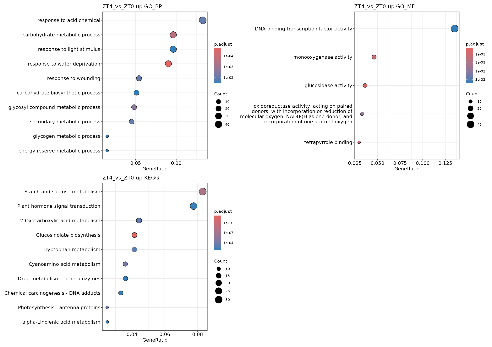

# 19 非模式生物支线：GO 和 KEGG 富集分析

<!-- normalized-inputs -->
输入字段和项目迁移规则见[输入规范](<附4 输入文件规范与项目迁移.md>)。代码从能看到 `0script` 的项目根目录运行。

## 本章从哪里读取参数

以下值来自 [project.env](project.env)，不是写死在函数里的常量。案例值与新项目模板值分别列出；实际运行读取你当前文件中的设置。图形特有参数仍在本章入口集中设置。修改后需重新运行读取/赋值段，再调用函数；已经在内存中的旧变量不会随文件编辑自动刷新。

| 参数 | 当前案例配置 | 空模板默认 | 用途与修改注意 |
| --- | --- | --- | --- |
| `FDR_CUTOFF` | `0.05` | `0.05` | 差异汇总、火山图及相应富集筛选使用的校正 P 值阈值；默认 0.05。 改小通常筛选更严格。各章具体作用见正文；不等于所有检验共享一次多重校正，也不控制所有同名局部阈值。 |
| `DE_RESULT_FILE` | `5DESeq2/de_result.tsv` | `5DESeq2/padj0.05_lfc1/de_result.tsv` | 第 11–15、19–20 章读取的合并差异结果表。 第 10 章重新汇总后更新为实际新文件；更改阈值不会自动把旧表搬到新目录。 |
| `TIME_RESULT_ROOT` | `10Time_Series` | `10Time_Series` | 第 16、19 章重绘/支线读取已有聚类组合的根目录。 通常保持 10Time_Series；若聚类输出到 custom 等目录，应明确更新，不按修改时间找文件。 |
| `TIME_VARIANT_DIR` | 空（按条件填写） | `mark30_GOtop5_seed20260907` | 聚类的 top_var_prop/Clusters_num 组合下，mark/GOtop/seed 末级目录。 旧案例结果没有该层时为空；新运行按真实目录填写。改值只是选择已有组合，不重算聚类。 |
| `NONMODEL_MODULE_RESULT_ROOT` | `9Enrichment_Analysis/OrgDb/diamond/module_enrichment` | `9Enrichment_Analysis/OrgDb/diamond/module_enrichment` | 第 19 章非模式模块富集结果的根目录。 与所选聚类组合配套；通常不用随物种改目录名，只有实际保存位置变化才修改。 |
| `NONMODEL_MODULE_VARIANT_DIR` | 空（按条件填写） | `GOtop5_fdr0.05` | 非模式模块富集组合下的 GOtop/fdr 末级目录。 旧案例为空；模板为 GOtop5_fdr0.05，必须与实际完成结果一致，不能仅改名冒充新检验。 |

## 1. 用自建映射，保留差异分析结果

本章承接第 18 章的蛋白注释。差异表达仍来自同一套测序数据和 DESeq2；改变的是功能注释来源，不是重新制造一套差异基因。DIAMOND 自建注释的富集结果与官方注释主线分开保存。

本案例把已知模式物种暂当作非模式物种演练。自建注释与官方注释覆盖率不同，条目数量不同并不直接说明哪条路线“更准确”。没有注释到某个功能，也不证明该基因没有这个功能。

## 2. 加载数据库与 KEGG 映射

| 参数入口 | 含义与修改位置 |
| --- | --- |
| 第 3 节 `comparison_ids / directions / term_num` | 选择比较、上下调方向和显示条目数；传递到第 14 章同名参数 |
| 第 3 节 `ontologies / include_kegg` | GO 类别和是否计算 KEGG；不更换注释来源 |
| `fdr_cutoff / minGSSize / maxGSSize / simplify_cutoff` | 富集筛选、集合大小和 GO 去冗余，与第 14 章含义一致 |
| 第 4 节 `top_var_props / cluster_numbers` | 选择第 16 章已经完成的组合，不在本章重新聚类 |
| `markGenes_num` | `NULL` 沿用原标签名单；整数则从该组合的高变基因排名重选，0 不标基因名 |
| `enrichment_top_n / enrichment_fdr` | 每模块展示条目数和 BH 阈值；统计表保存完整检验 |
| `cluster_root / output_root` | 已有聚类的来源目录与新富集输出目录；两者分开，避免写回源对象 |

自建 OrgDb 使用 `GID`，不能继续写 `TAIR` 或混用其他项目的包名。直接加载当前路线的 SQLite 文件。官方与自建注释在独立 R 进程中执行；交互运行时切换注释须重启 R，而不只是 detach 包。这样既避免同名包冲突，也避免同物种、同 ID 类型的 GO 缓存被误用。下方的会话选项只记录经自建入口加载的路线，不能检测所有手工加载的官方注释，不能代替重启 R。

GO 仍由 `enrichGO` 检验。自建 KEGG 使用 eggNOG 提供的 `mapXXXXX → 基因` 对应关系，由 clusterProfiler 的 `enricher` 检验；不能把自己组装的基因 ID 直接传给只认识物种既有基因编号的 `enrichKEGG`。

实现：[查看编号脚本](scripts/19_nonmodel_ora_functions.R)。

<!-- execute: nonmodel_ora_functions env=rnaseq -->
```r
# 目的：加载本节共用函数，供后面的分析/重绘入口调用；本段不启动统计或绘图。
# source("路径")：在当前 R 会话读取该脚本及它声明的共用依赖。路径相对项目根目录，不是下载地址。
# 输入：0script/scripts/19_nonmodel_ora_functions.R；产物是 R 会话中的函数定义，不是结果文件。
# 修改脚本后需重新 source；仅加载函数不会自动更新已有结果，后面的参数赋值和调用仍须执行。

source("0script/scripts/19_nonmodel_ora_functions.R")
```

上面的 `plot_ORA` 是第 14 章展示的完整函数。其背景取每个比较实际有有限检验 P 值的基因，并进一步限于相应数据库有注释的基因。官方与自建注释的有效背景可能不同，实际背景各自另存。GO 保留 BP/MF/CC/ALL、原始/去冗余、Top10/Top20、条形/点图及综合图；上调、下调和全部差异基因各自分析。

## 3. 使用 DIAMOND 注释执行

第 18 章的 DIAMOND OrgDb 和映射表必须已就绪；缺少时停止本支线，不以官方数据库替代。

实现：[查看编号脚本](scripts/19_diamond_ora.R)。

<!-- execute: diamond_ora env=rnaseq -->
```r
# 目的：批量执行 DIAMOND 自建注释的非模式 ORA。
# 关键输出：output_root/fdr阈值_gs最小-最大_top展示数/比较ID/方向[__标签]/。
#   默认根目录 9Enrichment_Analysis/OrgDb/diamond/ORA；
#   all_tests 为返回的完整检验，raw 为筛选后未去冗余，simplified 为 GO 去冗余结果。
#   保存 *_all_tests.tsv、*_raw.tsv、*_simplified.tsv 和 ORA_results.rds；空/未检验条目另有状态 TXT。
#   同目录 input_genes.txt、tested_background.txt、*_effective_background.txt 分别是候选、可检验背景和注释有效背景。
#   图名如 GO_BP_raw_top10_bar/dot.png/.pdf，综合图以 ORA_overview 开头。
# 运行位置：项目根目录（能看见 0script）；在本章指定环境的 R 中执行。
# 输出/边界：保存于支线 ORA 根目录，不重做第 18 章蛋白注释，也不覆盖模式物种 ORA。
# 共用读取：readRenviron 读取 project.env；Sys.getenv 返回文本，as.numeric/as.integer 将阈值/种子转成数值。
#   更改配置后需重新执行读取与赋值，旧变量不会自动刷新。
# 参数设置（下方为本次取值；不需要修改函数内部实现）：
# comparison_ids：字符向量或 NULL，比较 ID 必须来自 contrasts.tsv 且已有差异结果。
#  NULL：处理全部启用比较；"Treat_vs_Control"：只处理这一个真实 ID。
#  c("A_vs_Control", "B_vs_Control")：只处理列出的多个比较，名称只是写法示例。
#  不按文件名拆组，不用 ""、NA 或 character() 代替“全部”；换项目从自己的比较表取值。
# term_num：正整数向量；每种图最多展示的富集条目数，如 c(10,20) 各出 Top10/Top20，只取已有达标条目，不强行补足。要避免重算请选择重绘入口；
#   完整分析入口改此值仍会运行相应分析。
# directions：只能从 "all"、"up"、"down" 中选一个或多个，多个写 c("all", "up", "down")。
#  "up"：差异表中 direction=up 的上调基因；"down"：direction=down 的下调基因。
#  "all"：上述两类的并集，不包含 ns，不是全部被检验基因；方向均相对比较表的参照组。
#  第 11 章只据此选集合；第 14/19 章会对所选方向分别做富集，不合并为同一次检验。
# ontologies：GO 本体，选 "BP"、"MF"、"CC"、"ALL" 中一个或多个，大小写按此填写。
#  "BP"：生物过程，如基因参与什么活动；"MF"：分子功能，如结合或催化能力。
#  "CC"：细胞组分，如位于什么结构；"ALL"：把三类 GO 条目合在同一次本体分析中。
#  c("BP", "MF", "CC", "ALL") 会分别运行四套，ALL 不是前三张显著表的简单拼接。
#  改本体会改变检验集合和校正范围；不只是换标题，不能在重绘阶段补算缺少的本体。
# include_kegg：单个 TRUE/FALSE；TRUE 计算所选路线的 KEGG 富集，FALSE 跳过 KEGG、仍分析所选 GO。
#  官方路线 TRUE 需匹配的物种代码、基因 ID 及可用 KEGG 服务；自建路线 TRUE 需第 18 章通路映射。
#  没有匹配注释时用 FALSE 明确跳过，不用另一物种的数据冒充。
# fdr_cutoff：数值阈值，通常 0.05，范围 (0,1]；控制当前步骤的校正 P 值筛选，调小更严格。各比较/富集本体分别校正，不代表全项目共同做一次 BH。
# minGSSize：正整数；与输入/背景匹配后的基因集中允许的最少基因数。提高会排除较小条目，改变参与检验的条目集合。
# maxGSSize：正整数，且不小于 minGSSize；允许的最大基因集规模。降低会排除过大的条目，改变检验范围。
# simplify_cutoff：0–1 数值；GO 语义相似性去冗余门槛，不是 P 值。越低越容易将相似条目合并；原始 raw 结果仍单独保留，KEGG 不做这项 GO 简化。
# go_qvalue：0–1 数值；GO ORA 的 q-value 筛选设置，另于 fdr_cutoff 的 BH/p.adjust 门槛。不是图中条目数量，也不用于 GSEA。
# kegg_qvalue：0–1 数值；KEGG ORA 的 q-value 筛选设置，独立于 BH 门槛；改它会影响保留的通路。
# plot_styles：ORA 图形样式，选 "bar"、"dot" 中一个或两个，两个写 c("bar", "dot")。
#  "bar"：条形图便于比较条目命中数量；"dot"：点图同时展示比例、命中数及校正 P 值。
#  具体轴与图例以图片为准；二者共享同一份富集对象，不产生第二次检验。
# plot_width：正数，单位英寸；输出图宽。增大可缓解标签拥挤，不改变统计筛选。
# plot_dpi：正数，单位像素/英寸；PNG 的像素密度。相同英寸下越大像素越多、文件通常越大；PDF 的矢量图形不靠此值提高清晰度。
# overview_dpi：正数，像素/英寸；多面板富集综合图的 PNG 密度，与单张图的 plot_dpi 独立。
# output_root：字符路径；本步骤输出根目录，函数再按比较/参数建立子目录。通常沿用；试算可选新目录，但后续读取位置不会自动更新。
# variant_label：一个文本标签，默认 "" 表示不加额外后缀；如 "large_font" 会给末级结果目录加 __large_font。
#  非空时只用字母、数字、点、下划线、短横线，首字符为字母或数字；不填路径、空格或 NA。
#  调整未进入目录名的图幅、字体等时用不同标签另存；标签本身不改变计算参数。
#  它不是强制覆盖开关：同一路径参数冲突仍停止，不修改旧结果清单。
# 调用：先加载脚本，再设置参数，最后运行函数。改值后重新执行赋值和调用。

source("0script/tools/metadata.R")
source("0script/tools/outputs.R")
readRenviron("0script/project.env")
source("0script/scripts/19_diamond_ora.R")
comparison_ids <- NULL
term_num <- c(10, 20)
directions <- c("all", "up", "down")
ontologies <- c("BP", "MF", "CC", "ALL")
include_kegg <- TRUE
fdr_cutoff <- as.numeric(Sys.getenv("FDR_CUTOFF"))
minGSSize <- 10
maxGSSize <- 500
simplify_cutoff <- 0.75
go_qvalue <- 0.05
kegg_qvalue <- 0.2
plot_styles <- c("bar", "dot")
plot_width <- 10
plot_dpi <- 180
overview_dpi <- 150
output_root <- "9Enrichment_Analysis/OrgDb/diamond/ORA"
variant_label <- ""
# interface-parameters: diamond_ora
run_diamond_ora(
  comparison_ids = comparison_ids,
  term_num = term_num,
  directions = directions,
  ontologies = ontologies,
  include_kegg = include_kegg,
  fdr_cutoff = fdr_cutoff,
  minGSSize = minGSSize,
  maxGSSize = maxGSSize,
  simplify_cutoff = simplify_cutoff,
  go_qvalue = go_qvalue,
  kegg_qvalue = kegg_qvalue,
  plot_styles = plot_styles,
  plot_width = plot_width,
  plot_dpi = plot_dpi,
  overview_dpi = overview_dpi,
  output_root = output_root,
  variant_label = variant_label
)
```

### 查看本步关键文件

示例查看本次第一个比较和第一个方向；候选名单与背景名单用途不同。检验表中 ID/Description 为条目，Count 为命中数，p.adjust 为校正 P 值；不要把 raw 当成未筛选的完整检验。

```r
# 目的：只读当前参数路径的关键文本；留在上一框的 R 会话，不重新分析。
# 前提：上一分析已成功或明确提示完整结果复用；若报错/冲突，先处理，不把旧文件当本次成功结果。
# preview_dir/preview_files 只用于查看，不是传给分析函数的新参数。
# file.path 拼接路径；readLines(n = 10) 最多读前 10 行，含表头；不整表读入内存。
# file.exists 检查是否存在；cat 用 sep = "\n" 逐行显示；warn = FALSE 省略末行换行提示。
# nzchar 判断标签是否非空；非空时按原命名规则在末级目录加 __标签。
preview_comparisons <- read_contrasts()
preview_ids <- if (is.null(comparison_ids)) preview_comparisons$contrast_id[preview_comparisons$enabled] else comparison_ids
stopifnot(length(preview_ids) > 0)
preview_id <- preview_ids[1]
cat("示例比较：", preview_id, "\n")
preview_dir <- file.path(output_root, parameter_tag(fdr = fdr_cutoff, gs = c(minGSSize, maxGSSize),
  top = term_num), preview_id, directions[1])
if (nzchar(variant_label)) preview_dir <- paste0(preview_dir, "__", variant_label)
preview_annotations <- c(paste0("GO_", ontologies), if (include_kegg) "KEGG" else character())
stopifnot(length(preview_annotations) > 0)
preview_annotation <- preview_annotations[1]
preview_files <- file.path(preview_dir, c("input_genes.txt", "tested_background.txt", paste0(preview_annotation, c("_all_tests.tsv", "_raw.tsv", "_simplified.tsv"))))
if (preview_annotation == "KEGG") preview_files <- preview_files[!grepl("_simplified.tsv$", preview_files)]
for (preview_file in preview_files) {
  cat("\n文件：", preview_file, "\n")
  if (file.exists(preview_file)) {
    cat(readLines(preview_file, n = 10, warn = FALSE), sep = "\n")
  } else {
    cat("尚无此文件：核对上一步是否完成、是否选择该分析，以及空结果提示。\n")
  }
}
```

单次试跑可在下段批量调用前选择一个比较，设置 `directions <- "up"`、`term_num <- 15`，并将 `output_root` 改成原目录下的 `custom`。已有结果仅重绘时，用第 14 章第 4.4 节代码，把 `source_dir` 换成本路线已存在的结果目录。

## 4. 用自建注释解释已有趋势模块

聚类对象沿用第 16 章本次计算的结果；功能注释变了不需要重新聚类。以下在 `rnaseq_time` 环境中读取数据库文件，模块背景仍是同一个参数组合中全部参与聚类的基因。使用 GO BP，Top5 条目构建带/不带标签的组合图。

实现：[查看编号脚本](scripts/19_nonmodel_module_functions.R)。

<!-- execute: nonmodel_module_functions env=rnaseq_time -->
```r
# 目的：加载本节共用函数，供后面的分析/重绘入口调用；本段不启动统计或绘图。
# source("路径")：在当前 R 会话读取该脚本及它声明的共用依赖。路径相对项目根目录，不是下载地址。
# 输入：0script/scripts/19_nonmodel_module_functions.R；产物是 R 会话中的函数定义，不是结果文件。
# 修改脚本后需重新 source；仅加载函数不会自动更新已有结果，后面的参数赋值和调用仍须执行。

source("0script/scripts/19_nonmodel_module_functions.R")
```

实现：[查看编号脚本](scripts/19_diamond_modules.R)。

<!-- execute: diamond_modules env=rnaseq_time -->
```r
# 目的：枚举已有聚类组合调用非模式模块 GO 分析。
# 关键输出：output_root/top_var_prop_比例/Clusters_num_模块数/GOtop条目数_fdr阈值[__标签]/。
#   保存 cluster_enrichment_BH.tsv、clustered_background.txt、marked_genes.txt 及带/不带标签的模块 GO 图。
#   聚类对象仍读取 cluster_root 和 cluster_variant 指定的旧组合，不重新聚类。
# 运行位置：项目根目录（能看见 0script）；在本章指定环境的 R 中执行。
# 输出/边界：复用第 16 章 cluster_object.rds，输出支线富集和图片；展示参数与原模块成员分开记录。
# 共用读取：readRenviron 读取 project.env；Sys.getenv 返回文本，as.numeric/as.integer 将阈值/种子转成数值。
#   更改配置后需重新执行读取与赋值，旧变量不会自动刷新。
# 参数设置（下方为本次取值；不需要修改函数内部实现）：
# top_var_props：比例向量 (0,1]；用于定位第 16 章已经完成的高变基因组合，如 c(0.1,0.2)。这里不重新挑选基因/聚类，所列组合必须有匹配的保存对象。
# cluster_numbers：整数向量，元素至少 2；第 16 章逐一运行这些 Mfuzz 聚类数，第 19 章读取对应已有组合；选中基因数须足够。
# markGenes_num：非负整数；优先标记的高变基因数量，总数而非每个模块各 N 个。0 不标基因；第 19 章允许NULL 沿用保存名单，不改变聚类成员。
# enrichment_top_n：正整数；每个模块图上最多展示的 GO 条目数，不是标记基因数，只显示通过enrichment_fdr 的条目。重绘入口可不重算；
#   完整分析入口改此值仍会执行相应分析步骤。
# enrichment_fdr：数值 (0,1]；模块富集图取 p.adjust 不大于此值的 GO 条目，每个模块的检验先完成 BH。没有达标条目时显示明确空结果提示。
# enrich_type：模块 GO 本体，单选 "BP"、"MF"、"CC" 或 "ALL"，不能传 c(...) 多选。
#  "BP" 看生物过程；"MF" 看分子功能；"CC" 看细胞组分；"ALL" 合并三类后分析。
#  更换它需要重新做对应模块富集；模块聚类本身不是因此改变。
# minGSSize：正整数；与输入/背景匹配后的基因集中允许的最少基因数。提高会排除较小条目，改变参与检验的条目集合。
# maxGSSize：正整数，且不小于 minGSSize；允许的最大基因集规模。降低会排除过大的条目，改变检验范围。
# label_versions：逻辑向量；FALSE 不显示已选标记基因标签，TRUE 显示，c(FALSE,TRUE) 保存两版。仅控制标签呈现，不改变点的位置、检验结果或模块成员。
# label_size：正数；时间聚类热图中标记基因的字号，通常从 10 调整，经 genes.gp 传给绘图函数；不改变标签名单或聚类结果。
# cluster_root：字符路径；已完成的第 16 章聚类根目录，配合比例、模块数、cluster_variant 定位保存对象。不是本步新聚类的输出。
# cluster_variant：字符末级目录名；对应第 16 章已有 mark/GOtop/seed 变体，无此层的旧结果留空，按真实路径填写，不自动猜选。
# output_root：字符路径；本步骤输出根目录，函数再按比较/参数建立子目录。通常沿用；试算可选新目录，但后续读取位置不会自动更新。
# variant_label：一个文本标签，默认 "" 表示不加额外后缀；如 "large_font" 会给末级结果目录加 __large_font。
#  非空时只用字母、数字、点、下划线、短横线，首字符为字母或数字；不填路径、空格或 NA。
#  调整未进入目录名的图幅、字体等时用不同标签另存；标签本身不改变计算参数。
#  它不是强制覆盖开关：同一路径参数冲突仍停止，不修改旧结果清单。
# 路径组合：file.path 按目录层级拼接；project_result 读取配置指定来源并核对存在，不查找最新目录。重绘来源与输出目录应分清。
# 调用：先加载脚本，再设置参数，最后运行函数。改值后重新执行赋值和调用。

source("0script/tools/metadata.R")
source("0script/tools/outputs.R")
readRenviron("0script/project.env")
source("0script/scripts/19_diamond_modules.R")
top_var_props <- c(0.1, 0.2)
cluster_numbers <- 6:10
markGenes_num <- NULL
enrichment_top_n <- 5
enrichment_fdr <- 0.05
enrich_type <- "BP"
minGSSize <- 10
maxGSSize <- 500
label_versions <- c(FALSE, TRUE)
label_size <- 10
cluster_root <- project_result("TIME_RESULT_ROOT", "10Time_Series")
cluster_variant <- Sys.getenv("TIME_VARIANT_DIR", "")
output_root <- "9Enrichment_Analysis/OrgDb/diamond/module_enrichment"
variant_label <- ""
# interface-parameters: diamond_modules
run_diamond_modules(
  top_var_props = top_var_props,
  cluster_numbers = cluster_numbers,
  markGenes_num = markGenes_num,
  enrichment_top_n = enrichment_top_n,
  enrichment_fdr = enrichment_fdr,
  enrich_type = enrich_type,
  minGSSize = minGSSize,
  maxGSSize = maxGSSize,
  label_versions = label_versions,
  label_size = label_size,
  cluster_root = cluster_root,
  cluster_variant = cluster_variant,
  output_root = output_root,
  variant_label = variant_label
)
```

### 查看本步关键文件

查看本次第一个既有聚类组合。背景是该组合全部参与聚类的基因；标签名单不等于背景或全部模块成员。

```r
# 目的：只读当前参数路径的关键文本；留在上一框的 R 会话，不重新分析。
# 前提：上一分析已成功或明确提示完整结果复用；若报错/冲突，先处理，不把旧文件当本次成功结果。
# preview_dir/preview_files 只用于查看，不是传给分析函数的新参数。
# file.path 拼接路径；readLines(n = 10) 最多读前 10 行，含表头；不整表读入内存。
# file.exists 检查是否存在；cat 用 sep = "\n" 逐行显示；warn = FALSE 省略末行换行提示。
# nzchar 判断标签是否非空；非空时按原命名规则在末级目录加 __标签。
preview_dir <- file.path(output_root, paste0("top_var_prop_", top_var_props[1]),
  paste0("Clusters_num_", cluster_numbers[1]), parameter_tag(GOtop = enrichment_top_n, fdr = enrichment_fdr))
if (nzchar(variant_label)) preview_dir <- paste0(preview_dir, "__", variant_label)
preview_files <- file.path(preview_dir, c("cluster_enrichment_BH.tsv", "clustered_background.txt", "marked_genes.txt"))
for (preview_file in preview_files) {
  cat("\n文件：", preview_file, "\n")
  if (file.exists(preview_file)) {
    cat(readLines(preview_file, n = 10, warn = FALSE), sep = "\n")
  } else {
    cat("尚无此文件：核对上一步是否完成、是否选择该分析，以及空结果提示。\n")
  }
}
```

只修改标签或 Top 条目时，不必执行上述富集函数。下面把聚类来源、DIAMOND 注释来源与重绘输出分开指定；同一比例/模块数必须对应，不能把图写回官方重绘目录。

实现：[只重绘脚本](scripts/19_module_redraw.R)。以下调用只读取已有对象，不重新检验。

```r
# 目的：将匹配的聚类对象和非模式富集表组合重绘。
# 关键输出：redraw_dir[__标签]/marked_genes.txt 及本次组合热图 PNG/PDF。
#   聚类与富集来源由各自 source_dir/variant 明确指定，原表和对象不写回。
# 运行位置：项目根目录（能看见 0script）；在本章指定环境的 R 中执行。
# 输出/边界：新图写 redraw_dir，不重算聚类或富集；cluster_variant 与 enrichment_variant 必须分别对应真实来源。
# 共用读取：readRenviron 读取 project.env；Sys.getenv 返回文本，as.numeric/as.integer 将阈值/种子转成数值。
#   更改配置后需重新执行读取与赋值，旧变量不会自动刷新。
# 参数设置（下方为本次取值；不需要修改函数内部实现）：
# combination：字符相对路径；一个已有比例/模块数组合，如 top_var_prop_0.1/Clusters_num_6，用于使聚类和富集来源指向同一组合。
# cluster_source_dir：字符路径；某个比例/模块数组合的聚类目录，尚未拼接 cluster_variant，内含所需聚类对象与选中基因表。
# cluster_variant：字符末级目录名；对应第 16 章已有 mark/GOtop/seed 变体，无此层的旧结果留空，按真实路径填写，不自动猜选。
# enrichment_source_dir：字符路径；与所选聚类组合对应的非模式模块富集目录，尚未拼接 enrichment_variant。不能混用不同模块成员的富集表。
# enrichment_variant：字符末级目录名；指向已保存非模式模块富集变体，旧结果无此层可空，不等同cluster_variant。
# redraw_dir：字符路径；保存重绘结果的新目录。原对象保持不动；相同目录参数冲突时用新目录或variant_label，不能靠覆盖隐藏差别。
#   也可用 NULL：在拼好 enrichment_variant 的富集来源下创建 custom_labels20_terms10；空字符串不等于 NULL。
# markGenes_num：单个非负整数，默认 20；从已选高变基因中标记的总数，0 不标记，不改变模块成员。
#   本重绘入口不要传 NULL；只有本章前面的 run_diamond_modules 支持 NULL 沿用保存名单。
# enrichment_top_n：正整数；每个模块图上最多展示的 GO 条目数，不是标记基因数，只显示通过enrichment_fdr 的条目。重绘入口可不重算；
#   完整分析入口改此值仍会执行相应分析步骤。
# enrichment_fdr：数值 (0,1]；模块富集图取 p.adjust 不大于此值的 GO 条目，每个模块的检验先完成 BH。没有达标条目时显示明确空结果提示。
# variant_label：一个文本标签，默认 "" 表示不加额外后缀；如 "large_font" 会给末级结果目录加 __large_font。
#  非空时只用字母、数字、点、下划线、短横线，首字符为字母或数字；不填路径、空格或 NA。
#  调整未进入目录名的图幅、字体等时用不同标签另存；标签本身不改变计算参数。
#  它不是强制覆盖开关：同一路径参数冲突仍停止，不修改旧结果清单。
# 路径组合：file.path 按目录层级拼接；project_result 读取配置指定来源并核对存在，不查找最新目录。重绘来源与输出目录应分清。
# 调用：先加载脚本，再设置参数，最后运行函数。改值后重新执行赋值和调用。

source("0script/tools/metadata.R")
source("0script/tools/outputs.R")
readRenviron("0script/project.env")
source("0script/scripts/19_module_redraw.R")
combination <- "top_var_prop_0.1/Clusters_num_6"
cluster_source_dir <- file.path(project_result("TIME_RESULT_ROOT", "10Time_Series"), combination)
cluster_variant <- Sys.getenv("TIME_VARIANT_DIR", "")
enrichment_source_dir <- file.path(project_result("NONMODEL_MODULE_RESULT_ROOT",
  "9Enrichment_Analysis/OrgDb/diamond/module_enrichment"), combination)
enrichment_variant <- Sys.getenv("NONMODEL_MODULE_VARIANT_DIR", "")
redraw_dir <- file.path(enrichment_source_dir, enrichment_variant, "custom_labels20_terms10")
markGenes_num <- 20
enrichment_top_n <- 10
enrichment_fdr <- 0.05
variant_label <- ""
# interface-parameters: module_redraw
run_module_redraw(
  combination = combination,
  cluster_source_dir = cluster_source_dir,
  cluster_variant = cluster_variant,
  enrichment_source_dir = enrichment_source_dir,
  enrichment_variant = enrichment_variant,
  redraw_dir = redraw_dir,
  markGenes_num = markGenes_num,
  enrichment_top_n = enrichment_top_n,
  enrichment_fdr = enrichment_fdr,
  variant_label = variant_label
)
```

### 查看本步关键文件

只查看本次标记名单，完整模块成员和原富集表仍留在各自来源目录。

```r
# 目的：只读当前参数路径的关键文本；留在上一框的 R 会话，不重新分析。
# 前提：上一分析已成功或明确提示完整结果复用；若报错/冲突，先处理，不把旧文件当本次成功结果。
# preview_dir/preview_files 只用于查看，不是传给分析函数的新参数。
# file.path 拼接路径；readLines(n = 10) 最多读前 10 行，含表头；不整表读入内存。
# file.exists 检查是否存在；cat 用 sep = "\n" 逐行显示；warn = FALSE 省略末行换行提示。
# nzchar 判断标签是否非空；非空时按原命名规则在末级目录加 __标签。
preview_dir <- redraw_dir
if (is.null(preview_dir)) {
  preview_source <- enrichment_source_dir
  if (nzchar(enrichment_variant)) preview_source <- file.path(preview_source, enrichment_variant)
  preview_dir <- file.path(preview_source, "custom_labels20_terms10")
}
if (nzchar(variant_label)) preview_dir <- paste0(preview_dir, "__", variant_label)
preview_files <- file.path(preview_dir, c("marked_genes.txt"))
for (preview_file in preview_files) {
  cat("\n文件：", preview_file, "\n")
  if (file.exists(preview_file)) {
    cat(readLines(preview_file, n = 10, warn = FALSE), sep = "\n")
  } else {
    cat("尚无此文件：核对上一步是否完成、是否选择该分析，以及空结果提示。\n")
  }
}
```

重绘同样保存输入和参数清单。已有目录内容不完整或参数不同会停止；更换 `variant_label` 另存，不删除未选中的旧样式。来源目录只读取，不写回。

## 5. 输出位置与解读

`9Enrichment_Analysis/OrgDb/diamond/ORA` 保存差异基因富集；同级 `module_enrichment` 保存时间模块富集。`raw` 指筛选后未做 GO 去冗余的结果，`all_tests` 才是完整检验表。不存在的条目不应补零后直接比较显著性。

## 6. 本次 DIAMOND 结果

ZT4_vs_ZT0 的上调集合在自建注释中得到 23 个 GO BP 显著条目，去冗余后为 18 个；通用 KEGG 映射得到 19 个通路。对应的模式主线数量不同，主要背景和注释来源也不同，不能用条目数多少判断哪种方法更准确。



例如 `response to water deprivation` 在该路线中的 GeneRatio 为 `30/332`、BgRatio 为 `137/4596`。仍是同一份 DESeq2 上调基因，但能够对应到 GO BP 的候选和背景变少了；不能把这里的 332 与主线的 809 当成两个独立实验的样本量。

KEGG 的 `mapXXXXX` 是通用功能图，其中可能出现药物代谢或动物疾病名称。这些名称反映共享 KO/酶反应的归属，不表示拟南芥患有相应疾病。应回到命中 KO、基因和具体反应解释，不能直接按通路标题写出生物学结论。

## 7. 同一套模块，换一套功能注释

下面仍是第 16 章 10% 高变基因、k = 6 的 1,587 个基因。基因归属、热图表达值和左侧趋势不变，右侧改用 DIAMOND 自建注释。


| 模块 | 官方注释下的显著 GO BP 条目数 | 自建注释下的显著 GO BP 条目数 |
| --- | ---: | ---: |
| C1 | 4 | 0 |
| C2 | 0 | 0 |
| C3 | 3 | 0 |
| C4 | 40 | 9 |
| C5 | 14 | 1 |
| C6 | 22 | 0 |

两列均按各自模块内 BH ≤ 0.05 统计，不是两个独立实验。虽然输入背景都提交这 1,587 个聚类基因，能够对应 GO BP 的有效背景分别为 1,203 和 484。自建路线 C4 的 `generation of precursor metabolites and energy` 为 `9/47` 对 `18/484`，BH 校正值约 `6.70 × 10^-4`。基因覆盖范围和功能映射的变化会同时影响分子、分母及显著性，不能只比较条目总数。

C5 的 `gametophyte development` 是这些基因的功能注释，不表示本案例改成了配子体样本；材料仍是叶片。多个条目也可能共享同一批命中基因。对空面板应回看注释覆盖、基因集大小和完整检验表，而不是把“未得到显著条目”写成“该模块没有功能”。
